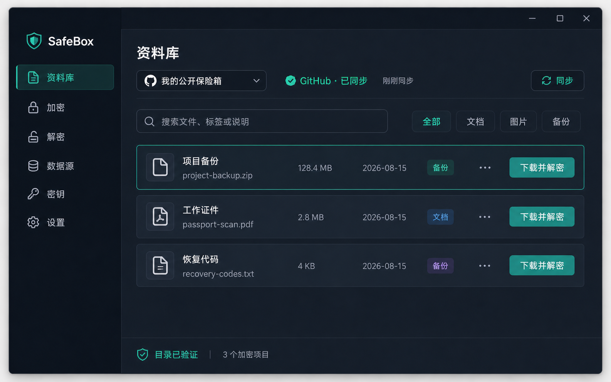

# SafeBox

SafeBox 是 SBOX v1 的纯 Flutter + Dart 跨平台客户端。它把任意本地文件或 UTF-8 文本加密成可公开托管的 `.sbox` 密文；公开 GitHub/Gitee 仓库、HTTPS 站点、网盘或普通文件夹只会看到随机对象名、密文分片和加密后的 `catalog.sbox`。加密保存只需要持久化的 RSA 公钥；只有在打开已有目录或解密文件时，才临时输入 12 词 BIP39 助记词重建私钥。

完整、具约束力的协议与产品定义见 [SBOX v1 Spec](docs/SBOX-v1-SPEC.md)。实现界面使用真实响应式 Flutter 组件，并由 8 张规范效果图和对应 Golden Test 锁定，不以图片作为页面背景。



## 安全模型

- 身份：BIP39 12 词经固定 profile 确定性派生 RSA-3072 与 Catalog 身份；公钥和 Key ID 可永久保存。
- 文件密钥：每个 SBOX、每个 multipart 分片都生成独立随机 256-bit DEK；RSA-OAEP-SHA256 只封装 DEK。
- 内容：AES-256-GCM，4 MiB 认证记录，另有认证 Metadata 和 Final 记录。
- 大文件：默认明文分片边界为 **16 MiB（16,777,216 字节）**；每片都是可独立认证的完整 SBOX，Catalog 记录顺序、偏移、逐片及整体摘要。
- 目录：新建或加密保存时，`catalog.sbox` 也只使用 RSA 公钥封装随机 DEK，并由 AES-256-GCM 认证；兼容读取旧版 Ed25519 签名目录。公钥加密目录不提供发布者签名证明，客户端仍执行身份、哈希链、回滚、分叉和重复键检查。
- 持久化：公钥、Key ID、公开数据源配置和完整 `.sbox` 原件可以永久保存；解锁后的 Catalog 可作为明文缓存永久保存在本地 `.sbox-sync/catalog.json`，只用于本地目录操作，绝不进入上传队列。助记词、BIP39 Seed、RSA/Ed25519 私钥和 DEK 不进入普通存储、平台安全存储、上传队列或日志。
- 私钥生命周期：每次身份恢复、签名或解密都在新的一次性 Crypto Isolate 中完成；成功、失败、取消、进入后台或应用退出时终止任务并释放引用。Dart 运行时无法承诺物理内存的确定性擦除，因此完整进程退出仍是最终内存边界。
- 凭据：GitHub/Gitee 写入令牌只通过窄类型接口进入系统安全存储；匿名读取不需要令牌。

不要把“公开密文”理解成“隐藏元数据”。托管方仍可观察对象数量、大小、上传时间、仓库身份和访问流量。助记词一旦丢失，密文无法恢复；一旦泄露，应建立新身份并重新加密数据。
启用本地 Catalog 明文缓存后，能读取该本地目录的其他账户或备份工具也能看到标题、原始文件名、说明、标签和对象索引；缓存不包含文件明文、助记词或私钥。

## 已实现功能

- 创建或恢复 12 词身份、随机位置确认、RSA 生成进度、公钥导出、历史公钥与助记词核验。
- 文件拖放/选择与直接文本输入；流式单文件和 multipart 加密，不把完整大文件载入 UI Isolate。
- 本地规范目录、只读散装 SBOX 扫描、单个 SBOX 检查与解密；无需配置任何云端。
- GitHub、Gitee 和只读 HTTPS 数据源；匿名读取、令牌写入、流式 Base64 上传、对象先行、Catalog 条件提交。连接测试会先验证仓库/分支；新建空仓库会明确提示尚未初始化 `catalog.sbox`，而不是误报为网络故障。
- 每个远端源的本地全量密文镜像；断网、清缓存或移除数据源配置不会删除已完成的 `.sbox` 原件。
- 加密先原子提交到本地，再选择“仅保存在本地”或同步远端。失败保留加密队列，可安全重试。
- 解锁后的 Catalog 可按用户选择永久保存在本地 `.sbox-sync/catalog.json`；缓存绑定当前 `catalog.sbox` SHA-256，不会上传或因应用重启自动删除。
- Catalog 409/412 冲突后最多三次拉取、验证、三方合并和条件重试；同条目冲突进入明确的本地/远端比较界面，不按时间戳覆盖。
- 已验证条目支持编辑标题/说明/标签和墓碑逻辑删除；每次增加条目 revision 与 Catalog generation、重新加密，且不会自动删除永久 SBOX 对象。编辑已有目录前仍需临时解锁目录。
- 前台网络恢复与应用回到前台时，按“手动 / Wi-Fi 与有线 / 任意网络”策略只拉取公开密文 Catalog；任何需要私钥的合并仍要求用户重新输入助记词。
- 受管理临时明文目录、完整认证后发布、打开/导出/单独删除、退出自动清理和“全部删除”；清理边界不会触碰本地密文原件。
- Windows/Linux/macOS 桌面侧栏、Android/iOS 移动底栏、后台隐私遮罩、敏感任务取消、键盘和语义标签基础支持。

## 数据目录

规范本地源直接使用用户选择的根目录：

```text
<local-root>/
├─ catalog.sbox
├─ objects/<file-id 前 2 位>/<file-id>.sbox
├─ .sbox-staging/
└─ .sbox-sync/
   ├─ catalog.json             # 可选的已解锁 Catalog 明文缓存，不上传、不自动删除
   └─ pending-base-*.sbox      # 加密的待同步共同基线
```

远端源使用应用支持目录中的独立永久镜像：

```text
<app-support>/cipher-mirrors/<source-id>/
├─ catalog.sbox
├─ objects/**/*.sbox
└─ .sbox-sync/catalog.json       # 用户允许保留的本地明文缓存，不上传
```

Android 的“打开本地目录”使用 Storage Access Framework 并持久保存 tree URI 读取授权；iOS/macOS 使用 security-scoped bookmark。系统文件提供方不保证条件写入和原子替换，因此这类授权目录按只读数据源挂载，并流式同步到应用支持目录中的永久密文镜像。移动端另提供“创建本机可写保险箱”，使用应用 Documents 下的 `SafeBox` 规范目录；iOS 已启用 Files 文档共享。Android 的明文/公钥导出使用系统 `ACTION_CREATE_DOCUMENT` 流式写入，iOS 使用系统文档导出选择器，不依赖桌面专用的保存位置 API。临时明文位于应用管理的临时根目录，并与全部永久密文目录强制隔离。

## 开发与验证

项目固定于 `.metadata` 中记录的 Flutter stable revision `4cf24164269a5ebf0c16a028a00727d0e77bbb05`（Flutter 3.47.0 / Dart 3.13.0）。

### 运行 Windows 桌面应用

使用项目自带的 [`run_safebox.py`](run_safebox.py) 启动 Windows 桌面版：

```powershell
python run_safebox.py
```

运行 Release 模式：

```powershell
python run_safebox.py --release
```

脚本会依次从 `PATH`、项目 Flutter 配置和常见 SDK 路径查找 Flutter。若 Flutter 安装在其他位置，可先设置：

```powershell
$env:FLUTTER_ROOT = 'C:\src\flutter'
python run_safebox.py
```

```powershell
flutter pub get
flutter analyze --no-pub
dart test test/sbox
flutter test test/persistence_security_test.dart test/widget_test.dart test/golden_test.dart --no-pub
flutter build windows --release --no-pub
```

可选的真实公网适配器检查只做匿名读取，不写任何仓库：

```powershell
$env:SBOX_LIVE_REMOTE_TESTS='1'
dart test test/live_remote_source_test.dart
```

其他一级平台：

```text
flutter build linux --release --no-pub
flutter build macos --release --no-pub
flutter build apk --release --no-pub
flutter build ios --release --no-codesign --no-pub
```

[跨平台 CI](.github/workflows/ci.yml) 在 Windows、Linux、macOS 和 Android runner 上固定同一 Flutter revision，覆盖五个原生目标；同时使用 OSV 扫描完整 `pubspec.lock`，发现已知依赖漏洞即失败。协议测试还包含确定性密文变异模糊回归。iOS 发布签名、Android 发布密钥、桌面代码签名和商店凭据必须由发行环境注入，仓库不会携带开发私钥或用 debug key 签名 Release。

自动化测试与依赖扫描不能替代规范要求的独立密码学/应用安全评审。正式发布前仍必须由第三方完成审计、记录发现并复核修复结果。

Golden Test 基线位于 [`test/goldens/`](test/goldens/)，对应规范第 15 节的 8 张效果图。只有经人工确认的设计变更才应运行：

```powershell
flutter test test/golden_test.dart --update-goldens --no-pub
```

Web 仅是二级实验目标。浏览器页面可被托管方替换，文件、Isolate 和秘密生命周期也不具备原生应用同等级保证，因此不应在不受信任网页中输入主助记词。

## 仓库与字体许可

上游仓库：<https://github.com/zhouzhipeng/SafeBox>

界面内嵌 Noto Sans SC 和 Roboto Mono，以保证中文与等宽指纹在 Golden Test 中稳定渲染；授权文本分别位于 [`assets/fonts/OFL-NotoSansSC.txt`](assets/fonts/OFL-NotoSansSC.txt) 和 [`assets/fonts/OFL-RobotoMono.txt`](assets/fonts/OFL-RobotoMono.txt)。项目依赖的精确版本记录在 `pubspec.lock`。
