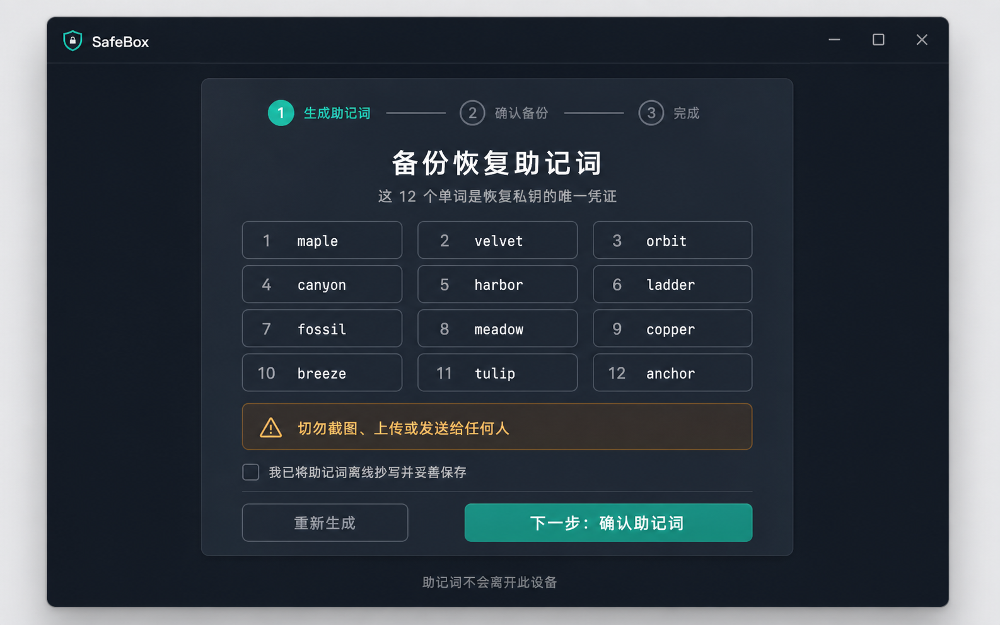
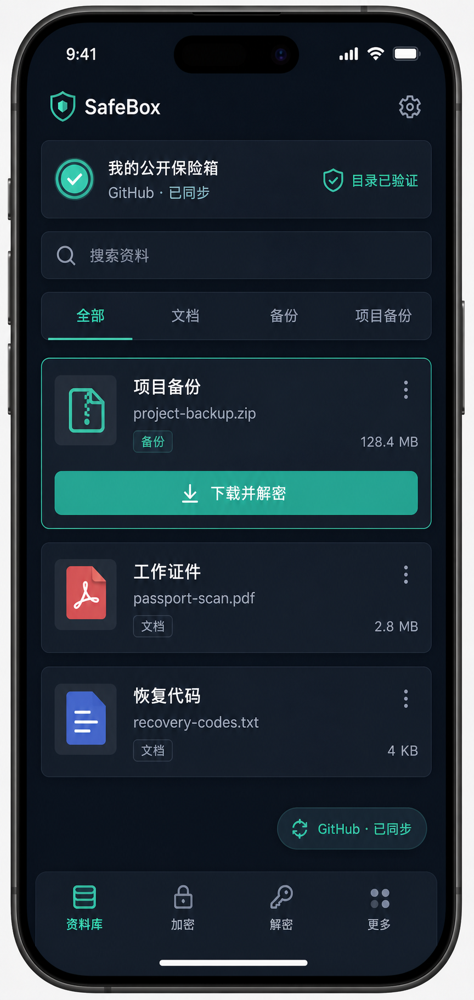
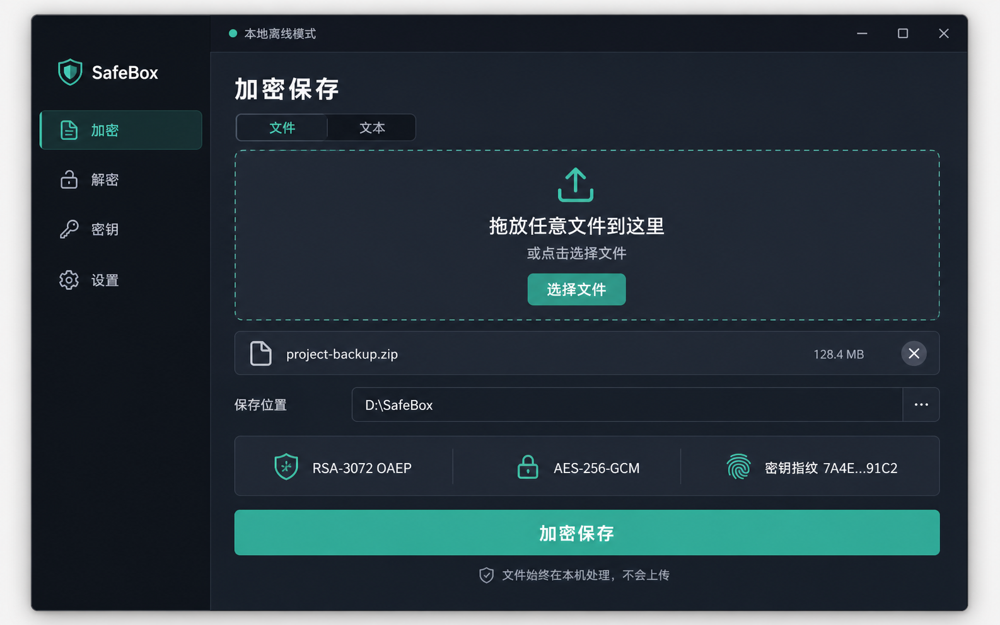
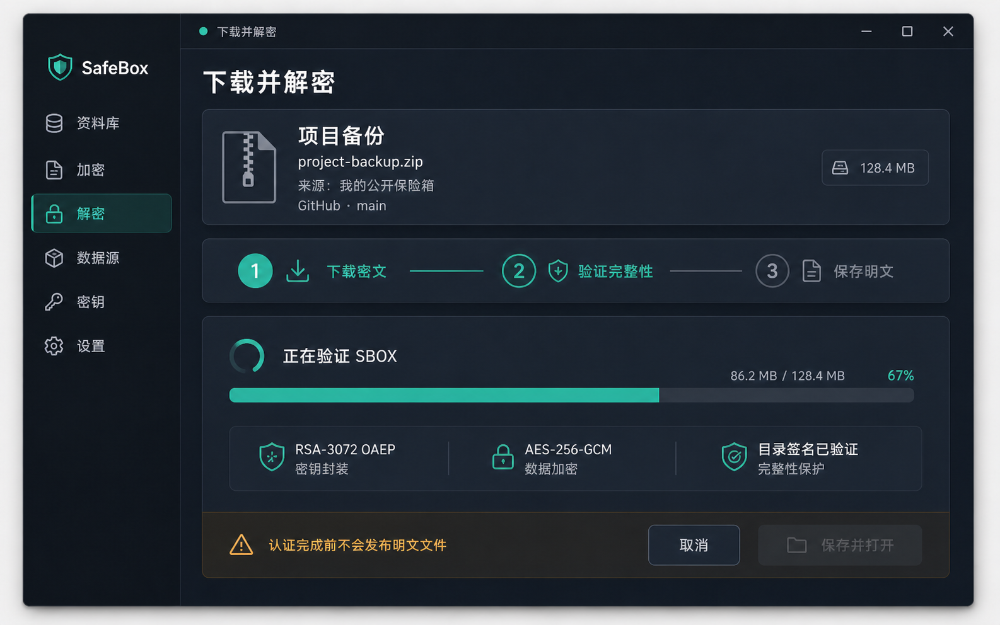
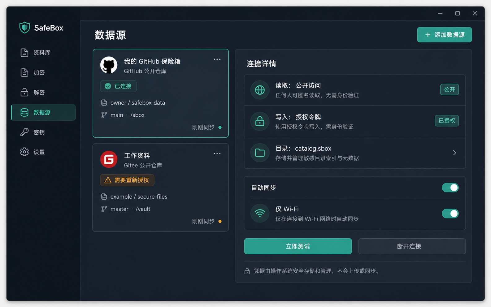
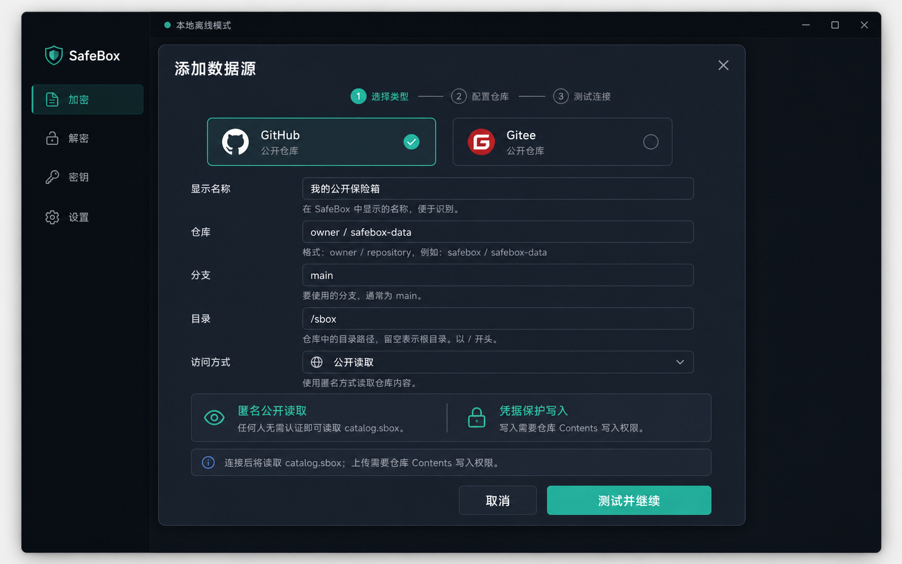
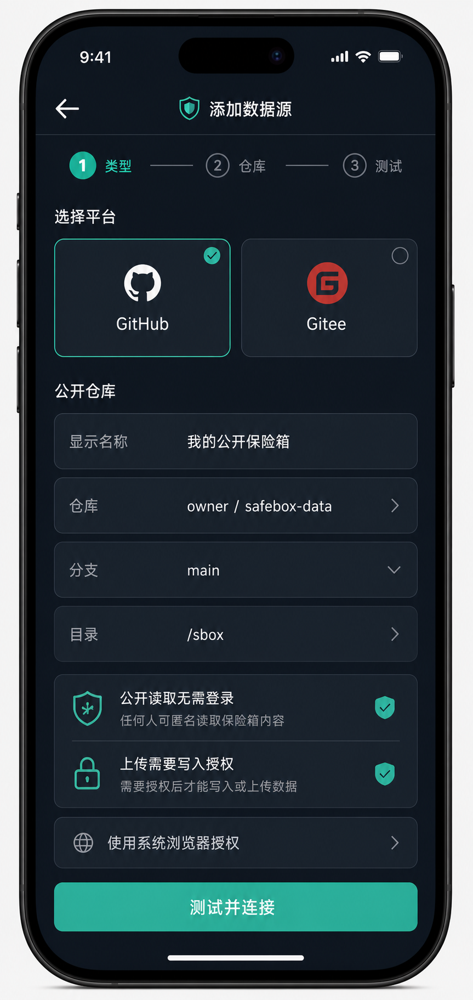

# SBOX v1 文件加密容器协议与跨平台应用规范

| 项目 | 值 |
|---|---|
| 协议名称 | SafeBox Container Protocol |
| 协议标识 | `SBOX` |
| 当前版本 | `1.0` |
| 文档状态 | Draft / 可实现基线 |
| 更新日期 | 2026-08-15 |
| 密钥体系 | BIP39 12 词确定性 RSA-3072 |
| 内容加密 | AES-256-GCM 分块认证加密 |
| 目录认证 | 默认 RSA 公钥加密 + AES-256-GCM 认证；兼容 Ed25519 签名目录 |
| 客户端技术栈 | 纯 Flutter + Dart（无自定义 Rust/FFI 密码核心） |
| 一级支持平台 | Windows、macOS、Linux、Android、iOS |
| 密钥留存策略 | 公钥可永久保存；助记词、RSA 私钥和 Ed25519 私钥不得持久化 |
| 本地密文副本 | 每个数据源拥有可配置的本地同步目录，`.sbox` 密文原件允许永久保存 |
| 云端依赖 | 可完全跳过；用户可直接挂载本地 SBOX 目录并离线使用 |
| 临时明文 | 使用独立的临时解密目录，用户可随时执行“全部删除” |
| 大文件存储 | 逻辑文件拆成多个独立 `.sbox` 分片，顺序与完整性信息写入加密 Catalog |
| 默认 SBOX 分片 | 每片承载 16 MiB 明文，即 `16,777,216` 字节；末片按剩余长度 |
| 默认扩展名 | `.sbox` |

> 安全说明：SBOX v1 是面向本地跨平台应用和公开密文存储的自定义容器协议。本规范尽量复用公开标准，但“BIP39 助记词到 RSA 素数”的确定性映射和目录同步语义是 SBOX 自己定义的配置文件。生产发布前应接受独立密码学审查。本规范不声明 FIPS 认证。

## 1. 规范用语

本文中的“必须（MUST）”“不得（MUST NOT）”“应该（SHOULD）”“不应该（SHOULD NOT）”和“可以（MAY）”按 [RFC 2119](https://www.rfc-editor.org/rfc/rfc2119.html) 与 [RFC 8174](https://www.rfc-editor.org/rfc/rfc8174.html)解释。

除非另有说明：

- 所有整数均为无符号整数。
- 多字节整数均使用网络字节序，即大端序。
- 字节区间采用半开区间 `[start, end)`。
- `SHA-256(X)` 表示对字节串 `X` 计算 SHA-256。
- `ASCII("...")` 表示不包含结尾 NUL 的 ASCII 字节串。
- `I2OSP(x, n)` 表示将整数 `x` 编码为恰好 `n` 字节的大端字节串。
- `||` 表示字节串连接。
- “本地 SBOX 同步目录”或 `LocalCipherRoot` 表示用于长期保存 `catalog.sbox` 和对象 `.sbox` 密文原件的用户数据目录；它不是缓存目录。
- “临时解密目录”或 `ManagedTemporaryPlaintextRoot` 表示只用于受管理明文结果的独立目录；它不得位于任何 `LocalCipherRoot` 内部或包含后者。
- “Data 记录分块”表示一个 SBOX 容器内部的 AES-GCM 记录；“SBOX 分片”表示大逻辑文件在外层拆分后形成的一个独立、完整 SBOX 容器。二者不是同一层级。

## 2. 产品目标

SBOX v1 用于将任意单个本地文件或直接输入的 UTF-8 文本转换成可公开传播的 `.sbox` 文件。该文件可以存储在公开 GitHub 仓库、公开对象存储、网盘或其他不可信位置。

协议目标如下：

1. 没有对应 RSA 私钥的实体不能恢复文件内容。
2. 不可信存储方对密文、头部或记录的修改、截断和重排能够被检测。
3. 同一个明文重复加密时产生不同的 `.sbox` 文件。
4. 用户能够仅凭正确的 12 个 BIP39 英文助记词重建同一组 RSA 密钥。
5. 大文件可以流式加密和解密，不需要一次性载入内存。
6. 原始文件名和媒体类型位于加密区域内。
7. 协议解析必须有明确的长度上限和失败行为。
8. Windows、macOS、Linux、Android 和 iOS 客户端必须产生互相兼容的密文与身份。
9. 客户端可以从公开 GitHub、Gitee 等数据源匿名拉取密文目录和对象，并在获得最小写入授权后上传同步。
10. `catalog.sbox` 在不公开目录内容的前提下，为随机命名的 SBOX 对象提供标题、说明、标签和版本索引；新建目录只需要 RSA 公钥。
11. RSA 公钥、Ed25519 验证公钥和对应 Key ID 可以在本地永久保存；任何私钥材料只允许在当前 Flutter 应用进程的临时内存中存在，应用不得将其持久化，操作结束后应尽力覆盖可变缓冲区、释放引用并终止专用 Crypto Isolate。加密保存、上传和同步已完成的公钥密文不得要求私钥。
12. 每个数据源都可以同步到本地 SBOX 目录；完整的 `catalog.sbox` 和对象 `.sbox` 是可长期保留的密文原件，不属于可随意清除的应用缓存。
13. 解密产生的临时明文必须与本地 SBOX 同步目录物理分离；用户能够查看其数量和占用空间，并选择一次性全部删除。
14. 超过当前数据源有效分片明文上限的逻辑文件必须拆成多个独立 SBOX；Catalog 必须认证分片集合、顺序、偏移、每片哈希和重组后整体哈希。
15. GitHub、Gitee 和其他云端配置必须是可选能力；用户可以在不登录、不授权且不创建任何远端连接的情况下，直接选择本地目录加载、校验、加密和解密 SBOX。

## 3. 非目标

SBOX v1 不提供以下能力：

- 不证明发送者身份。知道公钥的任何人都能创建一个可由接收者解密的 SBOX 文件。
- 不阻止公开存储方删除文件。
- 不单独检测合法旧版本的回滚或重放。
- 不隐藏密文的大致长度、上传时间、下载行为或访问关系。
- 不抵御已经控制用户电脑的恶意软件、键盘记录器、屏幕捕获或内存读取。
- 不保证 SSD、日志、交换分区或云端历史版本中的明文被安全擦除；“清空临时解密文件”只执行普通文件删除，不代表不可恢复的物理擦除。
- 不提供抗量子安全性；这是 SBOX v1 的明确设计取舍。
- 不自动解压 ZIP，也不自动执行解密后的文件。
- 不承诺绕过 GitHub、Gitee 或其他存储服务的单文件大小、容量、带宽、频率和账户策略限制。
- 不把公开 Git 仓库当作可靠备份服务；数据源可以删除、限流、封禁或永久保留历史密文。
- 不在 v1 中提供 GitHub 与 Gitee 之间的服务器到服务器双向镜像；每个数据源拥有独立 Catalog，跨源复制必须作为显式用户操作。
- 不提供“记住私钥”“保持解锁”或后台自动解密；严格无私钥留存策略优先于免输入助记词的便利性。
- 不承诺 Dart 垃圾回收器能够在指定时刻物理覆盖所有秘密副本；完整终止并重新启动发布版应用进程是清除 Dart Heap 状态的最终边界，开发模式 Hot Reload/Hot Restart 不计入该保证。
- 不保证浏览器 Web 版具备与原生客户端相同的大文件、后台任务和密钥保护能力。

## 4. 威胁模型

假定攻击者可以：

- 永久下载、复制和分析所有 `.sbox` 文件；
- 修改、截断、拼接、替换或回滚公开文件；
- 删除、遗漏、重复、调换或混入其他逻辑文件的 SBOX 分片；
- 获得 RSA 公钥和完整协议实现；
- 离线猜测用户助记词；
- 创建发送给目标公钥的新 SBOX 文件。
- 回滚、替换或删除 `catalog.sbox`，以及制造彼此冲突的同步结果。

假定攻击者不能：

- 读取保持离线且妥善保存的助记词；
- 在一次私钥操作执行期间读取受信任进程内存；
- 控制正在执行加密或解密的可信本机。

| 攻击者行为 | 预期结果 |
|---|---|
| 读取或复制 SBOX | 不能获得明文 |
| 修改头部或记录 | AES-GCM 认证失败 |
| 截断最后记录 | 缺少最终认证记录，整体失败 |
| 重排或重复数据块 | 记录索引和最终清单不匹配，整体失败 |
| 缺失、调换、重复或混入 SBOX 分片 | 已认证 Catalog 清单、分片 Metadata、逐片摘要或整体摘要不匹配；不得发布任何部分明文 |
| 替换为旧的合法 SBOX | 单个文件不能识别回滚，需要外部版本状态 |
| 使用公钥构造新 SBOX | 可以构造，因此解密后的内容仍应视为不可信输入 |
| 使用公钥构造新目录 | 新版 `public-key-only` Catalog 可以被任何公钥持有者构造；外层 GCM 可检测篡改但不能证明发布者，客户端必须显示“目录已认证但未签名”语义并依靠身份/哈希链/人工检查点防止误导 |
| 回滚到旧的已签名目录 | 已见过更高代数的客户端报警；全新设备仍无法独立识别回滚 |
| 并发更新同一目录 | 远端条件写入失败，客户端重新拉取、合并或要求用户处理冲突 |
| 窃取数据源写入令牌 | 可删除、回滚或上传密文；公钥目录模式下还可发布可解密但未经发布者签名的新目录，因此客户端必须保留 generation/哈希检查并提示用户核对；可用性仍可能受损 |
| 读取本地身份记录或 SBOX 同步目录 | 只能取得公钥、Key ID、密文和公开配置，不能取得助记词或私钥 |
| 读取尚未清理的临时解密目录 | 可以直接取得其中的明文；该目录必须受文件权限保护并允许用户全部删除，但普通删除不保证物理不可恢复 |
| 读取用户允许保留的 `.sbox-sync/catalog.json` | 可以取得 Catalog 标题、说明、原始文件名、标签和对象索引，但不能取得文件明文；该缓存必须明确标注为本地明文并且不得上传 |
| 窃取助记词或私钥 | 对应身份的全部历史公开密文可能失密 |

## 5. 固定密码套件

SBOX v1 只定义一个规范密码套件。实现不得静默降级。

| 用途 | SBOX v1 固定值 |
|---|---|
| 助记词 | BIP39 英文词表，12 词，128 位原始熵 + 4 位校验码 |
| BIP39 Seed | PBKDF2-HMAC-SHA512，2048 轮，输出 64 字节 |
| 派生函数 | HKDF-SHA512 |
| 确定性随机生成器 | HMAC_DRBG-SHA256 |
| RSA 模数 | 3072 位 |
| RSA 公共指数 | `65537` |
| RSA 密钥封装 | RSAES-OAEP，Hash=SHA-256，MGF1=SHA-256 |
| 每文件数据密钥 | 操作系统 CSPRNG 生成的 32 字节随机值 |
| 内容加密 | AES-256-GCM |
| GCM Nonce | 96 位，`4 字节前缀 || 8 字节记录索引` |
| GCM Tag | 128 位，不得截断 |
| 指纹和内容摘要 | SHA-256 |
| 目录签名 | Ed25519（RFC 8032），签名密钥由同一 BIP39 Seed 域分离派生 |
| 目录规范 JSON | JSON Canonicalization Scheme（RFC 8785） |
| 默认明文分块 | 4 MiB，即 `4,194,304` 字节 |
| 大文件外层分片 | 默认每片 16 MiB 明文；多个独立完整 SBOX 容器，集合、顺序和摘要由已认证 Catalog 的 multipart payload 保护 |

相关标准包括 [BIP39](https://github.com/bitcoin/bips/blob/master/bip-0039.mediawiki)、[RFC 5869](https://www.rfc-editor.org/rfc/rfc5869.html)、[NIST SP 800-90A Rev.1](https://csrc.nist.gov/pubs/sp/800/90/a/r1/final)、[FIPS 186-5](https://csrc.nist.gov/pubs/fips/186-5/final)、[RFC 8017](https://www.rfc-editor.org/rfc/rfc8017.html)、[RFC 8032](https://www.rfc-editor.org/rfc/rfc8032.html)、[RFC 8785](https://www.rfc-editor.org/rfc/rfc8785.html) 和 [NIST SP 800-38D](https://csrc.nist.gov/pubs/sp/800/38/d/final)。

## 6. 身份与确定性 RSA 密钥生成

### 6.1 助记词生成

新建身份时，实现必须执行以下过程：

1. 从操作系统密码学安全随机源读取恰好 16 字节，即 128 位熵 `ENT`。
2. 按 BIP39 计算 4 位校验码并编码为 12 个英文单词。
3. 必须使用 BIP39 官方英文词表和 UTF-8 NFKD 规范化。
4. 单词必须由程序生成，不得允许用户自行挑选一组“容易记忆”的单词作为新身份。
5. SBOX v1 的 BIP39 附加 passphrase 固定为空字符串。其他值属于未来配置文件，v1 不得接受。
6. 应要求用户离线抄写，并通过随机抽查至少 4 个词位完成确认。
7. 不得把助记词写入日志、崩溃报告、剪贴板历史、遥测或 `.sbox` 文件。

12 词助记词的安全强度上限是 128 位，而不是 132 位；后 4 位是校验码。助记词在本协议中等同于根私钥。

### 6.2 BIP39 Seed

将助记词按单个 ASCII 空格连接为 `mnemonic_sentence`，然后执行：

```text
bip39_seed = PBKDF2-HMAC-SHA512(
    password   = NFKD(UTF8(mnemonic_sentence)),
    salt       = NFKD(UTF8("mnemonic")),
    iterations = 2048,
    output_len = 64
)
```

本步骤必须与 BIP39 测试向量一致。

### 6.3 RSA DRBG 初始化材料

从 `bip39_seed` 派生 48 字节：

```text
drbg_okm = HKDF-SHA512(
    IKM  = bip39_seed,
    salt = ASCII("SBOX-v1/BIP39-to-RSA3072"),
    info = ASCII("HMAC-DRBG-SHA256/instantiate"),
    L    = 48
)

entropy_input = drbg_okm[0, 32)
nonce         = drbg_okm[32, 48)
personalization_string = ASCII("SBOX-v1/RSA-3072")
```

随后按 NIST SP 800-90A Rev.1 实例化 HMAC_DRBG-SHA256：

- 请求安全强度为 128 位；
- `prediction_resistance = false`；
- 不执行 reseed；
- 所有 Generate 调用的 `additional_input` 为空；
- 使用同一个连续 DRBG 状态生成候选素数和 Miller-Rabin 底数；
- 每次 Generate 后必须执行标准规定的状态更新，即使 `additional_input` 为空。

实现不得替换为操作系统 RNG、`StdRng`、ChaCha RNG 或某个库的默认 RSA KeyGen，因为这些选择会改变恢复结果。

### 6.4 RSA-3072 素数生成配置文件

固定参数：

```text
nlen = 3072
L    = 1536
e    = 65537
lower_bound = ceil(sqrt(2) * 2^1535)
```

每次候选生成按以下步骤执行：

1. 从 HMAC_DRBG Generate 读取 192 字节，并按大端解释为整数 `x`。
2. 如果 `x` 为偶数，令 `x = x + 1`。
3. 如果 `x < lower_bound` 或 `x >= 2^1536`，拒绝该候选。
4. 如果 `GCD(x - 1, 65537) != 1`，拒绝该候选。
5. 使用所有 `3..65521` 范围内的奇素数进行试除；如果任一素数整除 `x`，拒绝该候选。
6. 按 FIPS 186-5 附录 B.3.1 执行 4 轮 Miller-Rabin。
7. 每轮 Miller-Rabin 底数通过同一个 HMAC_DRBG 读取 192 字节获得；若整数不满足 `1 < b < x - 1`，继续读取新的 192 字节。
8. 4 轮通过后，按 FIPS 186-5 附录 B.3.3 再执行一次 General Lucas Probabilistic Primality Test。
9. 两种测试均通过时接受候选。

候选在进入 Miller-Rabin 前被拒绝时，不得为了“保持步数一致”额外消耗 DRBG 输出。Lucas 测试不消耗 DRBG 输出。

生成顺序必须为：

1. 连续生成 `p`，最多尝试 `5 × nlen = 15360` 个候选。
2. 继续使用同一个 DRBG 状态生成 `q`，最多尝试 `10 × nlen = 30720` 个候选。
3. `q` 除满足素数条件外，还必须满足：

```text
abs(p - q) > 2^(1536 - 100) = 2^1436
```

4. 计算：

```text
lambda = LCM(p - 1, q - 1)
d      = e^(-1) mod lambda
```

5. 如果 `d <= 2^1536`，使用当前 DRBG 状态重新生成一对新的 `p`、`q`。最多允许 16 次外层尝试。
6. 最终将较大的素数规范化为 `p`，较小的为 `q`。
7. 计算 `n = p × q`，并确认 `bit_length(n) = 3072`。
8. 计算 CRT 参数：

```text
dP   = d mod (p - 1)
dQ   = d mod (q - 1)
qInv = q^(-1) mod p
```

任何计数上限耗尽、逆元不存在或自检失败均必须终止身份创建，不得退回较小密钥或不同算法。

### 6.5 密钥编码与 Key ID

- 公钥规范编码：DER `SubjectPublicKeyInfo`，算法 OID 为 `1.2.840.113549.1.1.1`（`rsaEncryption`），`AlgorithmIdentifier.parameters` 必须显式编码为 DER `NULL`。
- 公钥导出格式：PEM `PUBLIC KEY`，内容是上述 DER 的 Base64。
- RSA 公钥 DER/PEM、Ed25519 验证公钥和两个 Key ID 都是非秘密信息，可以在本地永久保存、备份和公开分发。
- RSA 私钥如因密码库接口需要，可以在内存中短暂编码为 DER PKCS#8 `PrivateKeyInfo`；该字节串不得写入文件、数据库、Keychain、Keystore、DPAPI、Secret Service、云同步、备份或导出包。
- SBOX v1 不提供任何私钥导出功能，包括裸私钥、加密 PKCS#8、二维码、剪贴板或“受保护私钥备份”。12 词助记词是唯一恢复材料。

完整 Key ID 定义为：

```text
recipient_key_id = SHA-256(spki_der)  // 32 bytes
```

UI 可以显示前 8 字节和后 2 字节的缩写，但协议头必须保存完整 32 字节。

### 6.6 公钥永久留存与私钥不持久化

> **协议级强制规则：**RSA 公钥、Ed25519 验证公钥及其 Key ID 可以在本地永久留存；12 词助记词、BIP39 Seed、RSA 私钥和 Ed25519 私钥不得写入任何应用持久化介质。私钥只允许存在于当前前台私钥操作的专用 Crypto Isolate 中；操作完成、失败、取消、应用退到后台或进程退出时，必须尽力覆盖可变秘密缓冲区、释放全部引用并终止该 Isolate。

SBOX v1 采用强制的“公钥永久留存、私钥不持久化”策略。这里的“零留存”指应用不主动把私钥写入持久化存储，不表示 Dart VM 能证明某一时刻的所有 Heap 副本均已物理清零。

允许永久保存的身份数据只有：

```text
RSA SubjectPublicKeyInfo DER / PEM
recipient_key_id
Ed25519 public key raw 32 bytes
catalog_signer_key_id
身份显示名称和非秘密创建时间
```

以下材料不得以任何形式持久化，即使经过设备密钥或口令加密也不允许：

```text
12 词助记词及 BIP39 Seed
HMAC_DRBG 状态
RSA p、q、d、dP、dQ、qInv 或完整私钥对象
RSA PKCS#8 私钥 DER
catalog_sign_seed 或 Ed25519 私钥对象
解锁身份、私钥缓存、私钥会话或私钥派生检查点
```

Windows DPAPI、macOS/iOS Keychain、Android Keystore 和 Linux Secret Service 只可保存数据源 OAuth/访问令牌等独立凭据，**不得用于保存 SBOX 私钥、助记词或其可逆封装**。

创建身份时必须：

1. 生成并展示助记词，要求用户离线备份和完成词位确认；
2. 在一次性 Crypto Isolate 中派生 RSA 和 Ed25519 密钥；
3. 永久写入且仅写入上述公开身份数据；
4. 在创建流程完成、失败或取消时清空助记词控件，尽力覆盖 BIP39 Seed、DRBG、RSA 素数/私钥、PKCS#8 临时编码和 Ed25519 私钥种子的可变字节缓冲区，释放引用并终止 Crypto Isolate；
5. 重启应用后，本地不得存在可以恢复私钥的文件、数据库行、安全存储项或后台任务状态。

每次解密必须：

1. 要求用户重新输入完整 12 词助记词；
2. 在本次解密专用的 Crypto Isolate 中临时派生 RSA 私钥，并将所得公钥和 `recipient_key_id` 与本地永久公钥及目标 SBOX 头部同时比对；
3. 单对象使用 RSA 私钥执行一次 OAEP 解封；multipart 逻辑文件则在同一次前台操作中只对已认证 Catalog 清单列出的全部分片逐一解封，每片取得独立 32 字节 DEK；
4. 当前逻辑文件所需的全部 OAEP 解封结束后立即释放 RSA 私钥及 `p/q/d/CRT`、PKCS#8 和模幂中间对象的应用引用，并尽力覆盖实现可控制的 `Uint8List` 缓冲区；不得把 RSA 私钥留给下一逻辑文件。Dart VM 可能保留不可控副本，因此本规范不声称确定性物理清零；
5. 随后的 AES-256-GCM 解密只继续使用一个 DEK 或有上限的分片 DEK 数组；每片 Final 验证后尽力覆盖对应 DEK，整个逻辑文件完成、失败或取消后覆盖其余 DEK 与明文缓冲区并终止本次 Crypto Isolate；
6. 清空助记词 UI 控件和其可控副本，不得提供“记住助记词”“保持解锁”或“一段时间内免输入”选项；应用进入后台时必须取消私钥任务、删除未发布明文暂存文件并终止对应 Crypto Isolate。

该策略意味着每个文件的解密都需要重新输入助记词并重新执行确定性 RSA 生成。实现必须如实展示耗时和进度，不能用持久化私钥缓存优化这一流程。完整终止并重新启动发布版应用进程后，不得恢复任何此前的私钥操作状态。

“重新生成密钥”应表现为创建新身份。删除本地公钥记录不会删除任何私钥，因为本地从未保存私钥；但如果用户丢失助记词，历史 SBOX 将永久无法恢复。

### 6.7 Catalog 签名子密钥

普通 SBOX 只提供机密性和完整性，不证明创建者身份。`catalog.sbox` 默认沿用这一公钥加密语义，保证加密保存不需要私钥；需要发布者真实性时，可以额外使用只有助记词持有者能够生成的 Ed25519 签名模式。

从第 6.2 节的 `bip39_seed` 派生 Ed25519 私钥种子：

```text
catalog_sign_seed = HKDF-SHA512(
    IKM  = bip39_seed,
    salt = ASCII("SBOX-v1/BIP39-to-CatalogSign"),
    info = ASCII("Ed25519/seed"),
    L    = 32
)
```

随后按 RFC 8032 从该 32 字节种子生成 Ed25519 公私钥。目录签名 Key ID 定义为：

```text
catalog_signer_key_id = SHA-256(ed25519_public_key_raw_32)
```

要求如下：

- RSA 接收密钥和 Ed25519 目录签名密钥必须使用不同的 HKDF 域，任何实现不得复用 RSA 私钥执行目录签名；
- Ed25519 私钥种子不得持久化。创建或修改 Catalog 时从用户本次输入的助记词临时派生，只用于当前前台签名；签名后应尽力覆盖可变缓冲区、释放引用，并在操作结束时终止 Crypto Isolate；
- 恢复身份时必须同时重建 RSA 和 Ed25519 密钥，并分别核对两个 Key ID；
- 普通文件和 `catalog.sbox` 加密默认只需要 RSA 公钥；只有解密已有目录、处理冲突，或选择 Ed25519 发布者签名模式时才临时使用目录签名私钥；
- 若本地身份缺少匹配的签名公钥，客户端仍可以按 `public-key-only` 模式解密并验证目录结构，但不得把它标记为“Ed25519 签名可信”。

## 7. 每文件密钥与 RSA-OAEP

每次加密必须独立从操作系统 CSPRNG 读取：

```text
DEK          = random(32)  // AES-256 文件密钥
file_id      = random(16)
nonce_prefix = random(4)
```

`DEK` 不得从助记词、RSA 私钥、文件内容、文件名或时间戳派生。

RSA-OAEP 的参数固定为：

```text
RSA modulus = 3072 bits
Hash        = SHA-256
MGF         = MGF1(SHA-256)
message     = DEK, exactly 32 bytes
```

OAEP Label 为：

```text
oaep_label = ASCII("SBOX-v1-DEK")
             || 0x00
             || file_id
             || recipient_key_id
```

RSA-3072 OAEP 输出恰好 384 字节。OAEP 编码随机种子必须来自操作系统 CSPRNG。

## 8. SBOX 二进制容器

### 8.1 文件名

推荐文件名：

```text
lowercase_hex(file_id) + ".sbox"
```

示例：

```text
8f31d06eb42f4852ad3ec937a7243dea.sbox
```

文件名不是密码学输入。用户重命名 `.sbox` 不应导致解密失败；内部 `file_id` 才是规范值。

multipart 的每个分片仍使用上述随机 file ID 文件名；公开文件名不得包含 `.part001`、分片序号或 `multipart_id`。`.part` 后缀只允许用于未提交的本地暂存文件，绝不能作为远端已发布对象。

`catalog.sbox` 是唯一的保留外部文件名。它仍是一个完整的标准 SBOX 容器，每次更新均生成新的内部 `file_id`、DEK 和 Nonce；固定外部名称只是让数据源客户端能够定位入口目录。

### 8.2 固定头部

SBOX v1 固定头部总长为 468 字节。

| Offset | Size | 名称 | v1 取值或语义 |
|---:|---:|---|---|
| 0 | 8 | `magic` | `53 42 4F 58 0D 0A 1A 0A`，即 `SBOX\r\n\x1A\n` |
| 8 | 1 | `version_major` | `1` |
| 9 | 1 | `version_minor` | `0` |
| 10 | 2 | `header_len` | `468` |
| 12 | 4 | `flags` | 必须为 `0` |
| 16 | 2 | `key_profile_id` | `1` = BIP39-12 / deterministic RSA-3072 + Catalog authentication v1 (Ed25519 compatibility) |
| 18 | 2 | `key_wrap_alg` | `1` = RSA-OAEP-SHA256-MGF1SHA256 |
| 20 | 2 | `payload_alg` | `1` = AES-256-GCM chunked |
| 22 | 2 | `reserved0` | 必须为 `0` |
| 24 | 4 | `chunk_size` | 生成器必须写 `4,194,304` |
| 28 | 16 | `file_id` | 每文件随机 ID |
| 44 | 32 | `recipient_key_id` | `SHA-256(spki_der)` |
| 76 | 4 | `nonce_prefix` | 每文件随机 Nonce 前缀 |
| 80 | 2 | `wrapped_key_len` | `384` |
| 82 | 2 | `reserved1` | 必须为 `0` |
| 84 | 384 | `wrapped_dek` | RSA-OAEP 加密的 32 字节 DEK |

解码器必须：

- 拒绝错误 magic、未知主版本、非零 flags、非零 reserved 字段或未知算法 ID；
- 要求 `header_len = 468` 和 `wrapped_key_len = 384`；
- v1 生成器必须写默认 4 MiB 分块；兼容解码器可以接受 `64 KiB..16 MiB` 范围内的 2 的幂；
- 在任何大整数分配前完成上述边界检查。

头部认证摘要定义为：

```text
header_hash = SHA-256(header[0, 468))
```

该摘要不单独存储，而是进入每条 AES-GCM 记录的 AAD。

### 8.3 记录结构

固定头部之后是连续记录。每条记录编码为：

| Size | 名称 | 语义 |
|---:|---|---|
| 1 | `record_type` | `0x01` 元数据、`0x02` 数据、`0xFF` 最终记录 |
| 8 | `record_index` | 从 0 开始的连续大端索引 |
| 4 | `plaintext_len` | 本记录认证解密后的字节数 |
| `plaintext_len` | `ciphertext` | 与明文等长的 GCM 密文 |
| 16 | `tag` | 完整 128 位 GCM Tag |

记录总长为：

```text
13 + plaintext_len + 16
```

每条记录的 Nonce：

```text
nonce = nonce_prefix || I2OSP(record_index, 8)
```

每条记录的 AAD：

```text
record_header = record_type
                || I2OSP(record_index, 8)
                || I2OSP(plaintext_len, 4)

aad = ASCII("SBOX-v1-record")
      || header_hash
      || record_header
```

记录序列必须严格为：

```text
Metadata(index=0)
Data(index=1)
Data(index=2)
...
Final(index=N+1)
EOF
```

索引必须连续，不允许未知记录类型，不允许 Final 后存在任何尾随字节。

### 8.4 加密元数据

Metadata 记录的明文格式如下：

| Offset | Size | 名称 | 语义 |
|---:|---:|---|---|
| 0 | 1 | `metadata_version` | `1` |
| 1 | 1 | `content_kind` | `1` 完整文件，`2` UTF-8 文本，`3` SBOX Catalog JSON，`4` 大文件 SBOX 分片 |
| 2 | 1 | `compression` | `0`，v1 不做容器内压缩 |
| 3 | 1 | `reserved` | `0` |
| 4 | 8 | `original_size` | 数据记录全部明文的总字节数 |
| 12 | 2 | `name_len` | UTF-8 文件名字节数 |
| 14 | 2 | `media_type_len` | UTF-8 MIME 字符串字节数，可为 0 |
| 16 | `name_len` | `original_name` | NFC UTF-8 basename |
| 16+N | `media_type_len` | `media_type` | 例如 `text/plain; charset=utf-8` |

限制：

- Metadata 明文总长不得超过 4096 字节。
- `original_name` 不得为空，不得含 NUL、`/`、`\` 或父目录语义。
- `name_len` 最大 1024 字节。
- `media_type_len` 最大 255 字节。
- 文本输入默认名字为 `note.txt`，数据为应用文本控件内容的 UTF-8 编码。
- Catalog 输入必须使用 `content_kind = 3`、`original_name = "catalog.json"` 和 `media_type = "application/vnd.sbox.catalog+json"`。
- 单对象文件和文本的 Metadata 在 `media_type` 后必须立即结束；不得附加未知字节。
- 选中的 `.zip` 文件只是普通文件字节；SBOX v1 不使用 ZIP 密码，也不自动解压。

解密 UI 必须让用户确认最终保存路径，不得盲目信任 `original_name`。

当 `content_kind = 4` 时，`original_size` 表示**当前分片**的明文字节数，`original_name` 和 `media_type` 表示重组后的逻辑文件。紧随 `media_type` 后必须追加恰好 40 字节的分片扩展：

| 相对 Offset | Size | 名称 | 语义 |
|---:|---:|---|---|
| 0 | 16 | `multipart_id` | 每个逻辑文件 revision 随机生成的分片组 ID |
| 16 | 4 | `part_index` | 从 `0` 开始的分片索引 |
| 20 | 4 | `part_count` | 分片总数，范围 `2..10,000` |
| 24 | 8 | `plaintext_offset` | 当前分片在逻辑明文中的起始偏移 |
| 32 | 8 | `logical_plaintext_size` | 重组后的完整逻辑明文长度 |

分片 Metadata 要求：

- `part_index < part_count`，`original_size > 0`，且 `plaintext_offset + original_size <= logical_plaintext_size`；
- 同一逻辑 revision 的所有分片必须具有相同 `multipart_id`、`part_count`、`logical_plaintext_size`、`original_name` 和 `media_type`；
- `part_index = 0` 时 `plaintext_offset = 0`；后续偏移必须等于之前所有分片 `original_size` 之和，最后一个分片的结束偏移必须等于 `logical_plaintext_size`；
- 分片本身不得作为完整文件直接发布。没有经过已认证 Catalog 清单验证的 `content_kind = 4` 文件只能显示为“未关联 SBOX 分片”，不能自动重组或导出为原文件；
- `multipart_id`、索引、偏移和逻辑大小位于 GCM 认证的 Metadata 内部，不会以明文暴露在 SBOX 外部文件名中。

### 8.5 数据记录

- 每个 Data 记录的 `plaintext_len` 必须在 `1..chunk_size` 范围内。
- 生成器必须让除最后一个 Data 记录外的所有 Data 记录恰好等于 `chunk_size`；解码器在见到短 Data 记录后若又见到另一个 Data 记录，必须拒绝。
- 空文件没有 Data 记录。
- 文件数据保持原始字节不变。
- 文本数据是 UTF-8 字节；v1 不执行 Unicode 正规化或换行符转换。

### 8.6 最终认证记录

Final 记录的明文固定为 48 字节：

| Offset | Size | 名称 | 语义 |
|---:|---:|---|---|
| 0 | 8 | `total_data_len` | 所有 Data 明文总长度 |
| 8 | 8 | `data_record_count` | Data 记录数量 |
| 16 | 32 | `data_sha256` | 对完整原始数据流计算 SHA-256 |

解码器必须验证：

- Final 的 `plaintext_len = 48`；
- `total_data_len` 等于实际已认证数据长度；
- `data_record_count` 等于实际记录数；
- `data_sha256` 等于实际明文摘要；
- Metadata 中 `original_size` 与 Final 中 `total_data_len` 相同；
- Final 后立刻到达 EOF。

这些检查通过前，不得把临时明文标记为“已验证”，也不得允许打开、导出或系统分享。

## 9. 加密算法

以下流程生成一个独立 SBOX 容器；对于小文件，它承载完整逻辑文件，对于大文件，它由第 9.1 节调用并承载一个逻辑分片：

1. 确认输入是普通文件或文本字节流，并确定 `original_name` 和 MIME。
2. 从受信任密钥库读取目标 RSA 公钥并计算 `recipient_key_id`。
3. 从操作系统 CSPRNG 生成新的 `DEK`、`file_id`、`nonce_prefix` 和 OAEP 随机种子。
4. 使用第 7 节参数将 `DEK` 包装成 384 字节 `wrapped_dek`。
5. 构造 468 字节头部并计算 `header_hash`。
6. 创建不可被其他用户读取的随机 `.part` 密文文件：single 位于目标 `objects/<shard>/` 的同一文件系统；multipart 则由第 9.1 节指定在同一 `LocalCipherRoot/<source_id>/.sbox-staging/<job_id>/` 中。
7. 写入头部。
8. 写入 index 0 的 Metadata 认证记录。
9. 按 4 MiB 分块读取输入，写入连续 Data 认证记录，同时计算总长度和 SHA-256。
10. 写入 Final 认证记录。
11. Flush，并在平台支持时执行文件同步。
12. 关闭临时文件后，single 原子重命名为 `hex(file_id).sbox`，作为本地永久密文原件；multipart 先把已关闭且哈希完成的暂存 artifact 返回给第 9.1 节，整组完成后再逐片原子移动到规范对象路径。若用户还选择远端同步，后续上传只能读取永久原件。
13. 尽力覆盖可变 DEK、OAEP 中间值和明文缓冲区，释放引用；若任务运行在专用 Crypto Isolate 中，则在任务结束时终止该 Isolate。

如果任何步骤失败：

- 必须关闭并删除本次未完成的密文 `.part`；不得删除既有永久 `.sbox` 原件；
- 不得覆盖原始输入；
- 重试必须生成全新的 DEK、file ID、Nonce 前缀和 OAEP 随机值；
- v1 不允许断点续加密，因为复用相同 `(DEK, nonce)` 加密不同内容会破坏 GCM 安全性。

### 9.1 大文件外层分片算法

分片发生在 SBOX 加密**之前**。每个分片都是第 8 节定义的完整 SBOX 容器，内部仍使用 4 MiB AES-GCM Data 记录。实现不得把一个已经生成的 `.sbox` 密文按字节截断，也不得把缺少 Header、Metadata 或 Final 的片段称为 SBOX 分片。

数据源适配器必须给出有限正整数 `max_object_bytes`，或对纯本地文件系统显式声明 `unbounded`。对候选容器明文长度 `P >= 0`，使用最坏 4096 字节 Metadata 时，SBOX 大小上界为：

```text
record_count(P) = ceil(P / 4,194,304)
sbox_size_upper_bound(P) = P + 4,670 + 29 * record_count(P)
```

`effective_part_plaintext_size` 的选择规则：

1. SBOX v1 默认目标为 16 MiB，即 `16,777,216` 字节；用户或适配器可以在 1 MiB..512 MiB 范围内显式配置其他值；
2. 选择不超过目标值、且使 `sbox_size_upper_bound(P) <= max_object_bytes` 的最大 1 MiB 整数倍；
3. 本地数据源未设置单对象上限时仍默认 16 MiB，以保持可同步性和可恢复粒度；
4. 若数据源连 1 MiB 分片的大小上界都不能接受，则不得向该源保存文件；
5. `logical_plaintext_size <= effective_part_plaintext_size` 时默认生成单对象；大于该值时必须生成 multipart。高级操作可以强制对较小文件分片，但不得把分片数降为 1 后仍标记 multipart；
6. `part_count = ceil(logical_plaintext_size / effective_part_plaintext_size)` 必须在 `2..10,000`，超限时必须拒绝或在数据源允许的前提下提高分片大小，不能截断文件。

这里的“16 MiB 分片”指每个非末片承载的**明文长度**。完整 `.sbox` 还包含 468 字节 Header、加密 Metadata、记录头、GCM Tag 和 Final，因此实际密文对象会略大于 16 MiB；提供方限制必须使用上述 `sbox_size_upper_bound` 计算，不能把 16 MiB 明文误当成 16 MiB 密文。

规范 multipart 加密流程：

1. 输入必须具有可信的总长度；长度未知或不可重复读取的 Document Provider 输入必须先完整暂存并确定长度；
2. 从 CSPRNG 生成新的 16 字节 `multipart_id`，计算 `part_count`，创建仅供当前事务使用的 `.sbox-staging/<job_id>/`；
3. 按原始明文顺序读取连续、不重叠的范围。除最后一片外，每片明文长度必须恰好等于 `effective_part_plaintext_size`；
4. 对每片独立生成 DEK、`file_id`、`nonce_prefix` 和 OAEP 随机种子，使用 `content_kind = 4` 及第 8.4 节分片 Metadata 生成完整 SBOX；任何两片不得复用 DEK 或 Nonce；
5. 加密过程中同时计算每片明文 SHA-256、完整逻辑明文 SHA-256、每个 SBOX 的 SHA-256 和大小；
6. 每片先以 `.part` 写入事务暂存目录。全部分片均完成并核对总读取长度后，才能生成第 12 节 `payload.mode = "multipart"` 清单；
7. Catalog 清单必须记录 `multipart_id`、逻辑总长度、完整明文哈希、名义分片大小，以及每片的索引、偏移、明文长度、明文哈希、file ID、对象路径、SBOX 大小和 SBOX 哈希；
8. 本地提交按“全部分片对象先行，Catalog 后置”执行：将已完成分片原子移动到 `objects/`，再签名并原子更新 `catalog.sbox`。崩溃可能留下未被 Catalog 引用的孤立密文，但不得留下一个引用缺失分片的 Catalog；
9. 远端上传同样必须等所有本地分片完成后开始；各片可以独立重试和并发上传，但只有全部成功后才可条件提交 Catalog；
10. 加密阶段失败或取消时删除当前事务的 `.sbox-staging` 内容。已经完成整组本地提交的分片是永久密文原件，之后的上传失败不得删除它们。

multipart 的断点能力只允许发生在**完整分片边界**：已经生成并哈希验证的 SBOX 分片可以继续上传，不得从一个 SBOX 容器的中间记录继续生成或改写。重新执行已失败的分片加密必须使用新的 DEK、file ID 和 Nonce，并相应替换尚未发布的 Catalog 清单项。

## 10. 解密算法

以下流程解密一个独立 SBOX 容器；`payload.mode = "single"` 直接使用该流程，multipart 则按第 10.1 节对每个分片调用相同的容器认证规则：

1. 打开输入并读取前 468 字节，不信任任何长度字段。
2. 按第 8.2 节验证头部和算法 ID。
3. 要求用户输入完整助记词，按第 6 节在本次任务专用 Crypto Isolate 中临时派生 RSA 私钥；本地不存在可供查找的私钥缓存。
4. 将临时派生公钥和 Key ID 与本地永久公钥记录及头部 `recipient_key_id` 比对；任一不一致即失败。
5. 使用完全相同的 OAEP 参数和 Label 解封 `wrapped_dek`。
6. 解封结果必须恰好为 32 字节，否则失败；OAEP 调用返回后立即释放 RSA 私钥、私钥 DER、素数、CRT 参数、BIP39 Seed 和 DRBG 状态的应用引用，并尽力覆盖实现可控制的可变字节缓冲区，不得主动把 RSA 私钥保留给下一文件或下一操作。
7. 计算 `header_hash`。
8. 认证并解析 Metadata；认证失败时不得使用其中的文件名或长度。
9. 在 `ManagedTemporaryPlaintextRoot/<random_job_id>/` 中建立不可公开的临时明文文件；不得直接写入本地 SBOX 同步目录或用户最终导出位置。
10. 严格按连续索引认证每个 Data 记录；一条记录认证成功后才可写入临时文件。
11. 验证 Final、总长度、记录数量和 SHA-256。
12. 确认 Final 后是 EOF。
13. Flush、关闭并在当前任务目录内原子发布为“已验证临时明文”；此时才允许 UI 显示原始文件名以及“打开”“导出/另存为”。
14. 尽力覆盖 DEK、RSA 解封结果和可变明文缓冲区，释放引用并终止本次 Crypto Isolate。
15. 只有用户明确执行导出时，才把已验证临时明文复制到所选最终位置；导出完成后可由用户选择保留或删除该单个临时副本。

### 10.1 multipart 下载、解密与重组

multipart 只能从已经通过外层 GCM 和内层 Ed25519 签名的 Catalog 条目启动。单独拖入 `content_kind = 4` 的 SBOX 时，应用必须要求用户选择对应 `catalog.sbox` 或数据源，不得猜测分片顺序。

规范流程：

1. 严格验证 `payload.mode = "multipart"` 清单：`multipart_id`、分片数量、连续索引、偏移、明文长度之和、规范对象路径、唯一 file ID、每片及整体大小上限都必须成立；
2. 将清单中所有分片同步到 LocalCipherRoot。每片在任何 RSA 操作前都必须通过 SBOX 密文大小、完整 SHA-256、固定头部 `file_id` 和 `recipient_key_id` 检查；缺片时停止并允许继续同步；
3. 为逻辑文件创建一个 ManagedTemporaryPlaintextRoot 任务目录，但暂不发布任何明文；
4. 用户为本次逻辑文件解密输入一次助记词，在专用 Crypto Isolate 中派生一次 RSA 私钥；
5. 按 `part_index` 顺序对全部分片执行 OAEP 解封，取得每片独立的 32 字节 DEK，并只认证 Metadata。Metadata 必须为 `content_kind = 4`，且 `multipart_id`、索引、总片数、偏移、当前片长度、逻辑总长度、原始文件名和媒体类型都与 Catalog 完全一致；
6. 所有分片的 OAEP 与 Metadata 检查成功后，立即释放 RSA 私钥、BIP39 Seed、DRBG 和大整数对象引用；分片 DEK 以最多 `10,000 × 32` 字节的受控临时数组保留，失败时全部尽力覆盖；
7. 再按索引顺序解密每片的 Data 与 Final，将认证后的明文连续追加到同一个临时输出，同时计算重组后的 SHA-256。每片 Final 的长度和 `data_sha256` 必须分别等于 Catalog 中该片的 `plaintext_size` 和 `plaintext_sha256`；
8. 每片完成后尽力覆盖对应 DEK。不得并行向同一明文输出写入，不得按网络完成顺序重组；
9. 最后一片完成后，验证实际总长度等于 `payload.plaintext_size`，整体 SHA-256 等于 `payload.plaintext_sha256`，且输出末尾恰好对应最后一片结束偏移；
10. 只有全部检查成功后，才能把单一重组结果标记为已验证临时明文并提供打开或导出。任一缺片、重复片、调序、混组、认证错误、哈希错误或取消都必须关闭并删除整个临时重组输出，不得发布已成功部分。

下载可以多片并发并按片断点续传；解密和重组必须在所有 SBOX 分片完整落入本地后执行。进度同时显示逻辑总字节和 `当前分片 / 总分片`，但外部错误仍合并为不会泄漏 OAEP 细节的安全错误。

RSA 解封失败、GCM Tag 错误、Key ID 不匹配和格式损坏在外部 UI 中应该合并为同类错误，避免形成可观察的解密判别器：

```text
无法解密：密钥不匹配、文件损坏或认证失败。
```

## 11. 文本传输封装（可选）

二进制 `.sbox` 是唯一规范表示。只允许粘贴文本的网站可以使用非规范 ASCII Armor：

```text
-----BEGIN SBOX V1-----
<Base64，每行 64 或 76 字符>
-----END SBOX V1-----
```

解码时忽略 Base64 行间 ASCII 空白，得到的二进制内容必须按完整 SBOX 规则认证。ASCII Armor 大约增加 33% 体积。

## 12. `catalog.sbox` 加密目录

### 12.1 容器与用途

每个可写数据源的目录前缀下最多存在一个当前入口文件：

```text
catalog.sbox
```

它必须是第 8 节定义的完整 SBOX v1 容器，并固定使用：

```text
content_kind = 3
original_name = "catalog.json"
media_type = "application/vnd.sbox.catalog+json"
```

Catalog 的明文负载是 UTF-8 JSON。目录本身始终通过 RSA-OAEP + AES-256-GCM 保密和认证。新建或普通“加密保存”默认使用 `public-key-only` 目录模式，只需 RSA 公钥；该模式不声称证明发布者身份。实现必须兼容读取旧版 `Ed25519` 目录模式，只有该模式才提供助记词持有者的发布者签名证明。公开仓库只能看到 `catalog.sbox`、随机对象路径、密文大小和提交历史，不能看到标题、说明、原始文件名或标签。

每次更新 Catalog 必须像普通文件一样重新生成 DEK、`file_id`、`nonce_prefix` 和 OAEP 随机值。不得复用上一版 Catalog 的 DEK 或 Nonce。

### 12.2 明文 JSON 结构

顶层对象固定为：

```json
{
  "catalog": {
    "schema": "SBOX-CATALOG-1",
    "catalog_id": "6e4f2dc9b7184de3a69db64aa6f682a1",
    "generation": 7,
    "previous_catalog_sha256": "12ab...64-hex-characters...90ef",
    "recipient_key_id": "9549...64-hex-characters...04ae",
    "signer_key_id": "dc6c...64-hex-characters...60f2e",
    "created_at": "2026-08-15T08:00:00Z",
    "updated_at": "2026-08-15T09:30:00Z",
    "entries": [
      {
        "entry_id": "bded31e9677a4928ba4155748fc1c5d8",
        "revision": 3,
        "title": "项目备份",
        "description": "SafeBox 客户端与协议文档的阶段备份",
        "original_name": "project-backup.zip",
        "media_type": "application/zip",
        "payload": {
          "mode": "multipart",
          "multipart_id": "95ac45f00f604bc8a455174ca087ba9e",
          "plaintext_size": "33973862",
          "plaintext_sha256": "e331...64-hex-characters...7a21",
          "part_plaintext_size": "16777216",
          "parts": [
            {
              "index": 0,
              "object_path": "objects/8f/8f31d06eb42f4852ad3ec937a7243dea.sbox",
              "file_id": "8f31d06eb42f4852ad3ec937a7243dea",
              "plaintext_offset": "0",
              "plaintext_size": "16777216",
              "plaintext_sha256": "14d2...64-hex-characters...8bc1",
              "sbox_size": "16778784",
              "sbox_sha256": "ab91...64-hex-characters...019e"
            },
            {
              "index": 1,
              "object_path": "objects/a1/a102b1112233445566778899aabbccdd.sbox",
              "file_id": "a102b1112233445566778899aabbccdd",
              "plaintext_offset": "16777216",
              "plaintext_size": "16777216",
              "plaintext_sha256": "28b7...64-hex-characters...d104",
              "sbox_size": "16778784",
              "sbox_sha256": "73fa...64-hex-characters...b820"
            },
            {
              "index": 2,
              "object_path": "objects/f7/f7e0aabbccddeeff0011223344556677.sbox",
              "file_id": "f7e0aabbccddeeff0011223344556677",
              "plaintext_offset": "33554432",
              "plaintext_size": "419430",
              "plaintext_sha256": "908c...64-hex-characters...51df",
              "sbox_size": "421011",
              "sbox_sha256": "c622...64-hex-characters...9aac"
            }
          ]
        },
        "tags": ["备份", "项目"],
        "created_at": "2026-08-14T10:00:00Z",
        "updated_at": "2026-08-15T09:29:58Z"
      }
    ],
    "tombstones": []
  },
  "signature": {
    "algorithm": "public-key-only",
    "value": ""
  }
}
```

上例展示默认的公钥加密目录模式；兼容旧版时 `algorithm` 为 `Ed25519`，`value` 为 Base64URL 无填充签名。缩写哈希和签名不是测试向量，不得用于解析器测试。

小文件或文本使用相同的 payload 结构，但固定为一个 part，例如：

```json
{
  "mode": "single",
  "plaintext_size": "11",
  "plaintext_sha256": "cbce65dce351514751a199dfeebc0895c864bb81ac5dfd77581a448020dd9a83",
  "parts": [
    {
      "index": 0,
      "object_path": "objects/00/000102030405060708090a0b0c0d0e0f.sbox",
      "file_id": "000102030405060708090a0b0c0d0e0f",
      "plaintext_offset": "0",
      "plaintext_size": "11",
      "plaintext_sha256": "cbce65dce351514751a199dfeebc0895c864bb81ac5dfd77581a448020dd9a83",
      "sbox_size": "664",
      "sbox_sha256": "107e8cee375d787593432b713acaca2396e17bc370616646aa54d33df699497e"
    }
  ]
}
```

该 single 示例复用第 20.3 节 `hello SBOX\n` 容器的长度与摘要；single payload 不得包含 `multipart_id` 或 `part_plaintext_size`。

### 12.3 字段规则

| 字段 | 规则 |
|---|---|
| `schema` | 必须恰好为 `SBOX-CATALOG-1` |
| `catalog_id` | 初始化数据源时随机生成的 16 字节小写十六进制；后续版本不得改变 |
| `generation` | 从 `1` 开始的安全整数；每次成功发布恰好加一，最大 `2^53-1` |
| `previous_catalog_sha256` | 第一代为 JSON `null`；其余为前一版完整 `catalog.sbox` 二进制 SHA-256 |
| `recipient_key_id` | 必须等于外层 SBOX 头部及当前身份的 RSA Key ID |
| `signer_key_id` | 必须等于当前身份的 `catalog_signer_key_id` |
| 时间字段 | UTC RFC 3339，秒精度；只用于显示，不参与冲突胜负判断 |
| `entry_id` | 逻辑项目的随机 16 字节小写十六进制；内容更新时保持不变 |
| `revision` | 项目从 `1` 开始的安全整数；每次修改标题、描述、标签或整个 `payload` 引用时加一，最大 `2^53-1` |
| `title` | NFC UTF-8，1..256 字节，不得含 C0/C1 控制字符 |
| `description` | NFC UTF-8，0..4096 字节，不得含 NUL |
| `original_name` | 必须满足第 8.4 节 basename 规则 |
| `media_type` | NFC ASCII MIME 字符串，0..255 字节；必须与认证 Metadata 完全一致，不得用于绕过内容安全检查 |
| `tags` | 最多 32 个，每个 NFC UTF-8 标签 1..64 字节；不得重复 |
| `payload.mode` | 必须恰好为 `single` 或 `multipart` |
| `payload.multipart_id` | `multipart` 必须存在，为随机 16 字节小写十六进制；`single` 必须不存在 |
| `payload.plaintext_size` | 重组后逻辑明文长度，无前导零十进制字符串，范围 `0..2^64-1`；multipart 必须大于 0 |
| `payload.plaintext_sha256` | 完整逻辑明文 SHA-256，小写 64 位十六进制 |
| `payload.part_plaintext_size` | multipart 必须存在，为名义分片明文长度的无前导零十进制字符串，范围 1 MiB..512 MiB；single 必须不存在 |
| `payload.parts` | single 恰好 1 项；multipart 为 2..10,000 项，必须按 `index` 升序 |
| `parts[].index` | JSON 安全整数，必须从 `0` 连续到 `parts.length - 1` |
| `parts[].object_path` | NFC UTF-8 相对路径，不得以 `/` 开头，不得包含空段、`.`、`..`、反斜杠、NUL 或 URL 编码的等价绕过 |
| `parts[].file_id` | 必须和该分片 SBOX 头部的 16 字节 `file_id` 一致 |
| `parts[].plaintext_offset` | 逻辑文件偏移的无前导零十进制字符串；第一片为 `0`，之后必须连续无空洞、无重叠 |
| `parts[].plaintext_size` | 当前分片明文长度的无前导零十进制字符串；single 可为 `0`，multipart 必须大于 `0` |
| `parts[].plaintext_sha256` | 当前分片 Final 中明文 SHA-256 的小写 64 位十六进制 |
| `parts[].sbox_size` | 完整分片 SBOX 字节数的无前导零十进制字符串，范围 `1..2^64-1` |
| `parts[].sbox_sha256` | 完整分片 SBOX 二进制 SHA-256，小写 64 位十六进制 |

生成器必须：

- 让 `entries` 按 `entry_id` 的字节序升序排列；
- 让 `tombstones` 按 `entry_id` 的字节序升序排列；
- 让每个 `tags` 数组按 UTF-8 字节序升序排列；
- 让每个 `payload.parts` 按 `index` 数值升序排列；
- 不保留未知顶层字段；未来扩展必须提升 Catalog schema 版本；
- 将每个单对象或分片放在 `objects/<file_id 前两位>/<file_id>.sbox`，公开路径不得包含 `multipart_id`、分片索引或原始文件名；
- 限制解密后的 Catalog JSON 不超过 16 MiB、活动条目不超过 50,000 个、墓碑不超过 50,000 个、单条目分片不超过 10,000 个、全部活动分片记录不超过 100,000 个。

验证器必须拒绝重复 `entry_id`、同一 ID 同时出现在 `entries` 和 `tombstones`、任意活动 payload 间重复的 `file_id`/`object_path`/`multipart_id`、不等于规范对象路径的 `object_path`、分片索引或偏移不连续、分片长度之和不等于逻辑长度以及超出范围的 revision。

`payload.mode = "single"` 时，唯一 part 必须满足 `index = 0`、`plaintext_offset = "0"`、part `plaintext_size = payload.plaintext_size` 和 part `plaintext_sha256 = payload.plaintext_sha256`；对应 SBOX 的 `content_kind` 必须为 `1` 或 `2`。`payload.mode = "multipart"` 时，所有非末片长度必须等于 `part_plaintext_size`，末片长度必须在 `1..part_plaintext_size`，对应 SBOX 必须为 `content_kind = 4` 并通过第 8.4、10.1 节交叉验证。

删除条目时，不得立即忘记其逻辑版本。生成器必须从 `entries` 移除该条目，并写入：

```json
{
  "entry_id": "bded31e9677a4928ba4155748fc1c5d8",
  "revision": 4,
  "deleted_at": "2026-08-15T10:00:00Z"
}
```

SBOX v1 默认永久保留墓碑；实现可以提供显式“压缩目录”，但必须警告长期离线设备可能重新引入已删除条目。

### 12.4 目录认证模式

`signature.algorithm` 必须是下列值之一：

| 值 | `signature.value` | 用途 | 是否需要私钥 |
|---|---|---|---|
| `public-key-only` | 必须是空字符串 `""` | 新建/保存目录的默认模式；只有 RSA 公钥即可生成 | 否 |
| `Ed25519` | Base64URL 无填充的 64 字节签名 | 兼容旧版可信目录和需要发布者签名的显式模式 | 是，临时 |

两种模式都必须先通过外层 SBOX 的 RSA-OAEP 解封和 AES-256-GCM 全部认证，再验证 Catalog JSON、身份字段、分片清单、generation 与哈希链。`public-key-only` 模式只能证明“这是一份可由当前 RSA 私钥解密、且容器未被修改的目录”；任何知道 RSA 公钥的人都能构造另一份可解密目录，因此不能替代发布者签名。客户端 UI 必须避免把它显示为“Ed25519 签名有效”，可显示“目录已认证”并在能识别模式时追加“未签名”。

新建目录或加密保存文件时，调用方必须使用公钥生成随机 DEK、RSA-OAEP 包装和 AES-256-GCM 容器，不得因为目录负载而要求用户输入助记词。若本地已经存在加密 `catalog.sbox`，调用方可以在本次会话中复用已经解锁的 Catalog 明文快照；没有快照时，必须先执行一次目录解密，临时取得私钥后再追加条目。解锁、冲突合并和文件解密完成后必须按第 6 节清理私钥引用。

#### 12.4.1 Ed25519 兼容签名

签名输入为：

```text
catalog_jcs = RFC8785_JCS(catalog_object)

signed_bytes = ASCII("SBOX-v1-catalog-signature")
               || 0x00
               || UTF8(catalog_jcs)

signature.value = BASE64URL_NOPAD(
    Ed25519.Sign(catalog_sign_private_key, signed_bytes)
)
```

仅在选择 `Ed25519` 兼容模式时，生成 Catalog 签名才必须要求用户在当前前台操作中输入助记词，临时派生并核对 Ed25519 公钥。`Ed25519.Sign` 返回后必须清空助记词控件，尽力覆盖 `catalog_sign_seed`、BIP39 Seed 等可变缓冲区并释放 Ed25519 私钥对象引用；不得把签名私钥留到上传或条件提交阶段。签名后的 Catalog JSON 和加密后的 `catalog.sbox` 可以在终止 Crypto Isolate 后继续上传和重试。`public-key-only` 模式不得生成伪造的 Ed25519 值，必须使用空字符串签名值。

验证器必须：

1. 先完成外层 SBOX 的全部 GCM、Final 和 EOF 验证；
2. 按 UTF-8 严格模式解析 JSON，拒绝重复对象键、无效 Unicode 和非整数 `generation/revision`；
3. 要求顶层恰好包含 `catalog` 和 `signature`，且 `signature` 恰好包含 `algorithm` 和 `value`；
4. 若 `algorithm = "Ed25519"`，以严格 Base64URL 无填充形式解码 `value` 为恰好 64 字节；
5. 若 `algorithm = "public-key-only"`，要求 `value = ""`，不得尝试把空值当作签名；
6. 从本地身份记录取得预期 RSA/Ed25519 公钥，不得信任 Catalog 自带或远端提供的新公钥；
7. 核对 `recipient_key_id`、`signer_key_id` 和已固定的 `catalog_id`；Ed25519 模式还要对 `catalog` 成员重新执行 RFC 8785 规范化并验证签名；
8. 只有全部通过后才在 UI 中显示标题、说明、原始文件名和目录认证状态；public-only 必须标注“未签名”。

外层 GCM 保护容器内明文的完整性。只有 Ed25519 模式还能防止只持有公开 RSA 公钥的人伪造目录；public-only 模式的发布者真实性必须由外部检查点、可信仓库权限或用户人工核对补足。

### 12.5 版本、回滚与分叉

客户端应为每个数据源在本地保存以下非秘密状态：

```text
catalog_id
highest_generation
last_catalog_sha256
last_provider_revision
```

- 远端 `generation` 小于本地最高值时，必须显示“检测到目录回滚”并停止自动同步；
- 已固定过 Catalog 的数据源返回 404/空目录时，必须显示“远端目录被删除”，不得自动创建新的 generation 1；
- 代数相同但 Catalog SHA-256 不同时，必须显示“目录发生分叉”；
- 远端代数更高但 `previous_catalog_sha256` 与本地最后哈希不同时，可以是跳过了中间版本，也可以是分叉；客户端必须标记“历史链不连续”，不得静默声称完整连续；
- 当数据源声明 `history` 能力时，客户端可以按提供方提交历史回取受限数量的中间 Catalog 并逐代验证签名和哈希链；历史解析失败不得降低为无警告接受；
- 全新设备没有本地最高值，因此无法仅凭签名识别一个旧但合法的 Catalog；这是 v1 的已知限制；
- 时间戳、Git 提交时间、HTTP `Last-Modified` 和设备时钟不得用于自动解决冲突。

### 12.6 本地 Catalog 明文缓存

用户明确允许时，客户端必须允许把成功解锁后的 Catalog 明文永久缓存到当前本地同步目录的：

```text
<LocalCipherRoot>/.sbox-sync/catalog.json
```

该文件使用 `SBOX-CATALOG-CACHE-1` 包装，至少包含 `format`、当前 `catalog.sbox` 二进制的 `catalog_sha256` 和 `catalog` 对象。它不是远端协议文件、不是临时解密文件，也不得进入 GitHub、Gitee、HTTPS 或其他数据源的上传计划；应用不得因退到后台、重启、同步完成或“全部删除临时明文”而自动删除它。缓存可包含标题、说明、原始文件名和标签，UI 必须明确提示这是用户选择保留的本地明文。

应用启动、切换数据源或加密保存前可以读取该缓存，但只有同时满足以下条件才可使用：

1. `catalog_sha256` 与当前本地 `catalog.sbox` 的完整 SHA-256 一致；
2. `recipient_key_id`、`signer_key_id` 和已绑定的 `catalog_id` 与当前公开身份/数据源配置一致；
3. 若数据源已有 `last_catalog_sha256`/`pending_catalog_sha256` 或最高 generation 检查点，缓存也必须与该检查点一致或不低于其 generation；
4. JSON、Catalog 字段、上限和哈希链验证全部通过。

任一条件不满足时，缓存必须视为过期并忽略，不能用它覆盖新的 `catalog.sbox`，也不得据此展示目录条目；原文件可以留在本地供用户检查或手工删除。成功解锁或提交新 Catalog 后，客户端应使用新密文 SHA-256 原子替换该缓存。缓存只用于读取已有目录明文，不包含助记词、RSA 私钥、Ed25519 私钥或 DEK。

## 13. 数据源与同步协议

### 13.1 数据源类型与能力

规范数据源是“本地或公开存储位置 + 可选写入凭据 + 一个 Catalog + 一个本地永久密文目录”的组合；`loose_read_only` 是为了读取无 Catalog 散装 SBOX 而定义的受限本地视图。纯本地数据源的存储位置与本地密文目录是同一目录；远端数据源则在本机维护独立镜像。云端不是启动或使用 SBOX 的前置条件：`provider = local` 不创建账号、不要求令牌，也不执行网络请求。SBOX v1 应实现：

| 类型 | 公开读取 | 写入 | v1 状态 |
|---|---|---|---|
| 本地文件夹 | 文件系统权限 | 文件系统权限 | 必须 |
| GitHub 公开仓库 | 匿名 HTTPS / Contents API | GitHub App、OAuth 或细粒度令牌的 `Contents: write` | 必须 |
| Gitee 公开仓库 | 匿名 HTTPS / API v5 | OAuth 或访问令牌 | 必须 |
| 通用 HTTPS 目录 | 匿名 HTTPS | 不支持 | 可选、只读 |
| S3 兼容对象存储、WebDAV | 取决于服务 | 取决于服务 | 后续适配器，不属于 v1 发布门槛 |

GitHub Contents API 允许公开资源匿名读取，创建或更新文件时使用 Base64 内容，并在更新时要求现有 blob SHA；参见 [GitHub Repository Contents API](https://docs.github.com/en/rest/repos/contents)。Gitee API v5 同样提供读取、新建、更新和删除仓库文件的接口，并在更新时要求 blob SHA；参见 [Gitee API v5](https://gitee.com/api/v5/swagger)。

每个适配器必须声明能力：

```text
read
write
delete
conditional_write
history
max_object_bytes
max_request_body_bytes
upload_encoding             // binary | base64_json
max_parallel_object_transfers
supports_streaming_download
supports_resumable_object_download
```

没有 `conditional_write` 的远端不得启用多设备自动写入，只能作为只读源或经明确警告的单写入者源。

`max_object_bytes` 约束解码后的完整 SBOX 对象；`max_request_body_bytes` 约束实际网络请求体。`upload_encoding = base64_json` 时，适配器必须同时满足两项上限并计入编码与 JSON 包装开销。纯本地源可以将两项声明为 `unbounded`，但仍受第 18.3 节应用与剩余磁盘空间限制。`max_parallel_object_transfers` 的有效值为 `1..4`。

### 13.2 本地数据源配置

配置只保存在本机，不进入 Catalog：

```text
source_id                 // 本地随机 ID
display_name
provider                  // local | github | gitee | https
local_directory_mode      // canonical_catalog | loose_read_only；仅 local
owner / repository        // 仓库型数据源
branch_or_ref
path_prefix
catalog_path              // 固定为 <prefix>/catalog.sbox
mode                      // read_only | read_write
credential_reference      // 指向系统安全存储，不是令牌本身
directory_access_reference // 桌面规范路径或移动端持久目录授权；仅 local/local mirror
expected_recipient_key_id
expected_catalog_signer_key_id
catalog_id                // 第一次可信连接后固定
highest_generation
last_catalog_sha256
last_provider_revision
sync_policy               // manual | wifi_only | any_network
local_sync_path           // 本地永久密文镜像根目录或持久化目录授权引用
local_sync_mode           // v1 固定为 full_ciphertext
last_local_sync_at
```

规则如下：

- 具有 Catalog 的数据源前缀在 v1 中只绑定一个 RSA Recipient Key ID、一个 Catalog Signer Key ID 和一个 `catalog_id`；多身份共享同一 Catalog 不受支持；`loose_read_only` 可以列出不同 Recipient Key ID 的独立文件，但不能把它们合成一个资料库；
- 用户必须能够只创建 `provider = local` 数据源并跳过所有云端页面；本地源不得要求或创建 `owner`、`repository`、OAuth、访问令牌、远端 revision 或自动网络同步状态；
- `canonical_catalog` 表示所选目录根部存在或将显式初始化规范 `catalog.sbox`；`loose_read_only` 表示只扫描已有 SBOX，不提供 Catalog 编辑、multipart 重组或写入；
- `loose_read_only` 不得伪造 `catalog_id`、generation、Signer Key ID 或单一 Recipient Key ID；这些字段保持不存在，直到用户选择并成功验证一个规范 Catalog；
- 初始化后不得静默更换绑定身份。轮换身份必须在用户仍拥有旧助记词、可在前台临时派生旧私钥时执行显式迁移，或使用新的目录前缀；
- 如果目标路径已存在无法验证、身份不匹配或未知 schema 的 `catalog.sbox`，客户端不得覆盖或“重新初始化”该路径；
- `path_prefix` 在协议内部使用无前导 `/` 的规范相对路径；UI 可以为了可读性显示成 `/sbox`。读写模式必须选择可写分支，不能把 tag 或 commit SHA 当作写入目标；
- 公开读取不得要求用户提供令牌；
- 上传到公开仓库仍然必须获得写入授权；
- OAuth 登录必须使用系统浏览器，不得在应用内嵌 WebView 中收集密码；
- 访问令牌必须进入 Keychain、Keystore、DPAPI 或 Secret Service，不得进入 Flutter 首选项、普通 Dart 配置文件、Catalog、SBOX、URL、日志或崩溃报告；
- 应申请限定到单个仓库和 Contents 读写的最小权限；不得为方便而要求组织管理、工作流或删除仓库权限；
- 重定向到不同源站时不得转发 `Authorization`、Cookie 或访问令牌；生产连接必须验证 TLS 证书；
- `owner`、仓库、分支和目录都必须作为结构化字段编码，不得通过字符串拼接形成未转义 URL；
- GitHub、Gitee 和 HTTPS 数据源必须配置本地 SBOX 同步目录；`provider = local` 时，用户选中的目录本身就是本地 SBOX 数据源根目录，不得再自动插入 `<source_id>` 子目录；
- 本地目录只有读取权限时仍可挂载，但配置必须固定为 `read_only`；只有平台能提供稳定写入、同文件系统暂存和可靠原子替换时才可启用 `read_write`；
- 远端镜像的 `local_sync_path` 必须解析为稳定、可写的位置；纯本地源可以是只读，但同样必须具有稳定授权。两者都不得与临时解密目录互为同一路径、父目录或子目录；
- 删除数据源配置时默认保留本地 SBOX 目录，只删除连接配置和凭据。删除本地密文必须是另一项明确操作。

### 13.3 远端与本地 SBOX 目录布局

推荐且规范的仓库布局为：

```text
<path_prefix>/
├─ catalog.sbox
└─ objects/
   ├─ 00/
   │  └─ 000102030405060708090a0b0c0d0e0f.sbox
   ├─ 8f/
   │  └─ 8f31d06eb42f4852ad3ec937a7243dea.sbox
   └─ ...
```

对象是不可变的：相同 `object_path` 一旦存在，其完整 SHA-256 必须保持不变。更新一个逻辑条目时必须创建新的单对象 SBOX，或创建一整组具有新 `multipart_id` 和新 `file_id` 的分片 SBOX，再让 Catalog 中相同 `entry_id` 的下一 `revision` 指向新的完整 `payload`。不得覆盖旧对象内容或复用旧 multipart 清单的一部分。

客户端不需要通过远端目录枚举来发现对象；`catalog.sbox` 是唯一索引。远端存在但未被 Catalog 引用的对象属于孤立对象，不得自动解密或显示。

Catalog 不得保存提供方返回的临时 `download_url`、带签名 URL、访问令牌或 API 自链接。适配器每次必须根据结构化数据源配置和 `object_path` 获取新的下载地址。

每个**远端数据源的本地镜像**在用户选择的本地同步根目录下使用随机 `source_id` 作为目录名，避免把仓库名称或 Catalog 标题泄漏到父目录：

```text
<local_sync_root>/
└─ <source_id>/
   ├─ .sbox-staging/            # 本地加密事务暂存，不同步到远端
   ├─ catalog.sbox
   └─ objects/
      ├─ 00/
      │  └─ 000102030405060708090a0b0c0d0e0f.sbox
      ├─ 8f/
      │  └─ 8f31d06eb42f4852ad3ec937a7243dea.sbox
      └─ ...
```

纯本地 `canonical_catalog` 数据源直接使用用户选中的目录，不增加包装层：

```text
<user_selected_local_sbox_directory>/
├─ .sbox-staging/
├─ catalog.sbox
└─ objects/**/*.sbox
```

本地同步目录规则：

- `catalog.sbox` 和 `objects/**/*.sbox` 必须保持与远端规范路径一致；远端规范路径中不得保存明文 Catalog。用户允许的本地明文缓存只能位于 `.sbox-sync/catalog.json`，不得保存助记词、私钥、DEK、OAuth 令牌或临时解密文件；
- `.sbox-staging/` 只允许保存当前加密事务生成的密文 `.part`；分片集合和提交状态在事务完成前只存在于受控进程状态，不得写入包含原始文件名、明文哈希或明文 Catalog 的 sidecar。该目录不属于远端布局，不得上传，也不属于“临时解密文件”清理范围；
- 已完整下载、创建或验证的 `.sbox` 是**永久密文原件**而不是缓存。应用升级、退出、普通“清理缓存”和“清空临时解密文件”都不得删除它们；
- 新建和下载必须先写入同一文件系统中的随机 `.part` 文件，完成长度与 SHA-256 检查、Flush 和关闭后再原子重命名为规范 `.sbox` 路径；崩溃遗留的 `.part` 可以在确认不被任务使用后清理；
- 对象文件是不可变的。若本地规范路径已存在，哈希相同则复用，哈希不同则报告本地损坏或冲突，不得覆盖；
- `catalog.sbox` 更新必须使用暂存文件原子替换；旧对象不得因新 Catalog 不再引用而自动删除；
- v1 的 `full_ciphertext` 模式要求在 Catalog 完成可信解密后，为其中所有活动条目建立同步计划并下载缺失对象。锁定状态可以保存新取得的密文 Catalog，但在没有已验证对象路径清单时不能发现其中新增对象；
- 本地同步目录可位于普通磁盘、移动存储或用户自己的云盘同步文件夹，因为其中只有 SBOX 密文；产品仍须提示文件数量、大小、时间和目录结构等外部元数据会暴露；
- 只有用户从“本地密文管理”执行单独的删除/修剪操作并二次确认后，客户端才可删除完整 `.sbox`；该操作不得与临时明文清理共用按钮或默认勾选项。

### 13.3.1 跳过云端并直接加载本地目录

首次启动、资料库空状态和数据源页面都必须提供“打开本地 SBOX 目录”。该入口直接调用系统目录选择器，不得先要求配置 GitHub、Gitee、OAuth、令牌或网络。用户也可以选择“暂不配置云端”进入应用；云端数据源始终是后续可选项。

挂载本地目录的规范流程：

1. 获取用户明确选择的目录授权，解析稳定目录身份，并执行与 `ManagedTemporaryPlaintextRoot` 的同路径、父子路径、符号链接和重解析点边界检查；
2. 首次检查只能读取，不得移动、重命名、删除、整理或创建任何文件，也不得发起 DNS、HTTP、OAuth 或遥测请求；
3. 若根目录存在名称完全为 `catalog.sbox` 的普通文件，则进入 `canonical_catalog` 候选模式。客户端先验证 SBOX 公共头部和大小；用户输入助记词后，再按第 10、12 节验证外层认证、Catalog 认证模式、身份与全部对象路径；
4. 有 `catalog.sbox` 但其格式、身份或认证无效时必须停止并显示目录错误，不得静默降级为散装扫描，因为降级会绕过可信目录与回滚检查；用户可以从单独的诊断入口显式选择只读原始扫描，但结果不得标记为可信资料库；
5. 若根目录没有 `catalog.sbox`，则以 `loose_read_only` 模式扫描候选 `.sbox`。该模式不创建 Catalog、不修改目录，也不把扫描结果当作已认证目录；
6. 成功挂载后可以永久保存目录路径或平台目录授权引用、公开 Key ID、扫描统计和模式；若用户允许，可额外保存经过第 12.6 节绑定校验的明文 Catalog 缓存，但不得保存助记词、私钥或 DEK；
7. 应用重启后可以重新挂载仍有效的本地授权。授权失效时显示“重新选择目录”，不得悄悄复制文件到应用缓存或改为云端模式。

散装目录扫描规则：

- 只接受普通文件；不得跟随符号链接、junction、alias、快捷方式或目录外重解析目标；
- 默认扫描所选根目录及其子目录，最大深度 8、候选文件最多 100,000 个；达到上限时停止并要求用户缩小范围，不能返回一个看似完整的部分列表；
- 只把扩展名按 ASCII 大小写不敏感匹配 `.sbox` 的文件作为候选，并先读取固定 468 字节公共头部；列表在解锁前只能显示相对位置、密文大小、`file_id`、Recipient Key ID 和格式状态，不能显示或猜测原始文件名；
- 相同 `file_id` 出现多次且完整 SHA-256 相同时可以折叠为重复副本；相同 `file_id` 但哈希不同时必须报告冲突并禁止自动选择；
- 从扫描列表实际打开候选时必须使用 no-follow 或等价安全句柄，并重新核对目录边界、普通文件类型、平台文件身份、长度和公共头部；扫描后被替换的路径不得沿用旧检查结果；
- 对候选文件执行解密后，只有 `content_kind = 1` 或 `2` 的独立 single SBOX 可以按第 10 节发布临时明文；`content_kind = 3` 只能作为未绑定 Catalog 诊断，不能自动接管当前目录；
- `content_kind = 4` 是 multipart 分片。即使同一目录看似包含全部分片，也必须要求对应且已认证的 `catalog.sbox`，不得根据文件名、扫描顺序或 Metadata 猜测分片集合并重组；
- `loose_read_only` 不能作为“加密保存”目标。用户若要在该位置继续写入，必须明确选择一个空目录初始化规范本地 Catalog，或选择新的规范子目录；客户端不得就地移动或自动收编散装文件。

`canonical_catalog` 本地源不执行“拉取/上传”；对应 UI 操作名称为“刷新目录”和“校验本地密文”。只读源可以离线加载与解密；可写源可以按与远端相同的对象先行、Catalog 后置规则本地提交，但不产生任何网络队列。

### 13.4 拉取和解密

以下是远端数据源的规范拉取流程；`provider = local` 不执行第 1、2、5、6 步的网络复制，而是按第 13.3.1 节直接读取所选目录，再复用第 3、4、7、8、9 步的认证与解密边界：

1. 根据数据源配置读取 `<prefix>/catalog.sbox` 的 ETag、blob SHA 或提供方版本；本地副本版本一致时直接复用，否则流式下载到本地同步目录的 `.part` 文件；
2. 在下载过程中流式计算 SHA-256，并执行最大 20 MiB 的 Catalog 密文上限；完整后原子更新本地 `catalog.sbox`，即使当前没有助记词也可把它作为“尚未验证的密文副本”永久保存；
3. 按第 10、12 节解密并验证外层容器、目录认证模式、身份、代数和本地回滚状态；
4. Catalog 有效后才刷新资料库列表；可按第 12.6 节持久化用户允许的明文 Catalog 缓存，但远端同步计划只能保存原始加密 `catalog.sbox` 和不含标题/文件名的对象状态；
5. 根据已验证 Catalog 展开所有活动条目的 `payload.parts`，建立 `full_ciphertext` 同步计划。若本地分片对象缺失，则验证其 `object_path` 后流式下载到本地同步目录，并计算该 part 的 `sbox_sha256`；
6. 每个单对象或分片完成 `sbox_sha256`、`sbox_size`、SBOX 头部 `file_id` 和 `recipient_key_id` 检查后原子发布为本地永久 `.sbox`；同步中断只删除或保留可安全重试的 `.part`，不得损坏既有原件；
7. 用户选择解密时必须读取 `payload.parts` 列出的全部本地永久 `.sbox`；远端镜像缺少对象时先继续同步，纯本地源缺少对象时报告缺失且不得到目录外搜索替代品；single 进入第 10 节，multipart 进入第 10.1 节；
8. single 的 Metadata 必须与 Catalog `original_name`、`media_type`、`payload.plaintext_size` 一致；multipart 的每片 Metadata 必须与 Catalog 清单逐项一致。不一致时按 Catalog 错误处理，不能用 Catalog 值覆盖容器值；
9. 最终认证完成前，解密结果只能存在于临时解密目录，不能通过系统分享、最近文件或“打开方式”暴露。

对象哈希不替代 SBOX GCM 认证；它用于尽早发现下载错误、对象替换和错误的远端路径。

### 13.5 上传和 Catalog 提交

初始化空数据源必须由用户显式确认，并使用“仅当不存在时创建”语义发布 generation 1。若创建时发现 `catalog.sbox` 已出现，必须停止、拉取并验证新文件，不能把初始化结果覆盖上去。

发布或修改 Catalog 默认是公钥操作：加密保存文件、初始化 generation 1、上传已完成密文和重试上传不得要求用户输入助记词。应用使用 `public-key-only` 模式生成随机 DEK、RSA-OAEP 封装和 AES-256-GCM `catalog.sbox`；上传队列只可保存已经加密完成的 Catalog。只有读取已有 Catalog、处理远端并发冲突，或用户明确选择兼容的 `Ed25519` 发布者签名模式时，才在前台临时输入助记词并在一次性 Crypto Isolate 中派生 RSA/Ed25519 私钥。完成解密、合并或签名后必须尽力覆盖可变秘密缓冲区、释放私钥引用并终止该 Isolate。

规范远端上传必须遵循“对象先行，Catalog 后置”的顺序：

1. 在本地同步目录中完成 single SBOX 或整组 multipart SBOX 加密；所有分片关闭、验证并原子发布后才形成永久 payload 原件；
2. 计算每个 SBOX 的 SHA-256 和大小，以及逻辑明文与各分片明文哈希，以完整 `payload.parts` 建立待提交 Catalog 变更和可恢复上传任务；
3. 读取当前远端 `catalog.sbox` 及其提供方版本令牌；
4. 下载、解密并验证当前 Catalog；
5. 从本地同步目录将新 payload 的全部对象上传到各自规范、不可变的 `parts[].object_path`；可以有限并发，任一路径已存在时只能在完整哈希相同时视为幂等成功；
6. 在内存中应用目录变更，增加条目 `revision` 和 Catalog `generation`，并填写前一 Catalog SHA-256；
7. 按当前目录认证模式规范化并重新加密新的 `catalog.sbox`；新建/默认保存使用 `public-key-only`，兼容签名模式才执行 Ed25519 签名；
8. 使用第 3 步的版本令牌执行条件更新；
9. 条件更新成功后，将新 `catalog.sbox` 原子写入本地同步目录，并保存新的提供方版本、Catalog 哈希、最高代数和本地同步时间；
10. 条件更新失败时，不得覆盖远端；进入第 13.6 节冲突处理。

部分或全部对象上传成功而 Catalog 更新失败时会留下孤立密文，这是安全且可恢复的失败模式。本地永久 `.sbox` 原件、完整 multipart 清单和上传任务必须保留，客户端可以在后续成功提交时复用哈希一致的分片，但不得提交引用尚未成功上传分片的 Catalog，也不得在不确定是否被其他目录版本引用时自动删除对象。

可写 `canonical_catalog` 本地源执行相同的对象先行语义，但省略远端读取、上传和网络队列：客户端先取得目录级排他写锁，读取并验证锁内当前 `catalog.sbox` 哈希，在同一文件系统提交全部新对象，按当前认证模式生成并加密新 Catalog，最后以暂存文件原子替换 `catalog.sbox`。替换前若 Catalog 哈希已经变化，必须停止并进入本地冲突处理；不得以“只有本机”作为覆盖并发进程或云盘同步程序更改的理由。

### 13.6 并发合并与冲突

条件更新失败后，客户端必须重新拉取并验证最新 Catalog，然后以“共同基线、远端、待提交本地操作”进行三方合并：

客户端必须为尚未提交的操作保留其基线 `catalog.sbox` 密文、基线哈希和结构化操作日志；不得仅保存一份已经覆盖过的可变明文列表。操作日志若包含标题或说明，必须由设备绑定密钥加密，或只在前台进程内保留。

- 两端新增不同 `entry_id`：自动取并集；
- 一端修改 A、另一端修改 B：自动合并；
- 两端同时修改同一 `entry_id`：不得使用时间戳或最后写入者覆盖，必须显示标题、payload 摘要、分片数和 revision 的冲突界面；
- 一端删除、另一端修改同一 `entry_id`：必须由用户选择“保留修改”或“确认删除”；
- 同一 `entry_id`、同一 revision 但内容不同：视为目录分叉，不得自动接受；
- `payload` 是不可分割的原子值；合并器不得把两个 revision 的 `parts` 子集合拼成一个新 multipart，也不得只接受某些分片的更新；
- 合并后以最新远端 Catalog 为父版本，重新增加 `generation`，按当前认证模式重新加密（兼容签名模式才重新签名），再做一次条件提交。

实现必须限制自动重试次数并加入随机退避，避免多设备持续争抢 Catalog。外部 UI 应明确区分网络错误、授权失效、提供方限流和真正的目录冲突。

### 13.7 删除、历史与垃圾回收

- 删除逻辑条目时先提交带墓碑的新 Catalog；只有 Catalog 条件更新成功后，才可以尝试删除该条目当前 payload 清单中的全部对象；
- 对象删除失败不影响逻辑删除结果；公开 Git 历史仍可能永久保留旧密文；
- 自动垃圾回收只能删除“当前已验证 Catalog 和本地保留历史中均未引用”的对象，并必须默认关闭；
- 远端逻辑删除或垃圾回收不得自动删除本地同步目录中的 `.sbox` 原件；本地密文修剪是独立、默认关闭且需要二次确认的用户操作；
- Git 历史重写、强制推送或删除仓库属于数据源管理动作，不得由 SBOX 客户端自动执行；
- 从 Catalog 移除条目不等于销毁数据，也不撤回已下载副本。

### 13.8 提供方限制和大文件

数据源适配器必须声明经过当前 API、仓库策略和编码开销校正后的 `max_object_bytes`；服务限制属于可变化的外部能力，不能在协议核心中假定一个永久常量。加密前必须按第 9.1 节计算有效分片明文大小，并向用户展示逻辑文件大小、预计分片数、每片目标大小和目标数据源单对象上限。

v1 必须遵守：

- 逻辑大文件在进入 SBOX 容器加密前按连续明文范围拆分；每个结果都是完整、不可变、可独立进行 Header/Metadata/Data/Final 验证的 `.sbox`，不得把已经生成的 SBOX 密文字节再次截断；
- GitHub、Gitee 及其他适配器必须以 `max_object_bytes` 参与第 9.1 节上界计算；最终生成的每个 SBOX 实际长度仍须逐片复核，任何一片超限都必须在上传前失败关闭并重新规划整组 payload；
- 全部分片先在本地永久密文目录完成，再逐片上传；只有全部对象存在且哈希一致后，Catalog 才能原子发布该 multipart 清单；
- 已完成的分片可以在网络中断后按片恢复或幂等复用；不要求从一个 SBOX 容器的中间字节恢复生成，也不能发布半个容器；
- 使用 Base64 请求体的 API 必须流式编码单个分片，并把 Base64 膨胀、JSON 包装和提供方请求体上限计入能力值；不得同时把整个逻辑文件、SBOX 和 Base64 副本载入内存；
- Git LFS、Release 附件、S3 multipart upload 等传输机制必须作为具有独立能力声明的适配器实现。这里的“传输分段”不能改变 Catalog 所描述的 SBOX 分片边界；
- 若连 1 MiB 明文分片都无法容纳，或预计分片数超过 10,000，UI 必须阻止该目标并建议仅保存到本地、提高允许的分片大小或改选数据源，不能截断、降质或遗漏数据。

### 13.9 离线、取消和后台执行

- 本地加密并原子写入本地同步目录后才能排队上传；重试上传同一个已完成密文不会造成 GCM Nonce 重用；
- 将同一明文显式复制到另一个数据源时，默认应重新加密：single 产生新的 DEK、Nonce 和 `file_id`；multipart 产生新的 `multipart_id`，并为**每个**分片产生新的 DEK、Nonce 和 `file_id`。复用完全相同密文会让公开观察者通过 SHA-256 关联两个仓库，只有在用户确认后才可执行；
- 如果选择重新加密，必须废弃旧的待上传 payload 清单；不得混用旧组和新组分片。复制或上传进度可以在完整分片边界暂停、取消和继续；
- 取消下载、上传或应用进入后台不会改变已验证的远端 Catalog，也不得删除已完成的本地 `.sbox` 原件；未完成 `.part` 必须清理或以不含秘密的任务状态等待重试；
- v1 原生客户端应保证前台可靠同步；移动后台同步受 Android/iOS 调度限制，不得承诺固定完成时间；
- 后台任务可以下载、哈希并缓存密文 Catalog，但没有助记词时不能解密或把它标记为已验证；生物识别只能保护数据源令牌或确认 UI 操作，不能替代助记词产生 SBOX 私钥；
- 已在前台完成公钥加密（或兼容签名）且没有待解密内容的 Catalog 可以在 Crypto Isolate 终止后继续后台上传。若条件提交发生冲突，后台必须停止，等待用户回到前台临时解锁最新 Catalog、合并并按当前模式重新加密；
- 自动同步在锁定状态可以拉取密文 Catalog，并可按最后一次可信对象路径清单补齐本地 `.sbox`；发现新 Catalog 后必须等待用户解锁认证，才能生成新增对象的完整同步计划。自动上传只能处理本地同步目录中已经完成的密文对象或已加密 Catalog，必须由用户明确启用，并遵守“仅 Wi-Fi / 任意网络 / 手动”策略；
- 计量网络、漫游和低电量状态应在开始大对象传输前提示。

## 14. 纯 Flutter + Dart 跨平台技术架构

### 14.1 技术决策

SBOX v1 客户端固定采用以下架构基线：

| 层 | 选择 | 职责 |
|---|---|---|
| 应用与 UI | Flutter stable | 五端布局、状态管理、无障碍、路由、文件选择、系统分享和 OAuth 浏览器流程 |
| 业务与协议核心 | Dart stable | SBOX 格式、身份派生、流式加解密状态机、Catalog、同步合并和数据源适配器 |
| 并发模型 | UI Isolate + 一次性 Crypto Isolate | UI Isolate 只负责编排；RSA、AES、哈希、Catalog 验签及大文件任务在工作 Isolate 中运行 |
| 密码后端 | 经过向量验证和安全评审的纯 Dart 提供方 | AES-GCM、RSA-OAEP、SHA-2、HMAC、HKDF、Ed25519、安全随机数和大整数运算 |
| 平台能力 | 维护中的 Flutter 插件及系统 API | SAF、Document Picker、数据源凭据安全存储、OAuth 回调和后台传输 |

本规范中的“纯 Flutter + Dart”表示项目自有的 UI、协议、密码编排和同步代码全部使用 Dart，不包含自定义 Rust/C/C++ 密码核心、WASM 核心或 FFI 桥。Flutter 自动生成的平台 Runner 以及为文件选择、Keychain/Keystore、OAuth 等系统能力使用的受控插件不违反该定义，但插件不得实现或持久化 SBOX 私钥。

纯 Dart 密码实现可以评估 [`cryptography` 的 Dart 实现](https://pub.dev/documentation/cryptography/latest/dart/)承担 AES-256-GCM、SHA-2、HMAC、HKDF 和 Ed25519；RSA-OAEP、确定性 RSA 生成和大整数层必须另选经过审计并通过第 20 节向量的纯 Dart 实现，[`pointycastle`](https://pub.dev/packages/pointycastle)只可作为评估候选，不能因功能存在就自动视为获准后端。生产版本必须显式固定 OAEP Hash、MGF1 Hash、Label、GCM Tag 长度和 RSA blinding，禁止依赖包的算法注册表默认值。

随机数必须来自 [`Random.secure()`](https://api.dart.dev/dart-math/Random/Random.secure.html) 或具有等价平台保证的受审查接口；不可用时必须失败关闭，绝不能退回普通伪随机数。依赖的精确版本和 `pubspec.lock` 必须进入发布基线，升级后重新执行互操作与安全测试。

Flutter 官方支持 Android、iOS、Windows、macOS、Linux 和 Web，参见 [Flutter 支持平台](https://docs.flutter.dev/reference/supported-platforms)。一级支持范围为 Windows、macOS、Linux、Android 和 iOS；浏览器 Web 属于二级实验目标，不得阻塞一级平台发布。

### 14.2 分层和工程目录

```text
safebox/
├─ lib/
│  ├─ app/                 # 路由、主题、依赖装配、生命周期
│  ├─ features/            # 身份、加密、解密、资料库、数据源 UI
│  ├─ sbox/
│  │  ├─ format/           # 头部、记录、严格解析
│  │  ├─ identity/         # BIP39、DRBG、RSA、Catalog 签名子密钥
│  │  ├─ crypto/           # 密码提供方封装和临时秘密类型
│  │  ├─ engine/           # 流式任务、进度、取消、暂存提交
│  │  ├─ catalog/          # JCS、签名、合并、回滚状态
│  │  └─ source/           # 数据源接口与本地、GitHub、Gitee 适配器
│  ├─ workers/
│  │  ├─ crypto_isolate.dart
│  │  └─ job_protocol.dart
│  └─ platform/            # 文件授权、OAuth、凭据和后台任务抽象
├─ android/                # SAF、数据源凭据 Keystore、后台生命周期
├─ ios/                    # Document Picker、数据源凭据 Keychain、文件协调
├─ windows/
├─ macos/
├─ linux/
├─ test/vectors/
├─ integration_test/
└─ docs/
```

`sbox/` 下的协议模块必须保持无 Widget 依赖的纯 Dart 库边界，不能读取 `BuildContext`、页面状态或 Flutter 首选项。数据源适配器不得绕过格式、认证和 Catalog 验证直接向 UI 发布数据。

### 14.3 Isolate 与任务边界

Dart Native 的 Isolate 拥有彼此隔离的内存并通过消息传递通信，参见 [Dart 并发模型](https://dart.dev/language/concurrency)。SBOX 使用显式 `Isolate.spawn()` 管理需要进度和取消的长任务；每个涉及助记词或私钥的任务必须使用新建的一次性 Crypto Isolate，禁止复用为下一任务。

任务层暴露以下概念命令：

```text
createIdentity(options, mnemonicInput) -> jobId
inspectSbox(inputRef) -> publicHeaderSummary
attachLocalDirectory(directoryRef, requestedMode) -> localSourceId
scanLocalSboxDirectory(localSourceId) -> jobId
refreshLocalCatalog(localSourceId) -> jobId
encrypt(inputRef, outputRef, options) -> jobId
decryptWithMnemonic(inputRef, outputRef, identityId, mnemonicInput) -> jobId
fetchCatalog(sourceId) -> jobId
openCatalogWithMnemonic(sourceId, mnemonicInput) -> jobId
uploadObject(sourceId, stagedSbox) -> jobId
prepareCatalogCommitWithMnemonic(sourceId, catalogEdit, mnemonicInput) -> jobId
uploadPreparedCatalog(sourceId, preparedCatalogId) -> jobId
resolveConflictWithMnemonic(conflictId, resolution, mnemonicInput) -> jobId
cancel(jobId)
events(jobId) -> progress | phase | result | sanitizedError
```

- RSA 素数生成、RSA 私钥操作、AES-GCM、哈希、Catalog 验证以及大文件 I/O 不得在 UI Isolate 执行；
- 助记词应尽可能晚地从输入控件转换为 UTF-8 `Uint8List`，任务接收后立即清空 controller；关闭自动更正、个性化学习、自动填充和敏感日志；
- Isolate 间传递字节优先使用 `TransferableTypedData`，减少主动复制；不得通过普通 Map、JSON、日志事件或状态管理对象传递助记词、私钥、Seed 或 DEK；
- 大文件不得整体读入 `Uint8List` 或通过 SendPort 逐块往返；工作 Isolate 应直接流式访问受控暂存文件或 RandomAccessFile；
- 工作 Isolate 只能向 UI 返回公开身份信息、限频进度、成功状态、暂存结果引用和脱敏错误，不得返回私钥对象、私钥 DER、Seed、DEK 或可复用的“解锁令牌”；
- 成功、失败或取消后，工作 Isolate 必须在关闭文件和尽力覆盖可变秘密缓冲区后退出；进入 `inactive`、`paused`、`detached` 或等价后台状态时，私钥任务必须取消且不得恢复；
- Dart GC 可能复制或延迟回收对象，尤其是不可变 `String` 和 `BigInt`。因此 Isolate 退出是缩短秘密生命周期的工程措施，不等同于可证明的物理擦除；完整终止发布版应用进程并重新启动是最终内存状态边界；
- 进度事件应限频，例如每 100 ms 或每个记录边界一次，避免阻塞 UI；取消在记录或网络块边界安全退出。

### 14.4 移动文件系统

Android Storage Access Framework 会返回 `content://` URI，并可连接本地与云端 DocumentsProvider，参见 [Android SAF](https://developer.android.com/guide/topics/providers/document-provider)。iOS Document Picker 返回应用沙箱外的 security-scoped URL，访问时必须正确调用开始/结束访问并进行文件协调，参见 [Apple 文档](https://developer.apple.com/documentation/Foundation/NSURL)。

因此：

- Dart 核心 API 必须以 `Stream<List<int>>`、`IOSink`、`RandomAccessFile` 或受控暂存引用为中心，不得假定所有输入都有稳定本地路径；
- 若后台 Isolate 无法直接使用某个平台插件，平台层必须先在授权有效期内把输入复制到应用私有暂存文件，再把不含秘密的暂存引用交给 Crypto Isolate；
- Android 适配器负责保持 URI 授权和文件描述符所有权；iOS 适配器负责在完整导入/导出期间保持 security-scoped 访问；
- 本地目录入口必须使用系统目录选择器而不是要求用户手输路径。Android 应申请并验证持久化 tree URI 权限；iOS/macOS 应保存 security-scoped bookmark 或等价授权引用；Windows/Linux 应保存规范绝对路径及必要的平台文件身份。授权引用是非秘密配置，但不能被当作私钥或绕过每次访问检查；
- 当云端提供方不支持可靠流式写入、长度未知、Seek 或原子替换时，先写入应用私有暂存文件，完整验证后再通过系统导出；
- 解密明文暂存目录必须排除云同步和普通系统备份，并在 iOS 启用适当的 Data Protection 等级；本地 SBOX 同步目录则是用户明确选择的永久密文目录，不得使用操作系统 cache 标记；
- 应用被系统终止后，不得尝试续用未持久化的 DEK、私钥或 Nonce 中间状态继续加密；重新开始必须产生全新随机值。

本地文件必须分为两个互不重叠的根目录：

```text
LocalCipherRoot/                    # 用户选择；永久密文，可参与系统/云盘备份
└─ <source_id>/
   ├─ .sbox-staging/
   ├─ .sbox-sync/catalog.json    # 可选、用户允许保留的明文 Catalog 缓存
   ├─ catalog.sbox
   └─ objects/**/*.sbox

<direct_local_source_root>/         # provider=local 时用户直接选择；不增加 source_id 层
├─ .sbox-staging/
├─ .sbox-sync/catalog.json       # 可选、用户允许保留的明文 Catalog 缓存
├─ catalog.sbox                     # canonical_catalog 模式
└─ objects/**/*.sbox

ManagedTemporaryPlaintextRoot/      # 应用管理；临时明文，不同步、不备份
├─ .sbox-managed-temp               # 删除范围校验标记
└─ <random_job_id>/
   └─ <sanitized_original_name>      # 仅在完整认证成功后成为可打开结果
```

临时解密目录规则：

- 默认位置必须是应用私有的临时/支持目录，并明确排除云备份、媒体库、最近文件索引和公共分享；用户可以查看目录位置，但移动端不承诺其他应用可直接浏览；
- 开始解密前必须确认其规范化路径与所有 `LocalCipherRoot` 不相同且互不为父子目录；发现重叠必须拒绝任务，避免明文被同步为公开文件；
- 认证失败、格式错误、用户取消或进程异常恢复时，必须删除对应未完成任务目录；通过 Final 认证的临时明文可以跨应用重启保留，直到用户导出、单独删除、执行“全部删除”或启用退出时自动清理；
- “导出/另存为”把已验证明文复制到用户明确选择的最终位置。导出后的文件不再属于临时目录，“全部删除”不得删除它；
- 设置页必须显示临时明文的文件数量、合计大小、最早/最近生成时间，并提供“清空临时解密文件”操作。执行前显示影响范围，用户确认后删除该管理根目录下的全部任务子目录；
- 执行批量删除前必须重新解析绝对路径，确认 `.sbox-managed-temp` 标记存在、目标不是磁盘根目录/用户主目录/LocalCipherRoot，且删除遍历不得跟随符号链接；
- 删除失败时必须保留失败路径清单并显示剩余数量，不能报告“已全部删除”；普通删除不等于安全擦除，UI 必须保留这一提示；
- “清空临时解密文件”“清理应用缓存”和卸载前清理逻辑都不得触碰任何本地永久 `.sbox` 原件。

### 14.5 网络与凭据边界

数据源的流式下载、哈希、Catalog 验证和条件更新逻辑使用 Dart 实现。系统浏览器授权、回调、Keychain/Keystore 和后台传输可通过维护中的 Flutter 插件调用；原生后台任务只能接收已完成的密文暂存引用和数据源任务 ID，不得接收助记词、私钥、DEK 或明文 Catalog。

数据源凭据接口应使用仅接受访问令牌的窄类型：

```dart
abstract interface class CredentialStore {
  Future<void> putAccessToken(SourceCredentialId id, SourceAccessToken token);
  Future<SourceAccessToken?> getAccessToken(SourceCredentialId id);
  Future<void> deleteAccessToken(SourceCredentialId id);
}
```

具体实现由平台安全存储插件完成。该接口只允许保存 OAuth/访问令牌等数据源凭据；类型和模块边界必须使助记词、BIP39 Seed、RSA/Ed25519 私钥无法传入。代码库中不得存在通用的 `putSecret(Uint8List)` 或任何 SBOX 私钥持久化适配器。

### 14.6 Web 二级目标

纯 Flutter Web 可以实现小文件互操作，但 v1 不承诺和 Dart Native 应用完全等价：

- Dart Web 不具备与 Dart Native 完全相同的 Isolate 生命周期和文件 I/O 模型，不能依赖第 14.3 节的专用 Isolate 终止语义；
- 浏览器文件 API、可用内存、后台执行和随机数提供能力不一致；
- 托管页面一旦被服务端替换，可能窃取用户输入的助记词；
- 浏览器缺少可靠的大文件原子提交和可充分控制的秘密内存生命周期；
- Web 版与原生版一样不得持久化助记词或 RSA/Ed25519 私钥，并应显示“实验性环境”警告；
- 官方生产 UI 不得鼓励用户在未知第三方网页中输入主助记词。

### 14.7 构建与跨平台验证

- CI 必须覆盖 Windows x86-64、macOS ARM64、Linux x86-64、Android ARM64 和 iOS ARM64；模拟器目标只作为补充；
- iOS 构建、签名和设备测试必须在 macOS/Xcode 环境完成；
- 每个目标都必须运行 `dart analyze`、Flutter 单元/集成测试、第 20 节测试向量、Catalog 签名向量、篡改测试和至少一个跨平台往返文件；
- 发布产物必须使用 Flutter Release/AOT 构建、生成 SBOM、执行依赖与许可证审计并进行平台代码签名；安全测试不得使用 Hot Reload/Hot Restart 代替完整进程重启；
- Android/iOS 至少各在一台低端和一台主流真机上测试 RSA-3072 恢复耗时、4 MiB 分块内存峰值、Isolate 取消/退出、应用挂起和磁盘空间不足；
- Windows、macOS 和 Linux 也必须记录 RSA 恢复耗时及大文件吞吐；若最低支持设备上不可接受，必须阻止发布或调整产品流程，不能静默降低 RSA 位数；
- RSA 素数生成、加解密、下载、哈希和同步合并不得在 Flutter UI Isolate 上执行。

## 15. UI 信息架构

### 15.0 效果图的规范地位

本规范引用的 UI 效果图不是概念草图，而是 SBOX v1 的**强制视觉实现基线**。实现时必须完整遵照效果图中的信息架构、页面布局、组件层级、相对位置、尺寸比例、留白与间距、对齐方式、深色配色、字体层级、字重、图标语义、描边、圆角、阴影、透明度以及默认/选中/禁用/进度/错误状态。开发者不得以“平台默认样式”“组件库默认主题”或个人偏好为由自行重设计。

规范效果图资产清单：

| 页面 | 规范效果图 | 原始画布 |
|---|---|---:|
| 助记词备份 | [sbox-v1-mnemonic-ui.png](assets/sbox-v1-mnemonic-ui.png) | 1586×992 |
| 桌面资料库 | [sbox-v1-catalog-desktop-ui.png](assets/sbox-v1-catalog-desktop-ui.png) | 1586×992 |
| 移动资料库 | [sbox-v1-catalog-mobile-ui.png](assets/sbox-v1-catalog-mobile-ui.png) | 864×1821 |
| 加密 | [sbox-v1-encrypt-ui.png](assets/sbox-v1-encrypt-ui.png) | 1586×992 |
| 下载与解密 | [sbox-v1-download-decrypt-ui.png](assets/sbox-v1-download-decrypt-ui.png) | 1586×992 |
| 数据源管理 | [sbox-v1-data-sources-ui.png](assets/sbox-v1-data-sources-ui.png) | 1586×992 |
| 添加数据源（桌面） | [sbox-v1-add-source-ui.png](assets/sbox-v1-add-source-ui.png) | 1586×992 |
| 添加数据源（移动） | [sbox-v1-add-source-mobile-ui.png](assets/sbox-v1-add-source-mobile-ui.png) | 863×1823 |

实现仓库必须同时保留下列 Flutter Golden Test 基线；它们分别由真实组件在相同桌面/移动逻辑画布上渲染，并在 `test/golden_test.dart` 中逐项比较：

| 规范页面 | Golden Test 基线 |
|---|---|
| 助记词备份 | [`test/goldens/sbox-v1-mnemonic-desktop.png`](../test/goldens/sbox-v1-mnemonic-desktop.png) |
| 桌面资料库 | [`test/goldens/sbox-v1-catalog-desktop.png`](../test/goldens/sbox-v1-catalog-desktop.png) |
| 移动资料库 | [`test/goldens/sbox-v1-catalog-mobile.png`](../test/goldens/sbox-v1-catalog-mobile.png) |
| 加密 | [`test/goldens/sbox-v1-encrypt-desktop.png`](../test/goldens/sbox-v1-encrypt-desktop.png) |
| 下载与解密 | [`test/goldens/sbox-v1-download-decrypt-desktop.png`](../test/goldens/sbox-v1-download-decrypt-desktop.png) |
| 数据源管理 | [`test/goldens/sbox-v1-data-sources-desktop.png`](../test/goldens/sbox-v1-data-sources-desktop.png) |
| 添加数据源（桌面） | [`test/goldens/sbox-v1-add-source-desktop.png`](../test/goldens/sbox-v1-add-source-desktop.png) |
| 添加数据源（移动） | [`test/goldens/sbox-v1-add-source-mobile.png`](../test/goldens/sbox-v1-add-source-mobile.png) |

执行规则：

- 上表图片和第 15.1—15.5 节中直接嵌入的图片共同构成同一套规范引用；图片文件必须随 Spec 和实现仓库一起版本控制，禁止用外链临时替代；
- 桌面端必须复现效果图的左侧导航、顶部窗口区域、内容宽度、卡片/表单排列与底部状态区；移动端必须复现顶部身份区、纵向卡片、底部导航、安全区和主要操作按钮位置；
- 响应式适配只能按第 15.6 节在断点处重排，不能删除功能、改变视觉层级或把关键操作移动到效果图未表达的隐藏菜单；
- 外层设备模型、营销背景、操作系统状态栏和桌面系统窗口按钮不要求由应用绘制；应用内容区域内的布局和样式属于强制部分；
- 示例助记词、文件名、时间、大小、仓库名和列表内容仅是演示数据，不要求硬编码；安全文案、字段标签、操作名称和状态语义必须遵照本规范；
- 若文字安全要求与效果图冲突，安全与协议行为以文字为准；除此之外，视觉冲突以效果图为准。任何改变效果图已展示区域的视觉变更必须先更新图片和本节资产清单；文字规范明确指定为“同层级滚动延续”的新增卡片不得改变现有画面，且必须逐项复用所引用卡片的布局与样式，不能自行设计另一套外观；
- 必须为上述桌面和移动参考画布建立 Flutter Golden Test。除字体抗锯齿、操作系统系统栏和设备外框外，不允许布局几何、配色、圆角、描边或组件状态产生肉眼可见偏差；人工设计验收与 Golden Test 均通过才算完成。

桌面应用采用单窗口结构，资料库作为连接数据源后的默认首页：

```text
SafeBox
├─ 资料库
├─ 加密
│  ├─ 文件
│  └─ 文本
├─ 解密
├─ 数据源
├─ 密钥
└─ 设置
```

### 15.1 首次启动与助记词备份



> 效果图中的单词仅用于视觉展示，不得作为真实助记词或测试密钥使用。

首次启动流程：

1. **创建新身份 / 恢复现有身份**二选一。
2. 创建身份时显示 12 词助记词、离线备份警告和“重新生成”。
3. 用户勾选“已离线保存”后进入确认页。
4. 确认页随机要求填写至少 4 个位置，例如第 2、5、8、11 个单词。
5. 确认成功后显示 RSA 生成进度；RSA-3072 确定性素数搜索可能耗时数秒，不得伪装成卡死。
6. 完成后只保存公钥和 Key ID，显示“私钥未保存，解密时需要助记词”，随后尽力覆盖可变秘密缓冲区、释放引用并终止 Crypto Isolate；
7. 显示完整 Key ID、缩写指纹和“导出公钥”。
8. 身份完成页提供同层级入口“打开本地 SBOX 目录”“配置云端数据源”和“暂不配置”；“打开本地 SBOX 目录”为推荐主操作，任何选择都不得强制用户登录云端。

安全交互要求：

- 助记词只在创建流程中显示；离开该流程后无法从应用再次查看，因为应用没有保存助记词。系统身份验证也不能恢复它；
- 不提供一键复制全部助记词；允许逐词键盘访问以满足无障碍需求。
- 禁止将助记词写入窗口标题、最近文件、通知文本或应用日志。
- 操作系统仍可能截图，因此 UI 只能警告，不能声称“绝对禁止截图”。
- 恢复身份后必须显示 RSA Key ID 和 Catalog Signer Key ID，并要求用户与已有身份记录或 SBOX 头部核对；保存公钥后尽力覆盖可变秘密缓冲区、释放私钥引用并终止 Crypto Isolate。

### 15.2 资料库与 Catalog




资料库页必须以已验证的 `catalog.sbox` 为规范数据源的唯一索引，包含：

- 当前数据源选择器、提供方、分支、同步状态和最后成功同步时间；
- “目录已验证”“历史链不连续”“检测到回滚”“签名无效”等清晰状态；
- 标题、说明、原始文件名、大小、标签、更新时间和项目 revision；
- 一个 multipart 逻辑文件在主列表中只显示为一个项目，并以“`N` 个加密分片”徽标标识；不得把同一文件的分片伪装成 `N` 个用户文件。详情抽屉可以按索引显示每片同步、大小与校验状态，但默认隐藏随机对象路径；
- 搜索、标签过滤、手动同步和“下载并解密”；
- 空目录、离线缓存、授权失效、数据源限流和目录冲突的独立空状态；
- 对未验证 Catalog 禁止展示其中的标题或说明，只提供“保存原始 catalog.sbox”和诊断入口。

尚未配置数据源时，资料库不得跳转到云端登录墙；空状态必须直接提供“打开本地 SBOX 目录”“选择单个 SBOX 文件”和次级操作“配置 GitHub/Gitee（可选）”。挂载 `canonical_catalog` 本地源后，来源徽标显示“本地目录 · 离线”，同步操作显示为“刷新目录”；挂载 `loose_read_only` 后，列表标题显示“未编目本地 SBOX”，只展示公共头部允许的信息，并持续显示“没有 Catalog，multipart 无法重组”的提示。

用户选择“暂不配置云端”后，应用不得在每次启动、加密或解密时弹出强制云端引导；云端入口只保留在资料库空状态的次级操作和数据源页面，除非用户主动打开。

Catalog 字符串必须按纯文本渲染，不得解释为 HTML、Markdown、富文本、命令或可自动打开的 URL。资料库只能把解密后的 Catalog 持久化为第 12.6 节定义的本地缓存，不得写入其他普通 JSON、应用切换器快照、通知或桌面最近项目列表；这些 UI 状态默认不得包含 Catalog 标题或原始文件名。

### 15.3 加密主界面



文件模式包含：

- 拖放区和“选择文件”按钮；
- 当前文件名与大小；
- 保存目标选择：本地文件夹数据源或已配置的可写远端数据源；界面同时显示其本地 SBOX 同步目录；
- 当前公钥指纹；
- 固定套件摘要 `RSA-3072 OAEP` 与 `AES-256-GCM`；
- 主操作“加密保存”；
- 明确的“本地离线处理”状态。

选择数据源时还必须提供：

- Catalog 标题、可选说明和标签；
- 目标适配器的单对象上限、当前有效分片大小、预计分片数和是否符合限制；纯本地源显示应用分片策略、目录可用空间和“不会上传”；
- 远端源显示“先在本机加密，再上传密文”的明确说明；本地源显示“密文直接保存到所选本地目录”；
- 远端源提供“仅加密到本地”和“加密并同步”两个不可混淆的提交动作；本地源只显示“加密保存到本地”，不得出现伪同步或登录提示；
- 上传或 Catalog 提交失败时保留已完成本地密文并允许安全重试。

文本模式包含：

- 多行 UTF-8 文本编辑器；
- 明文字符数和 UTF-8 字节数；
- 可编辑的建议恢复文件名，默认 `note.txt`；
- 相同的保存目标、本地 SBOX 同步目录、公钥指纹和“加密保存”操作。

加密过程中显示：

- 已处理字节、总字节和百分比；
- 当前阶段：规划分片、读取、加密、写入、本地提交、上传分片、提交 Catalog；single 可以省略不适用阶段；
- multipart 同时显示整体进度与“分片 `i/N`”，并在已有进度卡片中列出已完成、正在处理、等待和失败的片数；该内容按第 15.0 节作为效果图进度区域的同样式滚动延续；
- 可取消按钮；
- 取消后明确说明本次未完成的密文 `.part` 已删除；已经完成整组本地提交的 multipart 分片和既有本地 `.sbox` 原件未受影响。

### 15.4 解密与下载界面



解密页包含：

- `.sbox` 拖放区；
- “打开本地 SBOX 目录”入口；选择后按第 13.3.1 节挂载或扫描，不要求先创建云端数据源；
- 解析后显示版本、内部 file ID、目标 Key ID；
- 公钥状态：已匹配、没有本地公钥记录、指纹不匹配；
- 12 词助记词临时输入区，并明确标注“仅用于本次解密，不会保存”；
- 本地密文状态：已永久同步、正在下载到本地、哈希不匹配或本地空间不足；
- multipart 条目显示分片总数、已下载 `x/N`、已验证 `x/N`、当前重组分片和整体字节进度；缺片、重复片、损坏片或清单不一致必须显示明确状态；
- 临时解密目录提示，并明确说明明文会保留到用户导出、单独删除或执行“全部删除”；
- 主操作“验证并解密”。

从资料库进入时，界面应将流程分为“同步全部密文分片到本地 → 验证 Catalog 与每个 SBOX → 按顺序重组到临时目录 → 打开或导出”，同时显示来源、Catalog 签名状态、逐片对象哈希检查、本地永久副本路径和当前网络阶段。single 的分片数为 1。下载成功不等于解密成功，Catalog 签名成功也不替代对象 GCM 认证。

认证 Metadata 成功前，UI 不得展示其中的原始文件名。multipart 的所有分片及整体摘要最终认证完成前，UI 不得提供“打开文件”或“导出/另存为”按钮，也不得暴露部分重组明文。导出完成后应提供“删除该临时副本”，但不得默认删除本地 `.sbox` 原件。

### 15.5 数据源管理







数据源页包含：

- 本地文件夹、GitHub、Gitee 和只读 HTTPS 类型；
- “本地 SBOX 目录”必须排在云端类型之前，并明确标注“不需要账号 · 完全离线”；
- 本地源显示目录、`canonical_catalog`/`loose_read_only` 模式、授权状态和读写模式；远端源才显示仓库 owner/name、分支和目录前缀；
- 远端源的公开匿名读取与授权写入必须显示为独立状态，不得用一个“已登录”状态混淆；本地源只显示文件系统授权；
- 远端源提供“测试连接”，依次验证仓库与分支可读、Catalog 可下载、SBOX 可解密、目录认证正确及可选写入权限；对于已确认可读但尚未包含 `catalog.sbox` 的新仓库，必须显示“连接成功，等待首次初始化”，不得误报为网络故障；本地源使用“刷新目录”和“校验本地密文”，不得显示网络连接测试；
- 远端源显示自动同步开关、仅 Wi-Fi、计量网络确认和移动后台限制说明；本地源不显示网络策略，可提供默认关闭的“目录变化时自动刷新”；
- 本地 SBOX 同步目录、密文对象数量、合计大小、最后本地同步时间和可用空间；
- 远端源显示当前 `max_object_bytes`、由此计算的有效分片明文大小、最大分片数和并发传输上限；能力未知或过期时不得开始上传。纯本地源显示应用分片策略、文件系统能力和剩余空间；
- “选择/更改本地目录”“打开本地目录”“立即同步”和“校验本地密文”操作；移动端应使用系统目录选择器并显示授权是否仍有效；
- 本地目录说明必须写明“这里永久保存加密后的 `.sbox` 原件，可以安全备份或放入云盘；不会保存助记词、私钥或解密明文”；
- 授权过期、网络失败、Catalog 不存在、身份不匹配和回滚警告；
- 断开连接只删除本地配置和凭据，不删除远端仓库内容，也默认不删除本地 `.sbox` 原件；
- 初始化空数据源时显示将创建的 `catalog.sbox` 路径、身份指纹和首次 generation。

添加本地源的表单只有“显示名称”“选择目录”“只读/可写（按实际权限）”和检测结果，不得出现 owner、仓库、分支、OAuth 或令牌字段。选择后先以只读方式显示识别结果：规范 Catalog、散装 SBOX、空目录或无效目录；初始化、写入或创建子目录必须由用户再次明确确认。

写入授权按钮必须打开系统浏览器。手动令牌输入框如被保留，应默认使用密码输入语义、禁止日志和自动填充，并提供清除操作；效果图和帮助文档绝不得展示真实令牌。

本地同步卡片必须作为 [数据源管理效果图](assets/sbox-v1-data-sources-ui.png)右侧“自动同步”卡片的同层级后续内容，沿用相同背景、描边、圆角、图标尺寸、标题/说明字阶、开关和青绿色按钮样式；允许内容区纵向滚动，不得改变效果图中已有区域的布局。

“打开本地 SBOX 目录”卡片及本地识别结果必须作为 [添加数据源桌面效果图](assets/sbox-v1-add-source-ui.png)和[添加数据源移动效果图](assets/sbox-v1-add-source-mobile-ui.png)中类型选择区域的同层级滚动延续，完整复用其卡片、按钮、间距、字体、描边和状态样式；云端类型不得在视觉上成为必经步骤。

### 15.6 移动端导航与响应式布局

- Android/iOS 使用底部导航：资料库、加密、解密、更多；数据源、密钥和设置放在“更多”中；
- 平板和宽屏使用导航栏或桌面侧栏，功能与手机相同，不得形成不同协议行为；
- 所有主要点击目标至少为 44×44 逻辑像素；
- 助记词、Key ID、错误详情和 Catalog 冲突页面必须适配竖屏且支持系统字体放大；
- 应用进入后台时使用不含敏感内容的遮罩快照；返回前台后重新确认任务和 security-scoped 文件授权仍有效；
- Android 返回手势和 iOS 交互式返回不得在未确认时丢弃正在编辑的 Catalog 元数据或冲突选择。

### 15.7 密钥界面

密钥页包含：

- 当前身份缩写指纹和完整 Key ID；
- 创建时间只作为本地 UI 信息，不进入 SBOX 协议；
- 导出公钥；
- 醒目状态“仅保存公钥 · 私钥不落盘”；
- 显示 Catalog Signer Key ID；
- 验证助记词恢复结果；
- 新建身份；
- 历史身份列表及其可解密文件数量（如果本地索引可用）。

应用不得提供“导入私钥”“导出私钥”“记住私钥”或“保持解锁”入口。删除身份表示删除本地公钥、Key ID 和索引记录，必须二次确认；它不会删除私钥，因为私钥从未持久化。只要助记词仍在，用户可以重新建立相同公钥记录；助记词丢失时公开密文将永久无法恢复。

### 15.8 设置与无障碍

- 设置页必须提供“存储管理”区域，并沿用 [数据源管理效果图](assets/sbox-v1-data-sources-ui.png)的详情卡片样式：
  - “本地 SBOX 密文”显示各数据源路径、对象数和占用空间，只提供进入数据源管理的入口，不与临时清理合并；
  - “临时解密文件”显示管理目录、明文文件数和合计大小，提供“打开目录”（平台允许时）、“退出应用时自动清理”开关和危险操作“全部删除”；
  - “全部删除”确认框必须明确写出“只删除临时解密明文，不删除本地 `.sbox` 密文原件，也不删除已导出的文件”，并显示待删除数量和大小；
  - 删除完成后显示实际删除数与失败数；部分失败时保留再次尝试和打开失败位置的入口。
- SBOX v1 的默认且必须通过验收的主题是效果图中的深色方案。浅色或跟随系统主题只有在补充对应全套效果图并完成同等 Golden Test 后才可发布，不能由 Material 默认主题自动推导。
- 正文与背景对比度应达到 WCAG AA。
- 所有操作必须可通过键盘完成，并有可见焦点状态。
- 进度和错误不得只依赖颜色表达。
- UI 缩放至少支持 100% 至 200%。
- 文件大小、算法名和指纹应使用等宽数字或等宽字体，减少误读。
- 同步状态、签名状态、错误和冲突不得只用颜色表达；必须配合文字和图标。
- 效果图是强制视觉实现基线；实际 Flutter 组件必须逐项复现其布局和样式，同时使用真实响应式组件、语义标签和平台安全区，禁止把效果图作为整张背景图片伪装实现。

## 16. 错误模型

Dart 协议核心应使用结构化内部错误；UI 只暴露必要信息。

| 内部错误码 | 语义 | 推荐 UI |
|---|---|---|
| `SBOX_E_FORMAT` | 结构或长度非法 | 文件格式无效或已损坏 |
| `SBOX_E_VERSION` | 不支持的主版本 | 需要更新 SafeBox |
| `SBOX_E_ALGORITHM` | 未知算法 ID | 不支持此加密套件 |
| `SBOX_E_KEY_NOT_FOUND` | 本地无对应公钥 Key ID | 导入公钥记录或输入助记词核对 |
| `SBOX_E_MNEMONIC_REQUIRED` | 私钥操作没有本次助记词输入 | 请输入 12 词助记词；内容不会保存 |
| `SBOX_E_KEY_DERIVATION` | 助记词派生公钥与目标 Key ID 不匹配 | 助记词与此文件不匹配 |
| `SBOX_E_UNWRAP` | RSA-OAEP 解封失败 | 密钥不匹配、文件损坏或认证失败 |
| `SBOX_E_AUTH` | GCM Tag 或最终摘要失败 | 密钥不匹配、文件损坏或认证失败 |
| `SBOX_E_TRUNCATED` | 缺少记录或 Final | 文件不完整 |
| `SBOX_E_METADATA` | 认证后的元数据非法 | 文件元数据无效 |
| `SBOX_E_IO` | 本地读写失败 | 显示安全的系统错误摘要 |
| `SBOX_E_LOCAL_MIRROR` | 本地 `.sbox` 缺失、哈希冲突或目录授权失效 | 本地密文同步异常，请重新校验或选择目录 |
| `SBOX_E_LOCAL_DIRECTORY_ACCESS` | 所选目录不存在、授权失效、不是目录或无法安全枚举 | 无法访问本地 SBOX 目录，请重新选择 |
| `SBOX_E_LOCAL_SCAN_LIMIT` | 散装扫描超过深度或 100,000 个候选上限 | 本地目录过大，请选择更小的目录 |
| `SBOX_E_LOCAL_READ_ONLY` | 只读或 loose 目录收到写入请求 | 此目录仅可读取；请选择可写规范目录 |
| `SBOX_E_CATALOG_REQUIRED` | 尝试在没有已认证 Catalog 时重组 multipart | 这是大文件分片，需要对应的 catalog.sbox |
| `SBOX_E_STORAGE_OVERLAP` | 本地密文目录与临时明文目录重叠 | 存储目录不能相同或互相包含 |
| `SBOX_E_TEMP_CLEANUP` | 临时明文未能全部删除 | 已删除部分文件，仍有项目需要处理 |
| `SBOX_E_CANCELLED` | 用户取消 | 操作已取消，临时文件已清理 |
| `SBOX_E_CATALOG` | Catalog JSON、字段或对象引用非法 | 加密目录格式无效 |
| `SBOX_E_MULTIPART_MANIFEST` | multipart ID、索引、数量、偏移、大小或路径约束非法 | 大文件分片清单无效，已停止处理 |
| `SBOX_E_MULTIPART_MISSING` | 清单所列一个或多个分片尚未取得 | 分片不完整，请继续同步 |
| `SBOX_E_MULTIPART_ASSEMBLY` | 分片 Metadata、逐片 Final 或重组后整体摘要不一致 | 分片损坏或不属于同一文件，未生成明文 |
| `SBOX_E_TOO_MANY_PARTS` | 有效大小会产生超过 10,000 个分片，或数据源无法容纳最小分片 | 此数据源无法保存该文件，请调整分片大小或更换目标 |
| `SBOX_E_CATALOG_SIGNATURE` | Ed25519 签名或 Signer Key ID 不匹配 | 目录签名无效，内容未展示 |
| `SBOX_E_CATALOG_ROLLBACK` | 远端代数低于本地最高值 | 检测到目录回滚，已停止同步 |
| `SBOX_E_CATALOG_FORK` | 相同代数不同哈希或历史链分叉 | 目录发生分叉，需要处理 |
| `SBOX_E_SYNC_CONFLICT` | 条件写入失败且无法自动合并 | 远端已变化，请处理同步冲突 |
| `SBOX_E_SOURCE_AUTH` | 写入凭据缺失、过期或权限不足 | 需要重新授权数据源 |
| `SBOX_E_SOURCE_NETWORK` | DNS、TLS、超时或离线 | 无法连接数据源，请稍后重试 |
| `SBOX_E_SOURCE_RATE_LIMIT` | 提供方限流 | 已被服务限流，将在指定时间后重试 |
| `SBOX_E_SOURCE_LIMIT` | 某个 SBOX 对象超过提供方能力 | 分片仍超过此数据源的单对象限制 |
| `SBOX_E_REMOTE_CHANGED` | 远端对象路径已存在但哈希不同 | 远端对象冲突，未执行覆盖 |

错误日志不得包含：助记词、BIP39 Seed、DRBG 状态、RSA 素数、Ed25519 私钥种子、私钥 DER、DEK、访问令牌、OAuth code、完整明文、解密后的 Catalog、OAEP 中间值或未经用户同意的敏感路径。

## 17. 公共托管注意事项

- GitHub 或云盘能够安全托管规范二进制 `.sbox`；平台是否公开不影响加密本身。
- 本地 SBOX 同步目录同样可以长期保存或由用户自己的云盘备份；它只允许包含密文容器，不得混入临时解密明文。
- `catalog.sbox` 也必须公开为密文；不得额外提交明文 `catalog.json`、README 文件名映射或包含标题的 Git commit message。
- 自动提交信息应使用不泄漏 Catalog 内容的固定模板，例如 `sbox: add encrypted object` 和 `sbox: update encrypted catalog`。
- 公开平台可能永久保存 Git 历史、缓存和备份。私钥未来泄露时，历史密文仍可能被解密。
- 删除或轮换密钥无法撤回攻击者已经下载的密文。
- GCM 可以检测修改，但不能检测“将新文件替换为旧的合法文件”。Catalog 签名加本地最高 `generation` 可以帮助已使用设备检测回滚，但新设备仍需可信的外部检查点。
- 公钥公开意味着任何人都能构造发给该身份的有效 SBOX；解密后仍要按不可信下载文件处理。
- Catalog 的 Ed25519 签名只证明目录来自助记词持有者，不证明条目中的文件是安全内容；文件仍可能包含恶意文档、程序或压缩包。
- 原始文件名被加密，但外部文件大小仍会泄露大致明文长度。v1 不提供填充。
- multipart 的随机路径不会直接暴露同组关系，但公开观察者仍可能通过相近上传时间、对象数量和大小模式推测哪些分片属于同一次大文件操作；v1 不隐藏访问与批量上传流量特征。
- 公开存储方删除任一分片即可阻止整个逻辑文件恢复；完整性校验可以检测缺失或替换，但不能提供可用性或纠删恢复。
- 仓库 owner、仓库名、分支、对象数量、对象大小、提交时间和访问流量仍是公开元数据。
- GitHub/Gitee 的可用性、API 行为和限制属于外部服务状态；适配器必须版本化、可禁用并对 API 变化失败关闭。

## 18. 实现安全要求

### 18.1 密码学实现

- 不得自行实现 AES、GCM、SHA-2、HMAC、HKDF、OAEP、Ed25519 或大整数模幂原语。
- 确定性 RSA 层只负责固定随机输入、候选顺序和标准测试编排；底层运算应来自经过审查的库。
- RSA 私钥操作必须启用 blinding，并避免根据 OAEP 失败原因产生不同外部错误。
- Catalog Ed25519 验证必须使用严格模式，拒绝非规范公钥、非规范签名和长度错误；不得把“能解密”当作“签名可信”。
- JCS 序列化必须通过跨语言测试向量固定，不得依赖 Dart 或 JavaScript 默认对象键顺序和数字格式。
- GCM 解密 API 只有在 Tag 验证成功后才能向调用方释放该记录明文。
- 可变秘密缓冲区应使用 `Uint8List` 并在释放前执行 `fillRange(0, length, 0)`；实现和产品文案必须明确这是尽力覆盖当前缓冲区，不能保证清除 Dart VM、不可变 `String`、`BigInt` 或密码包产生的所有副本。
- RSA OAEP 返回后应立即释放 RSA 私钥及派生中间对象的应用引用；Ed25519 签名返回后应立即释放签名私钥引用。成功、异常转换和用户取消路径都必须进入统一清理逻辑，并在当前任务结束时终止 Crypto Isolate。
- 发布构建必须关闭或严格限制可能包含进程内存的 core dump、崩溃转储、Flutter 状态恢复和敏感诊断采集。操作系统交换区与已被控制进程的内存读取不属于 v1 可证明保证。
- 纯 Dart AES-GCM、Ed25519、SHA-2、HMAC 和 HKDF 后端必须通过标准已知答案、分块边界、认证失败和跨平台一致性测试；RSA-OAEP/大整数候选还必须接受独立的 blinding、时序行为和错误统一性审查。
- 每次构建必须执行 Dart/Flutter 依赖、许可证和已知漏洞审计。任何密码包出现未处理的高危公告，或无法证明所需 OAEP/GCM 参数不会退回默认值时，必须阻止发布。

### 18.2 文件系统安全

- SBOX 加密/下载使用的 `.part` 密文应创建在对应 `LocalCipherRoot` 文件系统中，以便原子重命名为永久 `.sbox`；解密明文则必须先写入独立的 `ManagedTemporaryPlaintextRoot`，完整认证后再由用户导出。
- 密文 `.part` 和临时明文权限都必须限制为当前用户；临时明文目录应使用平台允许的最严格目录权限。
- Android/iOS 应用私有暂存文件必须排除普通云备份、媒体扫描和系统最近文件索引。
- 不得自动跟随解密元数据中的目录、符号链接或绝对路径。
- 覆盖现有文件前必须明确确认。
- 认证失败时必须删除临时明文；若删除失败，应向用户报告准确路径。
- 明文临时文件的安全删除在闪存和日志文件系统上不可靠；产品文案不得声称能够物理擦除所有副本。
- 本地同步目录中的完整 `.sbox` 是用户数据而非缓存。任何缓存清理、临时明文清理、注销数据源或空间优化 API 都不得自动删除这些密文原件。
- “全部删除”只能遍历带有管理标记的临时明文根目录且不得跟随符号链接；实现必须以路径边界测试证明它不会越界到 LocalCipherRoot、导出目录、用户主目录或磁盘根目录。
- 实现不得创建私钥缓存。OAuth 令牌和解密后的 Catalog 不得放入普通临时目录、剪贴板或 Flutter/Dart 调试状态恢复数据；允许的 Catalog 明文只能写入第 12.6 节路径。
- 应用在移动任务切换器中的快照必须使用隐私遮罩；桌面窗口标题不得包含解密文件名。
- SBOX v1 不自动提取 ZIP，从而避免 Zip Slip 和压缩炸弹进入核心解密流程。

### 18.3 资源限制

解码器必须在分配内存前执行下列限制：

- 头部固定为 468 字节；
- Metadata 最大 4096 字节；
- Data `plaintext_len <= chunk_size`；
- Final 明文固定 48 字节；
- v1 接受的 `chunk_size` 最大 16 MiB；
- 文件总大小上限由应用策略配置，但必须在 UI 中明确；
- 禁止从未认证元数据预分配 `original_size` 大小的缓冲区；
- Catalog SBOX 密文最大 20 MiB、认证后的 JSON 最大 16 MiB；
- Catalog 活动条目和墓碑分别最多 50,000 个；
- 单个活动条目的 `payload.parts` 最多 10,000 项，全部活动条目的 part 记录合计最多 100,000 项；解析器必须先计数再构造领域对象；
- JSON 嵌套深度最大 16，字符串和数组必须在分配前检查第 12.3 节上限；
- HTTP 重定向最多 5 次，响应头和错误正文必须设置小型固定上限；
- 下载对象不得仅信任 HTTP `Content-Length`，必须同时执行流式字节计数和本地剩余空间检查；
- 本地散装扫描最大深度 8、候选 `.sbox` 最多 100,000 个；计数、路径边界和普通文件类型检查必须发生在读取完整对象或创建 UI 行之前，并且不得跟随任何链接或重解析点；
- 加密预检必须确认本地同步目录能容纳整组 SBOX 暂存与提交开销；multipart 解密预检必须确认临时明文目录至少能容纳整个逻辑明文。空间不足时不得依赖部分输出继续；
- 数据源能力必须验证 `max_object_bytes`，且任何实际 part 的 `sbox_size` 都不得超限；同一数据源同时传输的分片最多 4 个，适配器可以因平台或限流进一步降低；
- multipart OAEP 阶段最多暂存 `10,000 × 32 = 320,000` 字节 DEK 加必要的固定管理开销；不得按逻辑文件大小分配秘密内存，每片 Final 成功后必须尽力覆盖该片 DEK；
- 同一数据源的 Catalog 写入必须串行化，并限制冲突重试次数。

## 19. Dart 核心接口与实现边界

### 19.1 流式容器 API

以下 API 在工作 Isolate 内部使用；UI 传递的是经验证的输入/暂存引用，而不是 `Stream`、文件内容或秘密对象本身：

```dart
Future<EncryptedArtifact> encryptContainer({
  required Stream<List<int>> input,
  required int inputLength,
  required IOSink stagedOutput,
  required EncryptOptions options,
  required JobControl control,
});

Future<VerifiedPlaintext> decryptSingleContainerWithMnemonic({
  required Stream<List<int>> input,
  required IOSink stagedPlaintext,
  required EphemeralMnemonic mnemonic,
  required PublicIdentity expectedIdentity,
  required JobControl control,
});

Future<PreparedPayload> encryptLogicalFile({
  required ReadableInputRef input,
  required int inputLength,
  required SourceCapabilities target,
  required LocalCipherStore cipherStore,
  required EncryptOptions options,
  required JobControl control,
});

Future<VerifiedPlaintext> decryptCatalogEntry({
  required VerifiedCatalogEntry entry,
  required LocalCipherStore cipherStore,
  required TemporaryPlaintextStore plaintextStore,
  required EphemeralMnemonic mnemonic,
  required PublicIdentity expectedIdentity,
  required JobControl control,
});
```

`encryptContainer` 与 `decryptSingleContainerWithMnemonic` 是单个完整 SBOX 的底层原语。`encryptLogicalFile` 按第 9.1 节产生 `PreparedPayload`：其中包含 single 或 multipart 的不可变对象列表、逐片摘要和待认证 Catalog payload，但不包含任何 DEK。`decryptCatalogEntry` 只接受已验证的 Catalog 领域对象；multipart 时它负责取得全部 part、一次派生 RSA、逐片解封、顺序重组和整体摘要验证，调用方不能自行传入一个未认证的 part 数组。

`EncryptedArtifact`、`PreparedPayload` 和 `VerifiedPlaintext` 只代表经过核心验证、等待对应存储层提交的结果。`EncryptedArtifact` 成功后提交为 LocalCipherRoot 中的永久 `.sbox`；`PreparedPayload` 只有在全部对象均已原子提交后才可返回；`VerifiedPlaintext` 成功后只能提交为 ManagedTemporaryPlaintextRoot 中的已验证临时明文。Document Provider 导出或系统分享必须在后者完成后由用户明确触发。若输入提供方不能可靠报告长度，平台层必须先暂存或完整扫描；不得把未知长度伪装为 `0`。

`EphemeralMnemonic` 只包装当前任务的可变 UTF-8 字节，不提供 JSON/数据库序列化，不得存入全局状态。Dart 代码应在 OAEP 后释放 RSA 私钥对象引用并尽力覆盖可变中间缓冲区；后续记录解密只在逻辑上持有 DEK。因为 `String`、`BigInt`、第三方包和 VM 可能产生不可控副本，最终通过任务结束时终止 Crypto Isolate 缩短整个 Heap 的存活期，而不是声称确定性清零。

核心必须区分：

```text
ParsedPublicHeader      // 仅含未认证公开头部，不含原始文件名
AuthenticatedMetadata   // Metadata GCM 成功后可用
VerifiedCatalogEntry    // 已认证 Catalog 中经过结构与上限检查的原子 payload
PreparedPayload         // 已完成本地提交的 single/multipart 密文对象集合
VerifiedPlaintext       // Final、摘要和 EOF 全部成功后可发布到受管理临时明文区
VerifiedCatalog         // 外层 SBOX + JCS + Ed25519 全部成功后可展示
```

密封类、私有构造器或不可伪造的状态对象应阻止 UI 在过早阶段取得敏感字段或发布结果。

本地永久密文和临时明文必须使用不同的类型化接口，避免调用方把二者交给错误的清理流程：

```dart
abstract interface class LocalCipherStore {
  Future<CiphertextObject?> find(SourcePath path, Uint8List expectedSha256);
  Future<StagedCiphertext> createStaging(SourcePath path);
  Future<CiphertextObject> commitVerified(StagedCiphertext staged);
  Stream<CiphertextObject> listPermanentObjects();
}

abstract interface class TemporaryPlaintextStore {
  Future<StagedPlaintext> createForJob(JobId jobId);
  Future<VerifiedTemporaryPlaintext> publishVerified(StagedPlaintext staged);
  Future<void> deleteOne(VerifiedTemporaryPlaintext file);
  Future<TemporaryCleanupReport> clearAll();
}
```

`LocalCipherStore` 不得实现通用 `clearCache()`；删除永久 `.sbox` 必须经过独立的用户确认用例。`TemporaryPlaintextStore.clearAll()` 必须在内部执行第 14.4、18.2 节的管理标记、规范路径和符号链接检查，不能让 UI 传入任意待递归删除路径。

### 19.2 任务状态机

长任务的规范阶段：

```text
Queued
→ Preparing
→ ScanningLocalDirectory | PlanningParts
→ Reading → EncryptingPart → CommittingLocalCiphertext
  或 DownloadingParts → AuthenticatingParts → Reassembling
→ UploadingPart
→ CommittingCatalog
→ Publishing
→ Completed

任意非终态 → Cancelling → Cancelled
任意非终态 → Failed
```

- 每个 `jobId` 必须在进程内唯一；
- 进度包含阶段、已处理字节、可选总字节、当前 part 索引、part 总数和可安全展示的消息，不包含秘密路径或 Catalog 明文；single 使用 `partIndex = 0`、`partCount = 1`；
- 取消和失败必须幂等；重复取消不得触发二次删除、重复关闭或悬空 Port；
- 取消私钥任务时先停止接收新工作，随后关闭文件、删除未发布明文、尽力覆盖可变秘密缓冲区并终止 Isolate；超时后允许主 Isolate 强制 `Isolate.kill()`；
- 一个或多个 payload 对象上传完成后取消 Catalog 提交会留下孤立密文，UI 必须如实说明而不能声称远端对象已删除；
- 进程崩溃恢复只能恢复“已完成本地 SBOX 的上传任务”，不得恢复进行到一半的加密、解密或 Catalog 私钥状态。

### 19.3 数据源接口

提供方版本令牌必须作为不透明字节串处理，不能假定 GitHub/Gitee 都使用相同 SHA 格式。概念接口：

```dart
abstract interface class DataSource {
  SourceCapabilities get capabilities;

  Future<SourceRead> get(
    SourcePath path, {
    RevisionToken? ifNoneMatch,
  });

  Future<RevisionToken> putNew(
    SourcePath path,
    Stream<List<int>> body, {
    required int length,
    required Uint8List sha256,
  });

  Future<RevisionToken> compareAndSwap(
    SourcePath path,
    RevisionToken expected,
    Stream<List<int>> body, {
    required int length,
  });

  Future<void> deleteIfMatch(
    SourcePath path,
    RevisionToken expected,
  );
}
```

- `SourcePath` 必须是验证后的数据源根目录相对路径类型，不能接受绝对路径或任意 URL；本地适配器也不得让它逃逸用户授权目录；
- 读取必须是流式的，并允许同时计算 SHA-256；
- `putNew` 遇到已存在且哈希不同的对象必须失败，不得覆盖；
- `compareAndSwap` 是可写 Catalog 的强制能力；
- 适配器将 HTTP 401/403、404、409/412、429 和 5xx 映射为不同内部错误，但不得把包含令牌的响应或请求头传给 UI；
- GitHub/Gitee 的提交信息使用固定模板，不能插入 Catalog 标题、文件名或说明。

`LocalDirectoryDataSource` 实现同一接口，但所有操作都限定在已授权目录内，绝不能调用 HTTP 客户端或凭据存储。`loose_read_only` 只实现受限扫描与 `get`；`canonical_catalog` 可写模式的 `putNew` 使用同文件系统暂存和不可变创建，`compareAndSwap` 使用目录锁、预期完整文件哈希与原子替换形成 `RevisionToken` 语义。平台不能可靠提供这些保证时必须降级为只读，而不是模拟成功。

### 19.4 Catalog 合并接口

Catalog 解析和合并不得直接操作无类型 `Map<String, dynamic>`。应先验证并转换为上限受控的领域类型：

```dart
VerifiedCatalog verifyCatalog(
  Uint8List bytes,
  CatalogIdentity expected,
  CatalogCheckpoint? localCheckpoint,
);

MergeOutcome mergeCatalog(
  VerifiedCatalog base,
  VerifiedCatalog remote,
  List<CatalogOperation> pending,
); // Merged | UserConflicts
```

`CatalogOperation` 只允许 Create、UpdateMetadata、ReplacePayload 和 Delete。`ReplacePayload` 必须携带一个已经完整验证的 single 或 multipart payload，不能表达增删单个 part。合并器把 payload 作为原子值且必须是确定性的；相同输入在所有平台产生逐字节相同的 JCS `catalog` 对象。签名和外层 SBOX 加密仍然每次不同。

### 19.5 秘密类型和 Dart 生命周期

- BIP39 Seed、DRBG 状态、RSA 私钥、Ed25519 种子、DEK 和访问令牌必须使用用途明确的临时类型；不得实现 `toJson()`、持久化接口或包含内容的 `toString()`，也不得进入 Provider/Riverpod/Bloc 等长期 UI 状态；
- 可变秘密以 `Uint8List` 保存时，`dispose()` 必须执行 `fillRange(0, length, 0)` 后释放引用；这只是尽力覆盖当前缓冲区，不保证清除 VM、不可变对象或第三方包产生的副本；
- `String` 与 `BigInt` 无法可靠原地覆盖。助记词输入和 RSA 私钥运算必须限制在一次性 Crypto Isolate，并尽量缩短作用域；不得为了“缓存解锁”保留对象；
- 页面离开、任务完成、失败、取消或应用进入后台时，必须清空 TextEditingController、释放 Port、删除未认证明文并终止私钥 Isolate；
- 完整终止并重新启动 Flutter Release 应用进程是 SBOX v1 对 Dart Heap 私钥状态的最终清理边界；Hot Reload、Hot Restart、仅关闭页面或把窗口最小化都不算进程重启；
- 应关闭表单自动填充、输入法个性化学习、敏感页面状态恢复以及包含内存或输入字段的崩溃附件。操作系统交换区、内核转储或被入侵进程的内存读取不在 v1 可证明保证内；
- UI Isolate 只能长期持有身份 ID、公开指纹、任务状态和公开配置，不得持有派生私钥、私钥 DER、BIP39 Seed 或 DEK；
- 网络连接池不得在不同数据源身份之间错误复用 Authorization header。

### 19.6 依赖与兼容边界

- SBOX 确定性 RSA 候选顺序、DRBG 消耗和素性测试流程必须由项目内的 Dart 代码固定，不能直接委托给可能升级改变行为的通用 `generateKey()`；
- 标准密码原语委托给经过评审的纯 Dart 提供方，但必须用已知答案测试约束输入输出；选择 `cryptography` 时必须显式实例化/封装所批准的 Dart 实现，不能让运行平台静默改变协议结果；
- `lib/sbox/` 不得导入 `dart:ffi`、动态库或平台 MethodChannel；系统插件只能存在于 `platform/` 边界，且不得执行 SBOX 私钥运算；
- Flutter SDK、Dart SDK、HTTP 客户端、密码后端和系统安全存储插件都必须锁定精确版本并提交 `pubspec.lock`；
- 任何改变身份派生结果、JCS 字节、Catalog 合并顺序或 SBOX 二进制的依赖升级都视为协议变更，不能作为普通修复静默发布；
- 日志、遥测和崩溃收集默认关闭敏感上下文；远程诊断必须由用户明确导出经过脱敏的报告。

## 20. 互操作测试向量

### 20.1 身份派生向量

以下助记词是公开测试值，绝对不得用于真实文件：

```text
abandon abandon abandon abandon abandon abandon
abandon abandon abandon abandon abandon about
```

BIP39 passphrase：空字符串。

预期 BIP39 Seed：

```text
5eb00bbddcf069084889a8ab9155568165f5c453ccb85e70811aaed6f6da5fc
19a5ac40b389cd370d086206dec8aa6c43daea6690f20ad3d8d48b2d2ce9e38e4
```

预期 `drbg_okm`：

```text
1abf8d87ee7320c33c1d5d567a1c095ee166f5c8563d4f3cb2347f09ccfc543b
e28e7fff1eebb75789d92fba9a0375da
```

预期候选计数：

```text
p: 2600
q: 197
```

预期 SPKI SHA-256 / Key ID：

```text
9549c41744d3b469c512aa2c845677940937fd20685220fb0eb00f15082b04ae
```

预期 Catalog Ed25519 私钥种子：

```text
05bfbbc1919ac84f114c3da35b31ae73e423d96b8bb217603fa90e1cfbf8edeb
```

预期 Catalog Ed25519 原始公钥：

```text
b563122ff456cb55816c16b87cd0a6fdb7e798115f9851804d26142dfb7ec77b
```

预期 Catalog Signer Key ID：

```text
dc6c7e5d4cfc3c6bb5b364086fc8b68da0f7d8b041da907896d8c9b0ca060f2e
```

任何平台若得到与上述任一预期值不同的结果，则不符合 `key_profile_id = 1`，不得继续创建可能无法恢复或无法验证 Catalog 的生产身份。

### 20.2 Catalog 规范化与签名向量

使用第 20.1 节的身份和以下 `catalog` 对象：

```json
{
  "schema": "SBOX-CATALOG-1",
  "catalog_id": "000102030405060708090a0b0c0d0e0f",
  "generation": 1,
  "previous_catalog_sha256": null,
  "recipient_key_id": "9549c41744d3b469c512aa2c845677940937fd20685220fb0eb00f15082b04ae",
  "signer_key_id": "dc6c7e5d4cfc3c6bb5b364086fc8b68da0f7d8b041da907896d8c9b0ca060f2e",
  "created_at": "2026-08-15T00:00:00Z",
  "updated_at": "2026-08-15T00:00:00Z",
  "entries": [],
  "tombstones": []
}
```

预期 RFC 8785 JCS UTF-8：

```json
{"catalog_id":"000102030405060708090a0b0c0d0e0f","created_at":"2026-08-15T00:00:00Z","entries":[],"generation":1,"previous_catalog_sha256":null,"recipient_key_id":"9549c41744d3b469c512aa2c845677940937fd20685220fb0eb00f15082b04ae","schema":"SBOX-CATALOG-1","signer_key_id":"dc6c7e5d4cfc3c6bb5b364086fc8b68da0f7d8b041da907896d8c9b0ca060f2e","tombstones":[],"updated_at":"2026-08-15T00:00:00Z"}
```

预期 JCS SHA-256：

```text
3083bef651fab06a600e5f0fa29455427b68da6a8b40108810439f963eb5b726
```

预期 `signed_bytes` SHA-256：

```text
a19cab07552bea589c1ab0d82bb15ed02a50291624ceab79687b0c216d51e413
```

预期 Ed25519 签名 Base64URL，无填充：

```text
WSiAR_lqmkiEDvqYNcgdtZpCzXy9jMawwDZtsl4Yn7iyAhdjzpAIwBGajFEyXcVwRCz_9J5EoIq24PDbc-aYAg
```

实现必须测试改变任一字段、增加未知字段、使用重复 JSON 键、替换签名或使用另一个身份的签名公钥都会失败。

### 20.3 完整容器向量

本向量固定随机值，仅用于互操作测试：

```text
file_id      = 000102030405060708090a0b0c0d0e0f
DEK          = 000102030405060708090a0b0c0d0e0f
               101112131415161718191a1b1c1d1e1f
nonce_prefix = a0a1a2a3
OAEP seed    = 202122232425262728292a2b2c2d2e2f
               303132333435363738393a3b3c3d3e3f
content_kind = 2
original_name = "hello.txt"
media_type    = "text/plain; charset=utf-8"
data          = UTF8("hello SBOX\n")
```

预期二进制长度：`664` 字节。

预期完整文件 SHA-256：

```text
107e8cee375d787593432b713acaca2396e17bc370616646aa54d33df699497e
```

预期二进制 Base64：

```text
U0JPWA0KGgoBAAHUAAAAAAABAAEAAQAAAEAAAAABAgMEBQYHCAkKCwwNDg+VScQXRNO0acUSqiyE
VneUCTf9IGhSIPsOsA8VCCsErqChoqMBgAAAaWEqGuJoPN/GLKOepxlLyNkHakFdOb1ovqPHJ+AC
wrP7kKlPOEh4kptOXGyqEAQ3BfezCzj/pAiFwpwhn8udfgEuLdA/4V3ar/gi/f9qzIe/flK2MjYl
dvGwXQLwEH+RyK5AE2jOOIubgdQK3kGp4jOCAiwCyW1mB6zcms5I3jEtDHE31MxNwN2JyK/nbREt
tl29RonB2491DjC515xw78RePSeJTR+kEbZXg6vz7jV11X4pBLsafKbA36NuX8XmqbEegITTu0kj
qPyUPmAnsfRFzjQpCcTJiYY4VdVyXY9UVmelleuxPeVPO/c+pxmIEEp8JQFR4m5hMk1x6bypsOP9
rIWZcgagKAqtr1efFJEItPX2bs/sNqnJmMDyFMG9rD+NNb2XU9uvmXkhvmNnCrtjgvn9aFDY1WzC
bjMewYRE4/r0HGvFbMf558CjyKq0AJinJ2ORUfoLDuHSwSugwRETRXecKYyWjgP35fkzYwl/ms7r
BsmviE/wTbs2fBBAAQAAAAAAAAAAAAAAMh27XDYjZLW8uTu7OFHTZcL69XEplmPhbRdBoExPdTow
rrsTk3P9y43yiKS6b/8H6lQcmiqDGpuqP+KsqkzNxDFMtwIAAAAAAAAAAQAAAAvYytTiA1SV9lSC
p16dxAlgkIxJWhhI3m9L2V3/AAAAAAAAAAIAAAAw67Ojm6cSkthAfO3BoYpPuGKTW3zNmhOgCOqb
+Tba7yBaqxZAYBVFjtxKR8Zhs8TbSE9jK7xZB5fvmvScHCJh9A==
```

实现必须至少测试：

- 正常解密该向量并得到 `hello SBOX\n`；
- 翻转头部任一受认证字节后失败；
- 翻转任一 ciphertext 或 tag 字节后失败；
- 删除 Final 后失败；
- 重排 Data 和 Final 后失败；
- 在 Final 后追加一个字节后失败；
- 使用错误助记词恢复的私钥解封失败；
- 空文件、1 字节、恰好一个 Data 记录、超过一个 Data 记录的 single 文件和第 20.4 节 multipart 文件往返成功。

### 20.4 multipart 结构与重组向量

本向量固定外层分片规划、Catalog 算术和重组摘要，不替代第 20.3 节的完整 SBOX 二进制向量。它使用生产配置允许的最小名义分片大小 1 MiB。

```text
multipart_id  = 00112233445566778899aabbccddeeff
original_name = "vector.bin"
media_type    = "application/octet-stream"
logical_data  = byte(0x61) repeated 1,048,576 times
                || byte(0x62) repeated 1,048,576 times
                || byte(0x71)
logical_size  = 2,097,153
part_size     = 1,048,576
part_count    = 3
```

预期清单核心字段：

| index | plaintext_offset | plaintext_size | 明文 | plaintext_sha256 |
|---:|---:|---:|---|---|
| 0 | 0 | 1,048,576 | `0x61 × 1,048,576` | `9bc1b2a288b26af7257a36277ae3816a7d4f16e89c1e7e77d0a5c48bad62b360` |
| 1 | 1,048,576 | 1,048,576 | `0x62 × 1,048,576` | `e56ec8dc1862be6c09c53620cbc0f00f639de2a51c882745fbbc4e144714b3c2` |
| 2 | 2,097,152 | 1 | `0x71` | `8e35c2cd3bf6641bdb0e2050b76932cbb2e6034a0ddacc1d9bea82a6ba57f7cf` |

预期重组明文 SHA-256：

```text
307ac063f271573ef5ae38cf78be6e1bab447e878772e11b25633f5e6a7a48fc
```

测试必须为三片各生成一个独立的 `content_kind = 4` 完整 SBOX，使用不同的 DEK、`file_id` 和 `nonce_prefix`，并把实际 `file_id`、SBOX 大小和 SBOX SHA-256 写入测试 Catalog 后签名。验证器和重组器必须证明：

- 正常清单按 `0,1,2` 重组为恰好 2,097,153 字节及上述整体摘要；
- 删除任一 part、重复 part 1、交换 part 0/1、把 part 1 的偏移改为 `1,048,577`、改变任一 `multipart_id`、混入另一组 SBOX 或篡改整体摘要时均失败关闭；
- 失败时受管理临时目录不存在可打开、可分享或可导出的 2,097,153 字节结果，也不存在可发布的部分文件；
- 本地对象枚举顺序与 Catalog 不同不会改变结果；实现必须按已验证 `index` 排序，而不是信任文件系统或 HTTP 返回顺序。

## 21. 版本策略

- 主版本变化表示不兼容的容器语义；v1 解码器必须拒绝未知主版本。
- 次版本只可用于不改变现有字段解释的兼容澄清；本头部固定 `minor = 0`。
- 新密码套件不得复用已有算法 ID。
- v1 实现不得根据平台能力自动改用 RSA-2048、SHA-1 OAEP、AES-CBC、ZipCrypto 或缩短 GCM Tag。
- `SBOX-CATALOG-1` 有独立 schema 版本；未知 Catalog schema 必须拒绝，不能按最接近版本猜测。
- `content_kind = 3` 只表示 Catalog 负载，不改变普通 SBOX 的“任何公钥持有者均可创建”语义；可信目录来自内层 Ed25519 签名。
- `content_kind = 4` 固定表示由 `SBOX-CATALOG-1` multipart payload 关联的大文件分片；不支持 multipart 的 v1 客户端必须拒绝该条目或提示升级，不能把第一片当作完整文件导出。
- `SBOX-CATALOG-1` 中 single/multipart payload 的字段、原子合并和验证规则是本规范的一部分；未来改变分片边界语义、允许稀疏偏移或纠删码必须使用新的 Catalog schema，不能静默解释现有清单。
- 如果未来给普通 SBOX 新增发送者签名、填充或其他公钥算法，应定义新的主版本或经审查的扩展头，而不是改变 v1 行为。
- 数据源 API 适配器可以独立升级，但不得改变远端对象路径、Catalog 签名字节、合并规则或失败关闭行为。

## 22. 验收标准

SBOX v1 跨平台应用达到发布条件前，必须满足：

- 身份测试向量在所有一级平台得到相同 RSA Key ID、Catalog 签名种子、公钥和 Signer Key ID；
- Catalog JCS 与 Ed25519 签名向量逐字节一致；
- 完整容器向量逐字节一致；
- 加密和解密均为流式实现；
- 所有篡改、截断、重排和尾随数据测试失败关闭；
- 私钥操作启用 blinding；
- 认证完成前不发布最终明文；
- 中断和失败路径不会复用 GCM Nonce；
- 助记词、DEK、Catalog 签名种子、访问令牌和解密 Catalog 不进入日志或遥测；
- Windows、macOS、Linux、Android 和 iOS 上允许永久保存 RSA/Ed25519 公钥、Key ID、公开配置和完整 `.sbox` 密文原件；文件、数据库、平台安全存储、备份和后台任务中均不存在助记词或私钥材料；
- 自动化持久化扫描覆盖 SharedPreferences、Hive/SQLite、平台 Secure Storage、Flutter 状态恢复、普通/临时文件、上传队列和备份清单，确认其中不存在助记词、BIP39 Seed、RSA/Ed25519 私钥、PKCS#8 或可逆私钥封装；
- 生命周期测试和代码审计证明：OAEP 与 Ed25519 操作后立即释放对应私钥引用、尽力覆盖可变缓冲区；成功、失败、取消和应用退到后台时均终止专用 Crypto Isolate，且不会恢复该私钥任务；不得宣称 Dart Heap 已被确定性物理清零；
- 完整杀死并重新启动 Flutter Release 应用进程后，可以恢复公钥身份、已完成密文任务和通过第 12.6 节校验的 Catalog 明文缓存，但不能恢复助记词、私钥、DEK 或进行中的私钥操作；Hot Restart 不得作为此项测试替代；
- 伪造 Catalog、错误 Signer Key、旧代数、同代不同哈希和重复 JSON 键均被拒绝或进入明确冲突状态；
- GitHub 与 Gitee 适配器至少通过一次公开匿名拉取、授权上传、条件 Catalog 更新、授权过期和并发 409/412 冲突测试；
- 全新安装在身份创建/恢复完成后可以选择“打开本地 SBOX 目录”或“暂不配置”，不创建任何 GitHub/Gitee 配置、不要求 OAuth/令牌，并通过网络拦截测试证明整个本地挂载、刷新、校验和解密流程没有 DNS/HTTP 请求；
- 选择现有 `canonical_catalog` 本地目录后，应用直接使用该目录根部的 `catalog.sbox` 与 `objects/`，不插入 `<source_id>` 层、不复制或重排对象；正确助记词可离线验证 Catalog、显示资料库并解密 single/multipart；
- 没有 `catalog.sbox` 的目录以 `loose_read_only` 加载：独立 single SBOX 可逐个验证解密，`content_kind = 4` 必须返回 `SBOX_E_CATALOG_REQUIRED`，且不会根据扫描顺序猜测或发布分片明文；
- 有无效、身份不匹配或签名失败 `catalog.sbox` 的目录不会静默降级为可信散装资料库；诊断扫描有持续的未受信状态并且不能重组 multipart；
- 本地扫描测试覆盖深度 8、100,000 候选上限、符号链接/junction/alias、目录外逃逸、重复 file ID 同哈希折叠和不同哈希冲突；达到上限不会显示误导性的“扫描完成”；
- 只读本地目录不会显示写入能力；可写规范目录通过目录锁、预期 Catalog 哈希、对象不可变创建和原子 Catalog 替换测试，且从不生成网络上传队列；
- 桌面路径、Android tree URI 和 Apple security-scoped bookmark 在应用重启后能按授权状态重新挂载；授权失效只要求重新选择目录，不会删除原件、复制到缓存或改为云端；
- 上传顺序测试证明 Catalog 永远不会先引用尚未成功上传的对象；
- 超过有效分片明文上限的输入会生成至少两个分别具有完整 Header、Metadata、Data 和 Final 的 SBOX；任何实现都不会按字节截断一个现成 SBOX；
- 默认分片边界测试证明：恰好 `16,777,216` 字节默认生成 single；`16,777,217` 字节默认生成两片，明文长度依次为 `16,777,216` 和 `1`；除非用户或适配器显式选择了其他有效配置，所有非末片均为 16 MiB；
- 同一 multipart 的每片使用不同 DEK、`file_id` 和 Nonce，Catalog 准确记录 `multipart_id`、连续索引、偏移、逐片明文/SBOX 大小与哈希以及重组后的整体大小与哈希；
- multipart 缺片、重复、调序、偏移篡改、混入另一文件分片、逐片 Final 不符或整体 SHA-256 不符时全部失败关闭，且不发布部分明文；
- multipart 上传必须先完成并验证全部远端 part，随后才条件提交 Catalog；网络中断后可以从已完成的分片边界恢复，且不会重新生成或覆盖哈希一致的已提交分片；
- 数据源能力测试证明每个实际 SBOX 分片均不超过 `max_object_bytes`，Base64/JSON 传输开销已计入规划；无法容纳最小分片或超过 10,000 片时在加密上传前被阻止；
- 两设备新增不同条目能够自动合并，同条目并发编辑和删除/修改能够进入用户冲突界面；
- Android `content://` 与 iOS security-scoped URL 的大文件往返测试不依赖伪造的本地路径；
- 每个 GitHub/Gitee 数据源都能建立独立 `LocalCipherRoot/<source_id>` 全量密文镜像；应用重启、离线、普通缓存清理和断开数据源后，已完成的 `.sbox` 原件仍保持逐字节不变且可以离线解密；
- `provider = local` 的目录直接作为 LocalCipherRoot，移除其应用内配置时默认保留目录及全部 SBOX；“清空临时解密文件”、缓存清理和云端断开操作都不会触碰它；
- 全量密文镜像包含 Catalog 所列 multipart 的每个 part；资料库仍把它显示为一个逻辑项目，详情能显示 `x/N` 同步和验证状态；缺片补齐后可离线顺序重组并通过整体摘要；
- 本地同步测试覆盖 Catalog 更新、缺失对象补齐、重复对象幂等复用、哈希冲突拒绝、`.part` 崩溃恢复、空间不足和目录授权失效；任何情况都不得覆盖哈希不同的既有 `.sbox`；
- 临时目录边界测试证明：本地 SBOX 目录与临时明文目录相同或互相包含时任务被拒绝；“全部删除”在正常、部分失败、符号链接和恶意路径条件下都不能越界；
- “清空临时解密文件”只能删除受管理明文并准确报告失败项；它不得删除任何本地 `.sbox`、密文 `.part`、已导出的明文或其他用户文件。普通删除不得被描述为安全擦除；
- 应用挂起、网络中断、磁盘空间不足和用户取消后，不发布部分明文、不覆盖远端新版本且可以安全重试已完成密文上传；
- 代码库中不存在自定义 Rust/C/C++/WASM 密码核心或 FFI 桥；完整大文件不进入 UI Isolate，RSA 恢复和大文件操作期间界面保持响应；
- 平台安全存储只保存数据源访问凭据，并通过类型边界和持久化扫描证明其不能接收 SBOX 助记词、BIP39 Seed、RSA/Ed25519 私钥或可逆封装；
- GitHub/Gitee 对象限制、有效分片大小和预计分片数在上传前显示，超限不会截断、遗漏或静默改写 SBOX；
- 完成依赖漏洞扫描、模糊测试和第三方安全评审；
- 8 张规范效果图均被文档直接引用并纳入 Flutter Golden Test；实现完整遵照其布局、组件层级、间距、配色、字体层级、圆角、描边、阴影和交互状态，且通过人工视觉验收；
- Web 实验版不能被宣传为与一级原生平台具有相同的私钥保护保证。
