# SafeBox UI 界面设计 Spec

| 项目 | 内容 |
| --- | --- |
| 文档状态 | Draft / UI 方案 |
| 版本 | 0.1 |
| 日期 | 2026-08-17 |
| 适用范围 | 桌面端、手机版、首次使用流程 |
| 设计目标 | 简洁、直接、隐藏技术复杂度 |

## 1. 设计范围

本方案将 SafeBox 的用户入口收敛为两个顶层 Tab：

1. **云端文件**：统一承载文件查看、上传、下载并解密三个动作。
2. **设置**：统一承载安全身份、云端备份和使用习惯。

原有的“上传”“下载解密”“双云设置”“身份”不再作为独立导航入口。这样用户只需要理解两个问题：

- 我要管理文件，进入“云端文件”。
- 我要调整保护和使用方式，进入“设置”。

本 Spec 只描述界面和交互意图，不改变现有实现代码，也不把 RSA、SBOX、MD5、API、Bundle、令牌、仓库路径等实现细节暴露给普通用户。

## 2. 信息架构

```text
SafeBox
├── 云端文件
│   ├── 上传文件
│   ├── 我的文件
│   ├── 搜索文件
│   └── 下载并解密
└── 设置
    ├── 安全身份
    │   ├── 备份恢复词
    │   └── 恢复身份
    ├── 云端备份
    │   ├── 主备份
    │   └── 备用备份
    └── 使用习惯
        ├── 界面主题
        ├── 打开文件后
        └── 清理临时文件
```

### 2.1 顶部 Tab

| Tab | 默认状态 | 负责内容 |
| --- | --- | --- |
| 云端文件 | 默认选中 | 查看、上传、打开文件；显示云端同步状态 |
| 设置 | 未选中 | 管理身份、云端备份和使用习惯 |

桌面端与移动端均使用相同的 Tab 名称和顺序。桌面端将 Tab 放在窗口顶部，移动端放在安全区下方的横向 Tab 栏中。

### 2.2 页面职责

#### 云端文件

- 页面首要动作是“上传文件”。
- 文件列表按文件为单位展示，不展示技术对象、分片或仓库信息。
- 每个文件提供“下载并解密”动作；下载、校验和解密被视为一个完整用户动作。
- 同步状态使用“云端同步已开启”“已保护”等用户语言表达。

#### 设置

- “安全身份”是设置中的第一个区块，不再有单独的身份 Tab。
- “云端备份”是设置中的第二个区块，不再有单独的双云设置 Tab。
- “使用习惯”只保留普通用户可以理解的选项。

#### 首次使用

- 第一次启动时进入设置流程，不要求用户先理解文件结构。
- 流程顺序为：安全身份 → 云端备份 → 完成。
- 用户可以稍后设置云端备份，但必须先完成或恢复安全身份，之后才能开始使用文件功能。

## 3. 设计原则

### 3.1 先告诉用户下一步

每个页面只设置一个主要动作：

- 云端文件：上传文件。
- 设置：完成安全身份、云端备份或调整习惯。
- 首次使用：创建或恢复安全身份。

### 3.2 用结果语言替代实现语言

| 技术/实现表达 | 界面表达 |
| --- | --- |
| 加密 Bundle | 安全文件 |
| 下载并解密 | 下载并解密 |
| 双云 API | 云端备份 |
| 公钥 / Key ID | 安全身份 |
| 临时明文目录 | 临时文件 |
| API 连接测试 | 连接正常 / 已连接 |

### 3.3 状态始终可见

顶部保留轻量状态：

- 已保护：安全身份可用。
- 云端同步已开启：备份服务可用。
- 当前运行正常：本地设置无待处理问题。

状态只用于建立信任，不抢占页面主操作。

### 3.4 渐进式呈现

普通用户默认只看到文件、状态和按钮。详细诊断信息、实现信息和日志属于后续诊断能力，不出现在主流程页面中。

## 4. 视觉设计系统

### 4.1 色彩

| Token | 色值 | 用途 |
| --- | --- | --- |
| `background` | `#07111D` | 页面主背景 |
| `backgroundDeep` | `#050C15` | 顶部区域、深层背景 |
| `panel` | `#111E2C` | 主卡片 |
| `panelRaised` | `#152433` | 浮层、强调卡片 |
| `panelSoft` | `#0D1926` | 输入区、上传区 |
| `border` | `#2A3B4D` | 控件边框 |
| `borderSoft` | `#1E3041` | 分隔线、弱边框 |
| `accent` | `#2FD5B4` | 主按钮、选中态、关键状态 |
| `accentStrong` | `#16AF96` | 强调按钮、交互反馈 |
| `text` | `#F1F6FA` | 主文字 |
| `textMuted` | `#99AABC` | 辅助说明 |
| `textDim` | `#6F8295` | 占位文字、禁用状态 |
| `success` | `#50D890` | 已保护、已连接、正常 |
| `warning` | `#FFB74A` | 待设置、需要注意 |
| `danger` | `#FF6978` | 失败、危险操作 |

### 4.2 字体与字号

- 中文字体：`Noto Sans SC`，回退 `sans-serif`。
- 桌面页面标题：30–38 px，字重 700。
- 移动页面标题：28–32 px，字重 700。
- 卡片标题：18–22 px，字重 600–700。
- 正文：14–16 px，行高 1.5。
- 辅助说明：12–14 px，使用 `textMuted`。
- 按钮文字：14–16 px，字重 600–700。

### 4.3 间距、圆角和触控

- 基础间距：8 px；常用间距：12 / 16 / 24 / 32 px。
- 桌面卡片圆角：12–14 px。
- 移动卡片圆角：14–16 px。
- 桌面主按钮高度：46–48 px。
- 移动主按钮高度：48–52 px。
- 移动端所有可点击区域不小于 44 × 44 px。
- 主要按钮使用薄荷绿色实心背景；次要动作使用透明底描边按钮。

## 5. 桌面端规格

### 5.1 画布与结构

- 推荐画布：1440 × 900；最低支持宽度建议不小于 1024 px。
- 窗口顶部为 App Bar，高度约 72 px。
- App Bar 下方为居中的横向 Tab，高度约 64 px。
- 页面内容最大宽度约 1280–1360 px，左右留白 32–64 px。
- 取消左侧 NavigationRail，避免把功能拆散到多个入口。

### 5.2 云端文件页

桌面端利用宽屏采用双栏结构：

- 左栏约占 34%：上传卡片。
- 右栏约占 66%：我的文件卡片。
- 文件列表每行展示文件名、时间、保护状态和“下载并解密”。
- 搜索框和文件统计放在“我的文件”卡片顶部。
- 页面底部使用轻量安全说明，不放技术解释。

参考图：

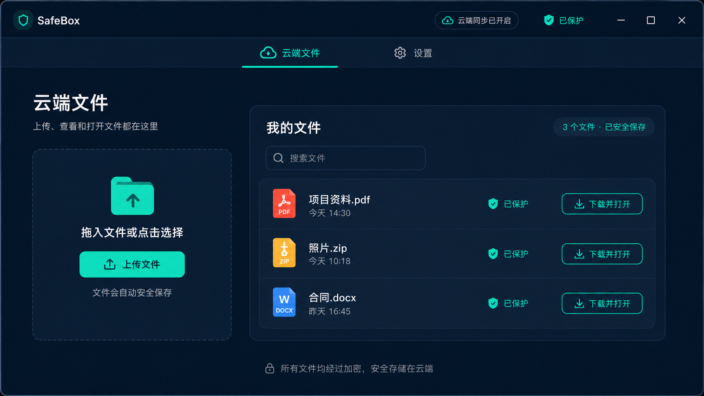

### 5.3 设置页

设置页使用纵向卡片分组，顺序固定为：

1. 安全身份：状态、恢复操作、恢复信息提示。
2. 云端备份：主备份、备用备份；文件保存后自动同步为默认行为，不提供单独开关。
3. 使用习惯：主题、临时文件行为、清理操作。

每个区块内部保持一条主信息线，不使用复杂表单。设置页参考图：

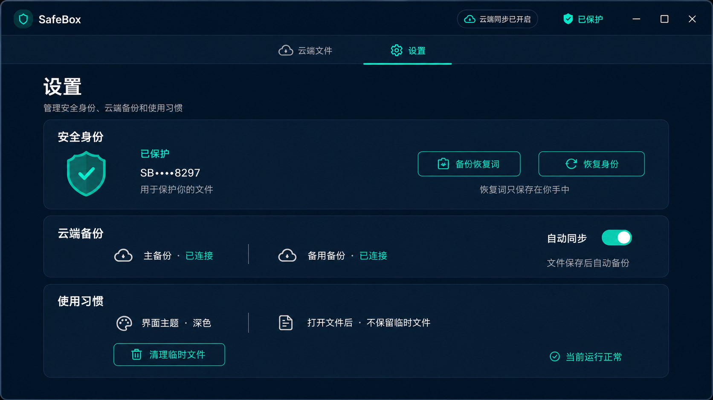

### 5.4 GitHub / Gitee 地址配置

云端备份展开后提供 GitHub 和 Gitee 两个并列配置卡片。每个平台只保留一个“完整地址”输入框，用户直接粘贴完整仓库地址即可，不再拆分账号、仓库名、分支或路径前缀。

配置卡片包含：

- 平台名称和连接状态。
- `完整地址` 输入框，例如 `https://github.com/your-account/your-repository`。
- `访问凭证` 密码输入框，默认隐藏内容。
- `测试连接` 次要按钮。
- 页面级 `保存设置` 主按钮。

界面文案强调“粘贴完整地址即可，不需要分别填写账号和仓库名”。凭证只显示为掩码，并提示“凭证仅保存在本机”。

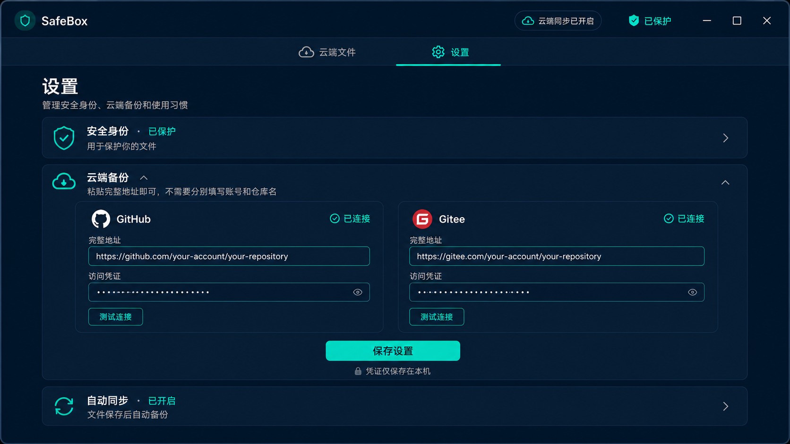

手机版将 GitHub 与 Gitee 配置卡片改为纵向堆叠，具体布局见 6.4。

## 6. 移动端规格

### 6.1 画布与结构

- 目标宽度：375–430 px。
- 推荐比例：9:19.5；内容适配安全区。
- App Bar 位于顶部，Tab 栏紧随其下。
- 页面内容改为单列卡片，不使用桌面表格。
- 文件行改为垂直信息块：文件名、时间、状态、打开按钮。
- 按钮和开关使用较大点击面积，避免只依赖图标。

### 6.2 云端文件页

移动端结构顺序：

1. 页面标题与云端状态。
2. 上传卡片。
3. 我的文件卡片。
4. 文件列表。
5. 安全说明。

参考图：

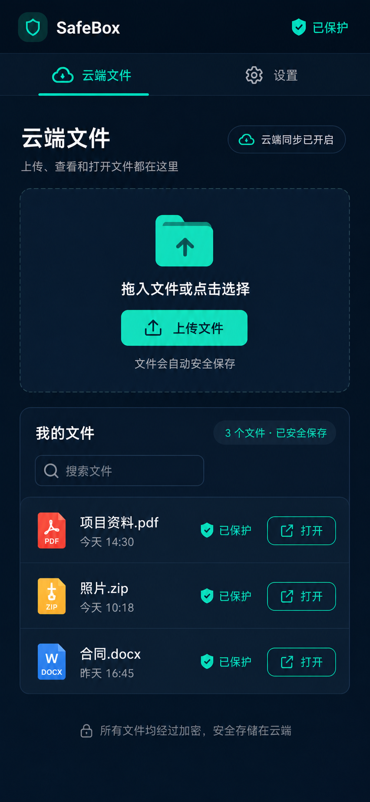

### 6.3 设置页

移动端设置页将桌面端的三个区块依次堆叠：

- 安全身份卡片：身份状态和两个操作按钮上下排列或并排占满宽度。
- 云端备份卡片：主备份、备用备份各占一行，文件保存后自动同步，不额外展示开关。
- 使用习惯卡片：每个选项独立成行，使用右箭头或开关表达可操作性。

参考图：

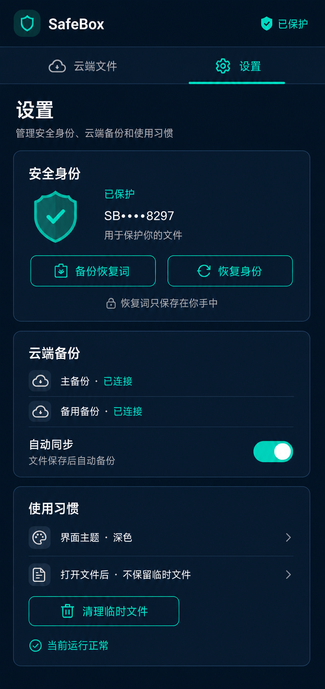

### 6.4 GitHub / Gitee 地址配置

- GitHub 和 Gitee 配置卡片按纵向排列，避免移动端横向并排造成拥挤。
- 每个平台的完整地址、访问凭证和“测试连接”保持独立可读。
- 页面级“保存设置”按钮位于两个平台卡片之后，凭证提示固定为“凭证仅保存在本机”。

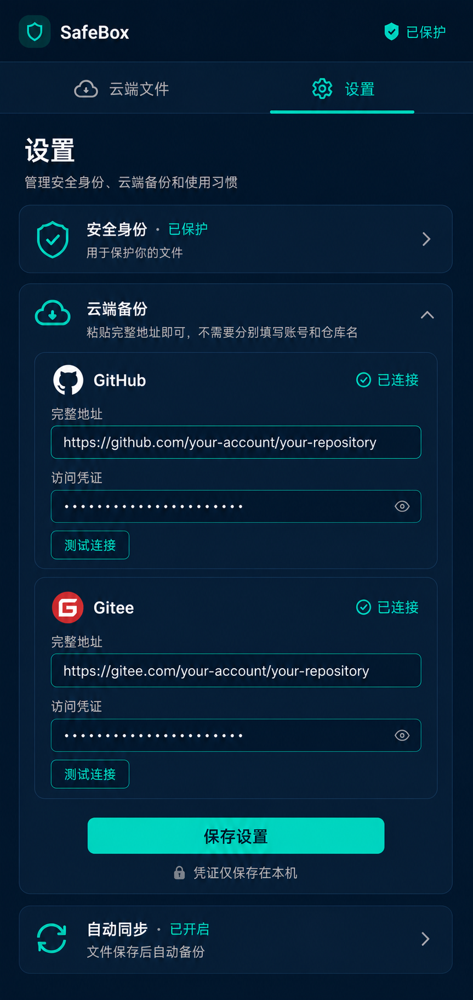

## 7. 首次使用设置

首次使用页面与正常设置页使用同一套视觉系统，但降低信息量，突出完成路径。

### 7.1 页面结构

- 顶部显示 SafeBox 和“首次使用”。
- “云端文件”Tab 处于弱化或不可用状态；“设置”Tab 处于选中状态。
- 标题：“欢迎使用 SafeBox”。
- 副标题：“完成一次设置，之后只需拖入文件”。
- 三步进度：`1 安全身份` → `2 云端备份` → `3 完成`。

### 7.2 第一步：安全身份

- 主要标题：“创建安全身份”。
- 主要动作：“创建安全身份”。
- 次要动作：“恢复已有身份”。
- 说明：“用于保护你的文件”。
- 安全提示：“恢复信息只保存在你手中”。

### 7.2.1 创建 12 个恢复词

点击“创建安全身份”后进入恢复词保存状态：

- 标题：“保存你的恢复词”。
- 副标题：“请按顺序保存这 12 个词，完成后即可继续设置”。
- 按顺序展示 1–12 的编号词卡，使用 3 列或 4 列网格；每一项必须同时显示序号和单词。
- 说明：“这些词只显示一次，请抄写并妥善保管”。
- 警示：“不要截图或发送给任何人”。
- 次要动作：“复制恢复词”。
- 主要动作：“我已妥善保存，继续”。
- 继续前要求用户完成明确的保存确认；主界面不展示真实用户的恢复词。
- 设计稿中的英文单词仅为演示占位，不得用于真实恢复。

12 个词卡以安全、可读为优先；确认后进入“云端备份”步骤。

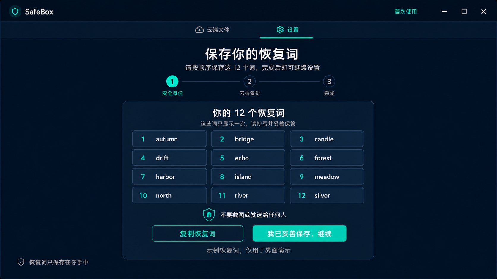

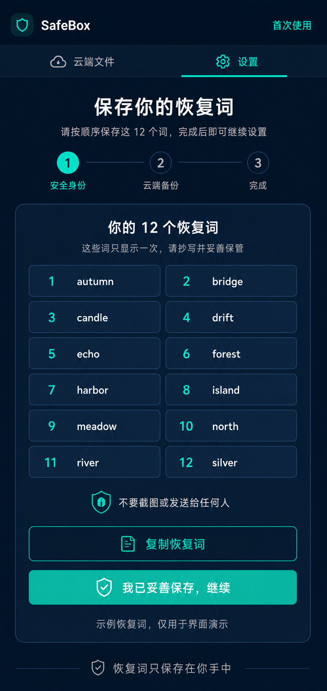

### 7.2.2 恢复已有身份

点击“恢复已有身份”后进入恢复流程：

- 标题：“恢复已有身份”。
- 副标题：“输入你的 12 个恢复词，找回安全身份”。
- 使用 12 个空白输入框按 1–12 编号排列，采用 3 列或 4 列网格；占位提示使用“第 N 个词”。
- 辅助说明：“按顺序输入恢复词，恢复词只保存在你手中”。
- 次要动作：“粘贴恢复词”。
- 主要动作：“恢复身份”。
- 安全提示：“恢复词仅用于本地恢复，不会上传”。
- 未完成 12 个词的输入或校验前，不允许继续进入云端备份步骤。
- 恢复失败时只提示“恢复词不正确，请检查顺序后重试”等可执行信息，不展示技术错误。

恢复流程不展示真实密语、密钥或算法信息；输入完成并校验成功后进入“云端备份”步骤。

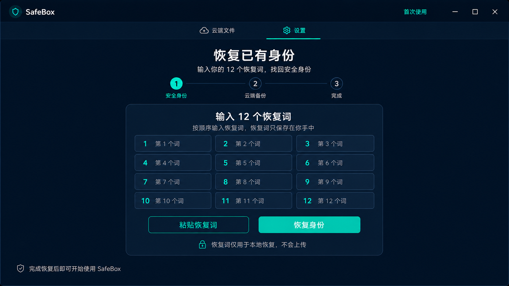

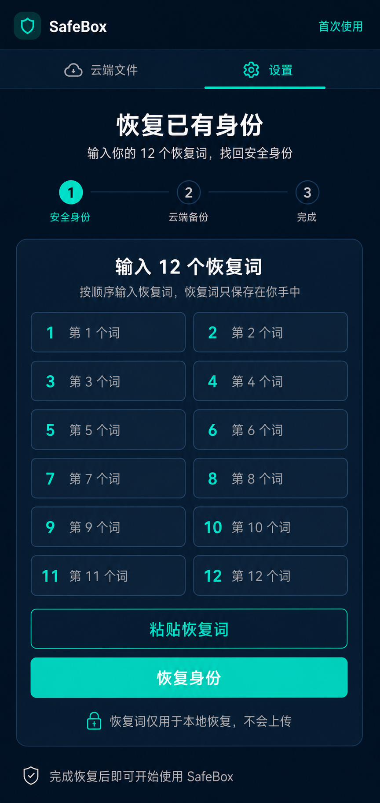

### 7.3 第二步：云端备份

- 初始状态：“待设置”。
- 辅助说明：“完成身份设置后再连接云端”。
- 次要动作：“稍后设置”。
- 完成身份后允许用户继续配置主备份和备用备份；自动同步默认启用。

### 7.4 完成状态

- 完成后进入“云端文件”。
- 通过顶部状态显示“已保护”和“云端同步已开启”。
- 首次进入云端文件页时，上传卡片保持最高视觉优先级。

首次使用参考图：

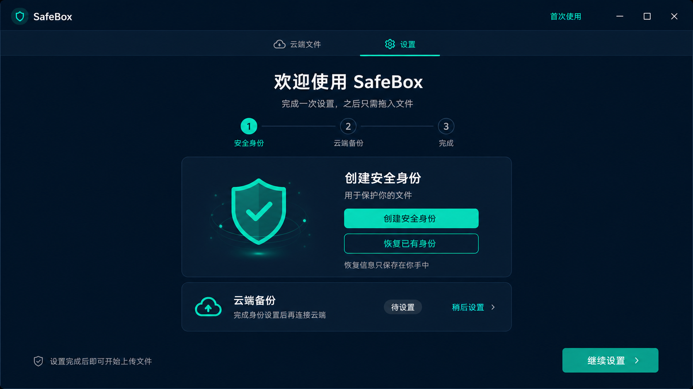

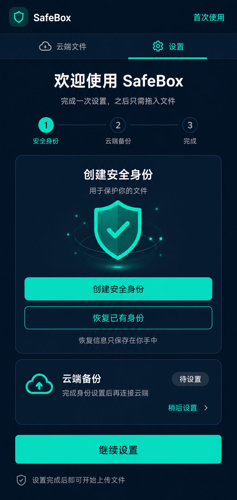

## 8. 交互规格

### 8.1 上传文件

1. 用户点击“上传文件”或将文件拖入上传卡片。
2. 上传卡片显示已选文件名和文件类型。
3. 用户确认后开始安全保存，并在状态位置显示进度。
4. 完成后文件进入“我的文件”，状态显示“已保护”。
5. 失败时在当前卡片内说明下一步，不弹出技术错误堆栈。

### 8.2 下载并解密

1. 用户在文件行点击“下载并解密”。
2. 按钮进入“准备中”状态，避免重复点击。
3. 完成后显示“已解密”，用户可再点击“打开文件”或“打开文件夹”。
4. 明文临时文件的清理策略由“设置 → 使用习惯”控制。

### 8.3 搜索文件

- 搜索按文件名过滤。
- 无结果时显示“没有找到文件”，同时保留“上传文件”按钮。
- 搜索框在桌面端位于文件卡片顶部，在移动端占满卡片宽度。

### 8.4 安全身份

- 已有身份时显示“已保护”和掩码标识。
- “备份恢复词”是高风险操作，需要二次确认。
- “恢复身份”使用独立流程，不在主设置页展开长表单。
- 不在主界面展示密钥、公钥、指纹或算法名称。

### 8.5 云端备份

- 主备份、备用备份只展示连接结果和同步状态。
- 用户看到的是“已连接”“待设置”“同步中”“同步失败”等结果词。
- 详细连接配置属于后续设置流程，不放在默认首屏。

## 9. 状态与文案

### 9.1 推荐文案

| 场景 | 推荐文案 |
| --- | --- |
| 身份可用 | 已保护 |
| 云端可用 | 云端同步已开启 |
| 文件正常 | 已保护 |
| 无文件 | 还没有安全文件 |
| 无配置 | 完成设置后即可开始上传文件 |
| 上传动作 | 上传文件 |
| 文件取回 | 下载并解密 |
| 连接正常 | 已连接 |
| 正在处理 | 正在准备 |
| 完成 | 当前运行正常 |

### 9.2 避免文案

主流程页面避免出现以下内容：RSA、SBOX、MD5、API、Bundle、Key ID、Token、Repository、Manifest、分片、对象名、HTTP、日志、诊断堆栈和本地绝对路径。

## 10. 可访问性与适配要求

- 颜色不能作为唯一状态表达方式；“已保护”同时配合盾牌或勾选图标。
- 所有按钮必须有可读文本或无障碍标签。
- 键盘焦点使用明显的薄荷绿色描边。
- 错误、警告和成功状态分别提供图标、文字和颜色三种线索。
- 移动端支持系统字体放大，卡片允许自然增高，不裁剪文字。
- 文件名超长时最多显示两行，并保留完整内容的可访问标签。
- 上传区支持点击和拖拽；移动端只显示点击选择入口。

## 11. 资源清单

| 文件 | 用途 |
| --- | --- |
| [`assets/safebox-cloud-files-desktop.png`](assets/safebox-cloud-files-desktop.png) | 桌面端云端文件参考图 |
| [`assets/safebox-cloud-files-mobile.png`](assets/safebox-cloud-files-mobile.png) | 手机版云端文件参考图 |
| [`assets/safebox-settings-desktop.png`](assets/safebox-settings-desktop.png) | 桌面端设置效果图 |
| [`assets/safebox-settings-mobile.png`](assets/safebox-settings-mobile.png) | 手机版设置效果图 |
| [`assets/safebox-first-use-settings-desktop.png`](assets/safebox-first-use-settings-desktop.png) | 首次使用设置效果图 |
| [`assets/safebox-first-use-settings-mobile.png`](assets/safebox-first-use-settings-mobile.png) | 手机版首次使用设置效果图 |
| [`assets/safebox-first-use-recovery-phrase-desktop.png`](assets/safebox-first-use-recovery-phrase-desktop.png) | 首次使用创建 12 个恢复词效果图 |
| [`assets/safebox-first-use-recovery-phrase-mobile.png`](assets/safebox-first-use-recovery-phrase-mobile.png) | 手机版首次使用创建 12 个恢复词效果图 |
| [`assets/safebox-first-use-restore-identity-desktop.png`](assets/safebox-first-use-restore-identity-desktop.png) | 首次使用恢复已有身份效果图 |
| [`assets/safebox-first-use-restore-identity-mobile.png`](assets/safebox-first-use-restore-identity-mobile.png) | 手机版首次使用恢复已有身份效果图 |
| [`assets/safebox-settings-cloud-address-desktop.png`](assets/safebox-settings-cloud-address-desktop.png) | GitHub / Gitee 完整地址配置效果图 |
| [`assets/safebox-settings-cloud-address-mobile.png`](assets/safebox-settings-cloud-address-mobile.png) | 手机版 GitHub / Gitee 完整地址配置效果图 |

## 12. 验收清单

- [ ] 桌面端没有左侧边栏，顶部只有“云端文件 / 设置”两个 Tab。
- [ ] 手机版没有侧边栏，Tab 位于顶部并适配安全区。
- [ ] “上传”和“下载并解密”都能从“云端文件”页直接理解和触达。
- [ ] “身份”和“双云设置”只在“设置”页出现。
- [ ] 设置页包含“安全身份 / 云端备份 / 使用习惯”三个区块。
- [ ] GitHub 和 Gitee 均使用一个完整地址输入框，不拆分账号、仓库名、分支或路径前缀。
- [ ] 首次使用页提供清晰的三步进度和创建/恢复身份入口。
- [ ] 首次使用设置、创建恢复词、恢复已有身份和 GitHub / Gitee 地址配置均有对应手机版效果图。
- [ ] GitHub / Gitee 手机版按纵向堆叠配置卡片，并继续使用完整地址输入框。
- [ ] 创建安全身份后展示 12 个按顺序编号的恢复词，并提供保存确认。
- [ ] 设计稿中的 12 个英文词只作演示占位，不可作为真实恢复词。
- [ ] 恢复已有身份使用 12 个按顺序编号的输入框，并在校验成功后继续流程。
- [ ] 主流程不展示 RSA、SBOX、MD5、API、令牌、仓库路径等技术复杂度。
- [ ] 移动端不出现横向滚动、微小按钮或桌面表格布局。
- [ ] 所有图片均保存在 `docs/assets/`，并在本文档中有对应引用。
